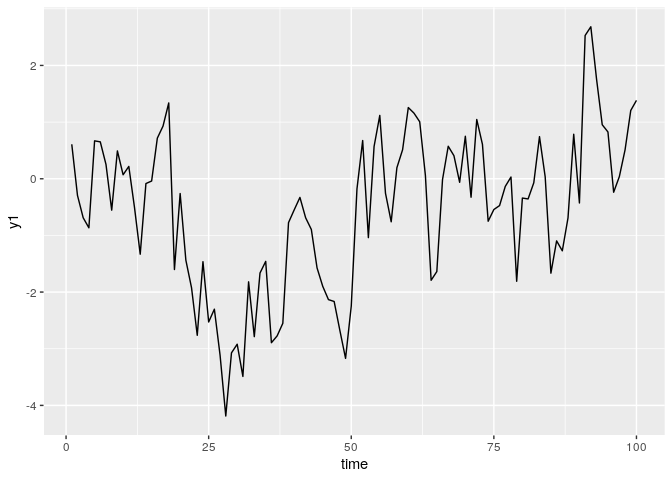
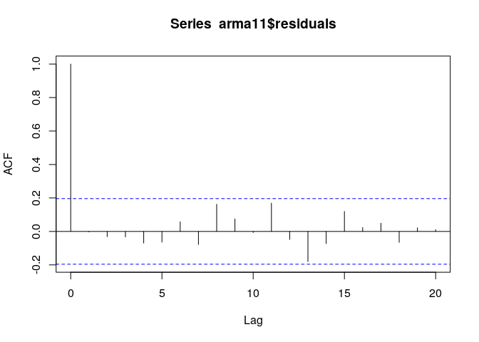
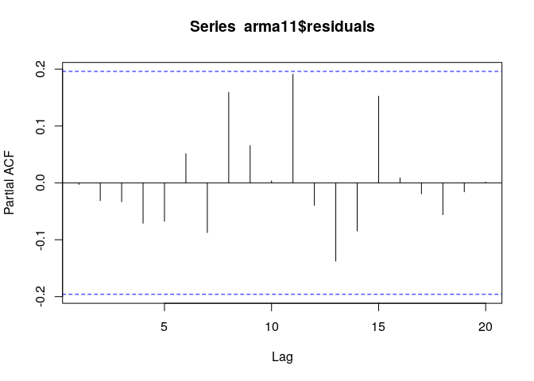

第2章 練習問題\[10\]
================

# \[10\]

データ SIM2.XLS の系列 y1 を用いて、以下の問いに答えよ。  
（y1 は AR(1) 過程から発生させた）

## (a)

横軸を時間とし、y1 を図示せよ。この系列は定常といえるか。

``` r
library(data.table)
library(dplyr)
```

    ## 
    ##  次のパッケージを付け加えます: 'dplyr'

    ##  以下のオブジェクトは 'package:data.table' からマスクされています:
    ## 
    ##     between, first, last

    ##  以下のオブジェクトは 'package:stats' からマスクされています:
    ## 
    ##     filter, lag

    ##  以下のオブジェクトは 'package:base' からマスクされています:
    ## 
    ##     intersect, setdiff, setequal, union

``` r
library(ggplot2)

SIM2 <- fread("../data/SIM2.csv")

# データのインデックスに列名が無いため時刻timeとして設定する
SIM2 <- dplyr::rename(SIM2, time = V1)
print(nrow(SIM2))
```

    ## [1] 100

``` r
# y1をプロット
g <- ggplot(SIM2, aes(x = time, y = y1)) +
     geom_line()
plot(g)
```

<!-- -->

見た目平均や分散が大きく変化していないので定常と考えられる。  
(詳細な定常性の検定については4章で解説されるらしい)

## (b)

表2.2と同じ結果が得られるかを調べよ。

モデル1 : AR(1)

``` r
# arima()でc(1, 0, 0)とすることでAR(1)モデルを構築
# include.mean=FALSEで定数項は除く
ar1 <- arima(SIM2[, y1], c(1, 0, 0), include.mean = FALSE)
results_ar1 <- list(
  a1_est = ar1$coef[1],
  # 推定したパラメータの分散共分散行列の対応する対角成分のsqrtとして推定量のstdを求める
  a1_std = sqrt(ar1$var.coef[1, 1]),
  # 自由度はデータ数 - パラメータ数 - 1
  # 最後の-1は誤差項の分散の分
  dig_free = ar1$nobs - length(ar1$coef) - 1,
  # 推定された分散 * データ数でSSRを計算
  SSR = ar1$sigma2 * ar1$nobs,
  AIC = AIC(ar1),
  BIC = BIC(ar1),
  # Box.testのLjung-Boxの統計量として修正Q統計量と修正Q統計量のp値を算出
  Q8 = Box.test(ar1$residuals, lag = 8, type = "Ljung-Box")$statistic,
  Q8_pvalue = Box.test(ar1$residuals, lag = 8, type = "Ljung-Box")$p.value,
  Q16 = Box.test(ar1$residuals, lag = 16, type = "Ljung-Box")$statistic,
  Q16_pvalue = Box.test(ar1$residuals, lag = 16, type = "Ljung-Box")$p.value,
  Q24 = Box.test(ar1$residuals, lag = 24, type = "Ljung-Box")$statistic,
  Q24_pvalue = Box.test(ar1$residuals, lag = 24, type = "Ljung-Box")$p.value
)

results_ar1
```

    ## $a1_est
    ##       ar1 
    ## 0.7839868 
    ## 
    ## $a1_std
    ## [1] 0.06062988
    ## 
    ## $dig_free
    ## [1] 98
    ## 
    ## $SSR
    ## [1] 85.25007
    ## 
    ## $AIC
    ## [1] 272.7832
    ## 
    ## $BIC
    ## [1] 277.9935
    ## 
    ## $Q8
    ## X-squared 
    ##  6.302434 
    ## 
    ## $Q8_pvalue
    ## [1] 0.6133949
    ## 
    ## $Q16
    ## X-squared 
    ##  15.66611 
    ## 
    ## $Q16_pvalue
    ## [1] 0.4764971
    ## 
    ## $Q24
    ## X-squared 
    ##  21.52829 
    ## 
    ## $Q24_pvalue
    ## [1] 0.6073987

``` r
# モデル2:AR(1) + β12 ε12
## include.mean=FALSEで定数項は除く
## c(1, 0, 12)とした上でMA12以外の項の係数を0に固定してモデル2を再現
ar1_ma12 <- arima(SIM2[, y1], c(1, 0, 12), include.mean = FALSE,
                  transform.pars = FALSE,
                  fixed = c(NA, 0, 0, 0, 0, 0, 0, 0, 0, 0, 0, 0, NA))
results_ar1_ma12 <- list(
  a1_est = ar1_ma12$coef[1],
  # 推定したパラメータの分散共分散行列の対応する対角成分のsqrtとして推定量のstdを求める
  a1_std = sqrt(ar1_ma12$var.coef[1, 1]),
  b12_est = ar1_ma12$coef[13],
  b12_std = sqrt(ar1_ma12$var.coef[2, 2]),
  # 自由度はデータ数 - パラメータ数 - 1
  # 最後の-1は誤差項の分散の分
  dig_free = ar1_ma12$nobs - 2 - 1,
  # 推定された分散 * データ数でSSRを計算
  SSR = ar1_ma12$sigma2 * ar1_ma12$nobs,
  AIC = AIC(ar1_ma12),
  BIC = BIC(ar1_ma12),
  # Box.testのLjung-Boxの統計量として修正Q統計量と修正Q統計量のp値を算出
  Q8 = Box.test(ar1_ma12$residuals, lag = 8, type = "Ljung-Box")$statistic,
  Q8_pvalue = Box.test(ar1_ma12$residuals, lag = 8, type = "Ljung-Box")$p.value,
  Q16 = Box.test(ar1_ma12$residuals, lag = 16, type = "Ljung-Box")$statistic,
  Q16_pvalue = Box.test(ar1_ma12$residuals, lag = 16, type = "Ljung-Box")$p.value,
  Q24 = Box.test(ar1_ma12$residuals, lag = 24, type = "Ljung-Box")$statistic,
  Q24_pvalue = Box.test(ar1_ma12$residuals, lag = 24, type = "Ljung-Box")$p.value
)

results_ar1_ma12
```

    ## $a1_est
    ##       ar1 
    ## 0.7873831 
    ## 
    ## $a1_std
    ## [1] 0.06269124
    ## 
    ## $b12_est
    ##       ma12 
    ## -0.0259633 
    ## 
    ## $b12_std
    ## [1] 0.1314164
    ## 
    ## $dig_free
    ## [1] 97
    ## 
    ## $SSR
    ## [1] 85.20061
    ## 
    ## $AIC
    ## [1] 274.7442
    ## 
    ## $BIC
    ## [1] 282.5597
    ## 
    ## $Q8
    ## X-squared 
    ##  6.337693 
    ## 
    ## $Q8_pvalue
    ## [1] 0.6094614
    ## 
    ## $Q16
    ## X-squared 
    ##  15.56535 
    ## 
    ## $Q16_pvalue
    ## [1] 0.4836856
    ## 
    ## $Q24
    ## X-squared 
    ##  21.38599 
    ## 
    ## $Q24_pvalue
    ## [1] 0.6158637

AIC, BICは書籍の値と異なるが、これは定義が異なるためだろう。  
他は修正Q統計量やモデル2のMA12項の係数が若干異なるが、結果に大きな影響を与えるほどではない。

## (c)

y1 を AR(2)
で推定すると、次の結果が得られることを確認せよ。()内は標準偏差。  
yt = 0.710(7.01)yt-1 + 0.105(1.04)yt-2 + et また、Q(8) = 5.13, Q(16) =
15.86, Q(24) = 21.02 となることを確認せよ。

``` r
ar2 <- arima(SIM2[, y1], c(2, 0, 0), include.mean = FALSE)
print(ar2)
```

    ## 
    ## Call:
    ## arima(x = SIM2[, y1], order = c(2, 0, 0), include.mean = FALSE)
    ## 
    ## Coefficients:
    ##          ar1     ar2
    ##       0.7016  0.1039
    ## s.e.  0.0991  0.0993
    ## 
    ## sigma^2 estimated as 0.8431:  log likelihood = -133.85,  aic = 273.69

``` r
list(
  # Box.testのLjung-Boxの統計量として修正Q統計量と修正Q統計量のp値を算出
  Q8 = Box.test(ar1_ma12$residuals, lag = 8, type = "Ljung-Box")$statistic,
  Q8_pvalue = Box.test(ar1_ma12$residuals, lag = 8, type = "Ljung-Box")$p.value,
  Q16 = Box.test(ar1_ma12$residuals, lag = 16, type = "Ljung-Box")$statistic,
  Q16_pvalue = Box.test(ar1_ma12$residuals, lag = 16, type = "Ljung-Box")$p.value,
  Q24 = Box.test(ar1_ma12$residuals, lag = 24, type = "Ljung-Box")$statistic,
  Q24_pvalue = Box.test(ar1_ma12$residuals, lag = 24, type = "Ljung-Box")$p.value
)
```

    ## $Q8
    ## X-squared 
    ##  6.337693 
    ## 
    ## $Q8_pvalue
    ## [1] 0.6094614
    ## 
    ## $Q16
    ## X-squared 
    ##  15.56535 
    ## 
    ## $Q16_pvalue
    ## [1] 0.4836856
    ## 
    ## $Q24
    ## X-squared 
    ##  21.38599 
    ## 
    ## $Q24_pvalue
    ## [1] 0.6158637

多少書籍の値と結果は異なるが、概ね同じ結果が得られたと言えるか。  
修正Q統計量のp値はいずれも0.1よりも大きく、有意水準10%でも残差に系列相関がないという帰無仮説を棄却できない。

## (d)

y1 を ARMA(1, 1)
で推定すると、次の結果が得られることを確認せよ。()内は標準偏差。  
yt = 0.844(12.16)yt-1 - 0.144(-1.12)et-1 + et 残差の標本ACF,
PACFから、系列相関が見られないことを確認せよ。

``` r
arma11 <- arima(SIM2[, y1], c(1, 0, 1), include.mean = FALSE)
arma11
```

    ## 
    ## Call:
    ## arima(x = SIM2[, y1], order = c(1, 0, 1), include.mean = FALSE)
    ## 
    ## Coefficients:
    ##          ar1      ma1
    ##       0.8384  -0.1463
    ## s.e.  0.0686   0.1333
    ## 
    ## sigma^2 estimated as 0.8422:  log likelihood = -133.79,  aic = 273.59

``` r
acf(arma11$residuals)
```

<!-- -->

``` r
pacf(arma11$residuals)
```

<!-- -->
