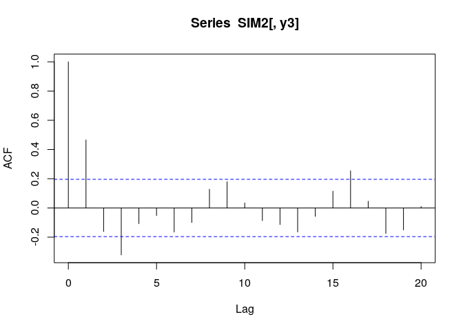

第2章 練習問題\[11\]
================

# \[11\]

データSIM2.XLSの系列y3を用いて、以下の問いに答えよ。  
(y3はAR(2)過程 yt = 0.7yt-1 - 0.49yt-2 + et から発生させた。)

## (a)

横軸を時間とし、y3を図示せよ。標本ACF, PACFを求め、AR(2)の理論上のACF,
PACFと比較せよ。

``` r
library(data.table)
library(dplyr)
```

    ## 
    ##  次のパッケージを付け加えます: 'dplyr'

    ##  以下のオブジェクトは 'package:data.table' からマスクされています:
    ## 
    ##     between, first, last

    ##  以下のオブジェクトは 'package:stats' からマスクされています:
    ## 
    ##     filter, lag

    ##  以下のオブジェクトは 'package:base' からマスクされています:
    ## 
    ##     intersect, setdiff, setequal, union

``` r
library(ggplot2)

SIM2 <- fread("../data/SIM2.csv")

# データのインデックス列に列名が無いためtimeを列名とする
SIM2 <- dplyr::rename(SIM2, time = V1)

# y3をプロット
g <- ggplot(data = SIM2, aes(x = time, y = y3)) +
     geom_line()
plot(g)
```

<!-- -->

``` r
# ACF
acf(SIM2[, y3])
```

<!-- -->

``` r
# PACF
pacf(SIM2[, y3])
```

<!-- -->

-   y3のプロットから、y3は定常であるように見える。
-   y3のACFから、lag1,
    lag3が有意であり、ACFが徐々に減衰する様子が見える。これはAR(2)の理論上のACFの特徴と一致する。
    -   一方で、lag16のあたりも有意であるため、MA項を入れることも視野に入れて良いかもしれない。
-   y3のPACFから、2次まで大きな尖りがある。これはAR(2)の理論上のPACFの特徴と一致する。
    -   一方で、2次以上のLagでもPACFで有意なlagがいくつかある。lag15付近のMA項を入れることを考慮するかもしれない。

Rの `pacf()`
はLag1から始まるのか。確かにLag0=1で確定だが若干分かりにくいかも…?

## (b)

AR(1)を推定すると、次の結果が得られるかを確認せよ。  
yt = 0.467(5.24)yt-1 + et  
診断テストを行うことで、このモデルが不適当であることを示せ。

``` r
ar1 <- arima(SIM2[, y3], c(1, 0, 0), include.mean = FALSE)
print(ar1)
```

    ## 
    ## Call:
    ## arima(x = SIM2[, y3], order = c(1, 0, 0), include.mean = FALSE)
    ## 
    ## Coefficients:
    ##          ar1
    ##       0.4631
    ## s.e.  0.0877
    ## 
    ## sigma^2 estimated as 0.1128:  log likelihood = -32.89,  aic = 69.78

``` r
# 残差のACF
acf(ar1$residuals)
```

<!-- -->

``` r
# 残差のPACF
pacf(ar1$residuals)
```

<!-- -->

``` r
# 修正Q統計量
Q_stat <- list(
  Q8 = Box.test(ar1$residuals, lag = 8, type = "Ljung-Box")$statistic,
  Q8_pvalue = Box.test(ar1$residuals, lag = 8, type = "Ljung-Box")$p.value,
  Q16 = Box.test(ar1$residuals, lag = 16, type = "Ljung-Box")$statistic,
  Q16_pvalue = Box.test(ar1$residuals, lag = 16, type = "Ljung-Box")$p.value,
  Q24 = Box.test(ar1$residuals, lag = 24, type = "Ljung-Box")$statistic,
  Q24_pvalue = Box.test(ar1$residuals, lag = 24, type = "Ljung-Box")$p.value
)
print(Q_stat)
```

    ## $Q8
    ## X-squared 
    ##  37.49595 
    ## 
    ## $Q8_pvalue
    ## [1] 9.326413e-06
    ## 
    ## $Q16
    ## X-squared 
    ##  56.61321 
    ## 
    ## $Q16_pvalue
    ## [1] 1.926612e-06
    ## 
    ## $Q24
    ## X-squared 
    ##  69.96049 
    ## 
    ## $Q24_pvalue
    ## [1] 2.216827e-06

-   ar1係数の標準偏差が書籍とずれている気がするが、推定値は大体同じ
-   残差のACF,
    PACF共に2次以上で有意なため、残差に系列相関の存在が示唆される。よってAR(1)モデルは不適当と考えられる。
    -   PACFで2次に尖りがあるため、AR(2)項の存在が考えられる。
-   修正Q統計量についてもQ8の時点でp値が小さく残差に系列相関が無いという帰無仮説が棄却されてしまう。

## (c)

ARMA(1, 1)モデルを推定すると、次の結果が得られることを確認せよ。  
yt = 0.183(1.15)yt-1 + 0.510(3.64)et-t + et  
このモデルが不適当であることを示せ。修正Q統計量を調べよ。

``` r
arma11 <- arima(SIM2[, y3], c(1, 0, 1), include.mean = FALSE)
print(arma11)
```

    ## 
    ## Call:
    ## arima(x = SIM2[, y3], order = c(1, 0, 1), include.mean = FALSE)
    ## 
    ## Coefficients:
    ##          ar1    ma1
    ##       0.1806  0.505
    ## s.e.  0.1314  0.100
    ## 
    ## sigma^2 estimated as 0.09647:  log likelihood = -25.22,  aic = 56.44

``` r
# 修正Q統計量
Q_stat <- list(
  Q8 = Box.test(arma11$residuals, lag = 8, type = "Ljung-Box")$statistic,
  Q8_pvalue = Box.test(arma11$residuals, lag = 8, type = "Ljung-Box")$p.value,
  Q16 = Box.test(arma11$residuals, lag = 16, type = "Ljung-Box")$statistic,
  Q16_pvalue = Box.test(arma11$residuals, lag = 16, type = "Ljung-Box")$p.value,
  Q24 = Box.test(arma11$residuals, lag = 24, type = "Ljung-Box")$statistic,
  Q24_pvalue = Box.test(arma11$residuals, lag = 24, type = "Ljung-Box")$p.value
)
print(Q_stat)
```

    ## $Q8
    ## X-squared 
    ##  18.03351 
    ## 
    ## $Q8_pvalue
    ## [1] 0.02097669
    ## 
    ## $Q16
    ## X-squared 
    ##   37.1858 
    ## 
    ## $Q16_pvalue
    ## [1] 0.001974373
    ## 
    ## $Q24
    ## X-squared 
    ##  45.28625 
    ## 
    ## $Q24_pvalue
    ## [1] 0.005387415

修正Q統計量がlag8,
16でp値が5%を切り、残差に系列相関がないという帰無仮説を棄却してしまう。  
よってARMA(1, 1)モデルは不適当であると考えられる。

## (d)

AR(2)モデルを推定せよ。係数の推定値が真の係数と一致していることを確認せよ。

``` r
ar2 <- arima(SIM2[, y3], c(2, 0, 0), include.mean = FALSE)
print(ar2)
```

    ## 
    ## Call:
    ## arima(x = SIM2[, y3], order = c(2, 0, 0), include.mean = FALSE)
    ## 
    ## Coefficients:
    ##          ar1      ar2
    ##       0.6861  -0.4722
    ## s.e.  0.0873   0.0866
    ## 
    ## sigma^2 estimated as 0.08674:  log likelihood = -20.02,  aic = 46.05

``` r
# 残差のACF
acf(ar2$residuals)
```

<!-- -->

``` r
# 残差のPACF
pacf(ar2$residuals)
```

<!-- -->

``` r
# 修正Q統計量
Q_stat <- list(
  Q8 = Box.test(ar2$residuals, lag = 8, type = "Ljung-Box")$statistic,
  Q8_pvalue = Box.test(ar2$residuals, lag = 8, type = "Ljung-Box")$p.value,
  Q16 = Box.test(ar2$residuals, lag = 16, type = "Ljung-Box")$statistic,
  Q16_pvalue = Box.test(ar2$residuals, lag = 16, type = "Ljung-Box")$p.value,
  Q24 = Box.test(ar2$residuals, lag = 24, type = "Ljung-Box")$statistic,
  Q24_pvalue = Box.test(ar2$residuals, lag = 24, type = "Ljung-Box")$p.value
)
print(Q_stat)
```

    ## $Q8
    ## X-squared 
    ##  9.524585 
    ## 
    ## $Q8_pvalue
    ## [1] 0.2999902
    ## 
    ## $Q16
    ## X-squared 
    ##  24.57651 
    ## 
    ## $Q16_pvalue
    ## [1] 0.07764735
    ## 
    ## $Q24
    ## X-squared 
    ##  32.08727 
    ## 
    ## $Q24_pvalue
    ## [1] 0.1248433

-   真の係数とおおよそ同じ値が得られた。
-   残差のACF,
    PACFもおおよそ有意なlagが存在しておらず、残差に系列相関が無いことが確認される。
    -   lag16が有意であるため、MA16項をモデルに加えることを考慮するかもしれない。
-   修正Q統計量のp値は残差に系列相関が無いという帰無仮説を有意水準5%では棄却できない。この点からも残差に系列相関が残っていないことが確認できる。
