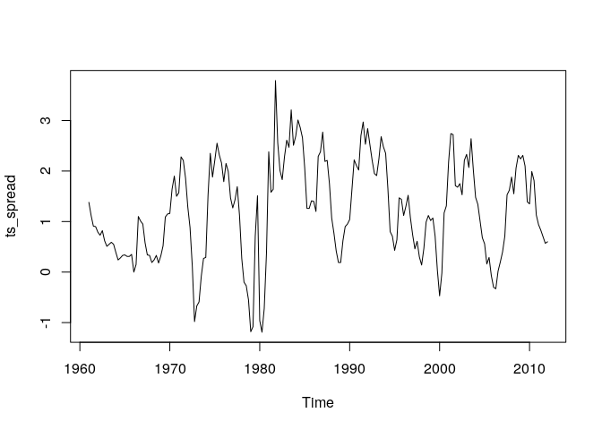
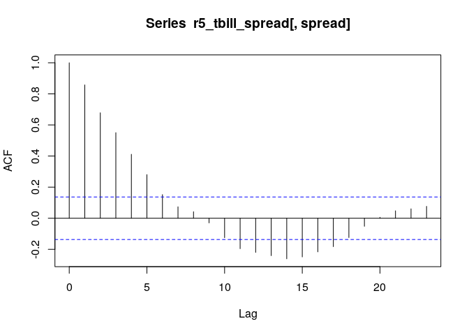
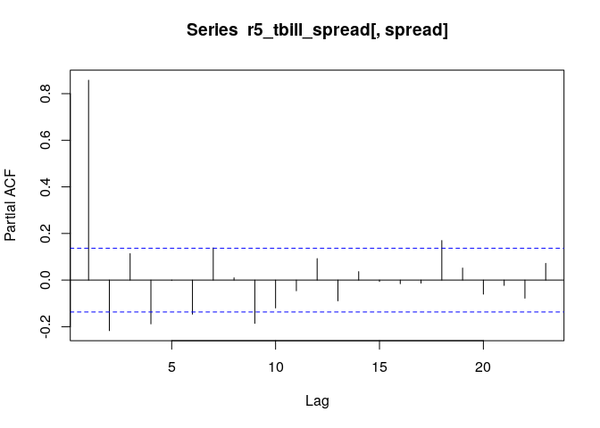

第2章 練習問題\[12\]
================

# \[12\]

QUARTERLY.XLSには米国の金利データ（1960Q1 \~ 2021Q4）が含まれる。
スプレッドは、長期金利 r5 と短期金利 tbill の差である。 スプレッドを
AR(7), ARMA(1, 1), ARMA(2, 1), ARMA(2, (1, 7))モデルで推定し、
2.10の結果を再現せよ。 （ただし、標本期間は1961Q4 \~
2021Q4で統一すること。）

## プロット、ACF、PACF

まずは金利スプレッドの時系列プロット、ACF、PACFを確認する。

``` r
library(data.table)
library(dplyr)
```

    ## 
    ##  次のパッケージを付け加えます: 'dplyr'

    ##  以下のオブジェクトは 'package:data.table' からマスクされています:
    ## 
    ##     between, first, last

    ##  以下のオブジェクトは 'package:stats' からマスクされています:
    ## 
    ##     filter, lag

    ##  以下のオブジェクトは 'package:base' からマスクされています:
    ## 
    ##     intersect, setdiff, setequal, union

``` r
library(ggplot2)

QUARTERLY <- fread("../data/QUARTERLY.csv")

# データのインデックス列に列名が無いためtimeを列名とする
QUARTERLY <- dplyr::rename(QUARTERLY, Q = V1)

# 金利スプレッド
# 1961Q4以降に絞り込み
r5_tbill_spread <- QUARTERLY %>%
                   slice(8:nrow(.)) %>% 
                   select(Q, r5, tbill) %>% 
                   mutate(spread = r5 - tbill) %>% 
                   select(Q, spread)
ts_spread <- ts(r5_tbill_spread$spread, start = c(1961, 1), frequency = 4)

# spreadをプロット
ts.plot(ts_spread)
```

<!-- -->

``` r
# ACF
acf(r5_tbill_spread[, spread])
```

<!-- -->

``` r
# PACF
pacf(r5_tbill_spread[, spread])
```

<!-- -->

-   時系列プロットから、おおよそ定常時系列であるように見える。
-   ACFが指数に比べるとゆっくり減衰しているので、純粋なARモデルとは考えにくい。
-   PACFが2, 4, 6,
    9あたりで有意であるため、これらのlagを持つARモデルの成分を含む可能性がある。

## AR(7)

``` r
ar7 <- arima(ts_spread, c(7, 0, 0))
print(ar7)
```

    ## 
    ## Call:
    ## arima(x = ts_spread, order = c(7, 0, 0))
    ## 
    ## Coefficients:
    ##          ar1      ar2     ar3      ar4     ar5      ar6     ar7  intercept
    ##       1.1073  -0.4464  0.3915  -0.2914  0.2134  -0.2877  0.1304     1.2089
    ## s.e.  0.0690   0.1018  0.1053   0.1065  0.1046   0.1008  0.0684     0.1744
    ## 
    ## sigma^2 estimated as 0.2139:  log likelihood = -133.74,  aic = 285.48

``` r
print(
  list(
    # 推定された分散 * データ数でSSRを計算
    SSR = ar7$sigma2 * ar7$nobs,
    AIC = AIC(ar7),
    BIC = BIC(ar7),
    # Box.testのLjung-Boxの統計量として修正Q統計量と修正Q統計量のp値を算出
    Q4 = Box.test(ar7$residuals, lag = 4, type = "Ljung-Box")$statistic,
    Q8 = Box.test(ar7$residuals, lag = 8, type = "Ljung-Box")$statistic,
    Q12 = Box.test(ar7$residuals, lag = 12, type = "Ljung-Box")$statistic
  )
)
```

    ## $SSR
    ## [1] 43.85399
    ## 
    ## $AIC
    ## [1] 285.4765
    ## 
    ## $BIC
    ## [1] 315.3836
    ## 
    ## $Q4
    ## X-squared 
    ## 0.1682995 
    ## 
    ## $Q8
    ## X-squared 
    ##  5.548475 
    ## 
    ## $Q12
    ## X-squared 
    ##  13.15541

書籍のa0が上記のinterceptに対応することに注意する。  
AIC,
BICは書籍と定義が異なるので値も異なる。（Rの定義はそのうち調べる。そのうち…）  
他は書籍の値と似たような結果が得られた。

## ARMA(1, 1)

``` r
arma11 <- arima(ts_spread, c(1, 0, 1))
print(arma11)
```

    ## 
    ## Call:
    ## arima(x = ts_spread, order = c(1, 0, 1))
    ## 
    ## Coefficients:
    ##          ar1     ma1  intercept
    ##       0.7571  0.3799     1.2043
    ## s.e.  0.0549  0.0964     0.1868
    ## 
    ## sigma^2 estimated as 0.229:  log likelihood = -140.53,  aic = 289.07

``` r
print(
  list(
    # 推定された分散 * データ数でSSRを計算
    SSR = arma11$sigma2 * arma11$nobs,
    AIC = AIC(arma11),
    BIC = BIC(arma11),
    # Box.testのLjung-Boxの統計量として修正Q統計量と修正Q統計量のp値を算出
    Q4 = Box.test(arma11$residuals, lag = 4, type = "Ljung-Box")$statistic,
    Q8 = Box.test(arma11$residuals, lag = 8, type = "Ljung-Box")$statistic,
    Q12 = Box.test(arma11$residuals, lag = 12, type = "Ljung-Box")$statistic
  )
)
```

    ## $SSR
    ## [1] 46.9375
    ## 
    ## $AIC
    ## [1] 289.0682
    ## 
    ## $BIC
    ## [1] 302.3602
    ## 
    ## $Q4
    ## X-squared 
    ##   6.61095 
    ## 
    ## $Q8
    ## X-squared 
    ##  18.25396 
    ## 
    ## $Q12
    ## X-squared 
    ##  24.00641

## ARMA(2, 1)

``` r
arma21 <- arima(ts_spread, c(2, 0, 1))
print(arma21)
```

    ## 
    ## Call:
    ## arima(x = ts_spread, order = c(2, 0, 1))
    ## 
    ## Coefficients:
    ##          ar1     ar2     ma1  intercept
    ##       0.4173  0.3157  0.6956     1.2017
    ## s.e.  0.1231  0.1157  0.0923     0.2053
    ## 
    ## sigma^2 estimated as 0.2232:  log likelihood = -137.97,  aic = 285.94

``` r
print(
  list(
    # 推定された分散 * データ数でSSRを計算
    SSR = arma21$sigma2 * arma21$nobs,
    AIC = AIC(arma21),
    BIC = BIC(arma21),
    # Box.testのLjung-Boxの統計量として修正Q統計量と修正Q統計量のp値を算出
    Q4 = Box.test(arma21$residuals, lag = 4, type = "Ljung-Box")$statistic,
    Q8 = Box.test(arma21$residuals, lag = 8, type = "Ljung-Box")$statistic,
    Q12 = Box.test(arma21$residuals, lag = 12, type = "Ljung-Box")$statistic
  )
)
```

    ## $SSR
    ## [1] 45.75962
    ## 
    ## $AIC
    ## [1] 285.9392
    ## 
    ## $BIC
    ## [1] 302.5543
    ## 
    ## $Q4
    ## X-squared 
    ##  1.243359 
    ## 
    ## $Q8
    ## X-squared 
    ##  12.14391 
    ## 
    ## $Q12
    ## X-squared 
    ##  18.81189

## ARMA(2, (1, 7))

``` r
arma217 <- arima(ts_spread, c(2, 0, 7),
                  transform.pars = FALSE,
                  fixed = c(NA, NA, NA, 0, 0, 0, 0, 0, NA, NA))
print(arma217)
```

    ## 
    ## Call:
    ## arima(x = ts_spread, order = c(2, 0, 7), transform.pars = FALSE, fixed = c(NA, 
    ##     NA, NA, 0, 0, 0, 0, 0, NA, NA))
    ## 
    ## Coefficients:
    ##          ar1     ar2     ma1  ma2  ma3  ma4  ma5  ma6      ma7  intercept
    ##       0.3482  0.3921  0.7768    0    0    0    0    0  -0.1387     1.2046
    ## s.e.  0.1257  0.1183  0.0942    0    0    0    0    0   0.0411     0.1993
    ## 
    ## sigma^2 estimated as 0.2131:  log likelihood = -133.42,  aic = 278.84

``` r
print(
  list(
    # 推定された分散 * データ数でSSRを計算
    SSR = arma217$sigma2 * arma217$nobs,
    AIC = AIC(arma217),
    BIC = BIC(arma217),
    # Box.testのLjung-Boxの統計量として修正Q統計量と修正Q統計量のp値を算出
    Q4 = Box.test(arma217$residuals, lag = 4, type = "Ljung-Box")$statistic,
    Q8 = Box.test(arma217$residuals, lag = 8, type = "Ljung-Box")$statistic,
    Q12 = Box.test(arma217$residuals, lag = 12, type = "Ljung-Box")$statistic
  )
)
```

    ## $SSR
    ## [1] 43.69364
    ## 
    ## $AIC
    ## [1] 278.8434
    ## 
    ## $BIC
    ## [1] 298.7815
    ## 
    ## $Q4
    ## X-squared 
    ## 0.8235655 
    ## 
    ## $Q8
    ## X-squared 
    ##  2.755951 
    ## 
    ## $Q12
    ## X-squared 
    ##  10.97779
