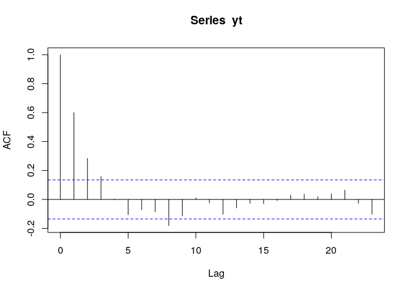
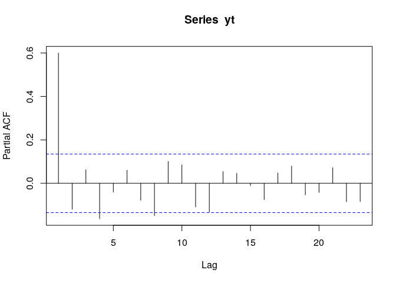
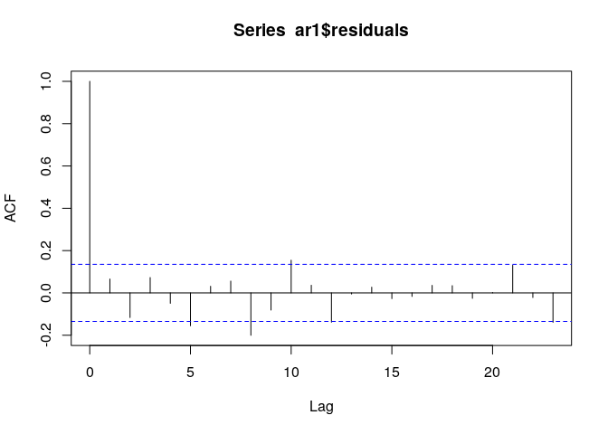
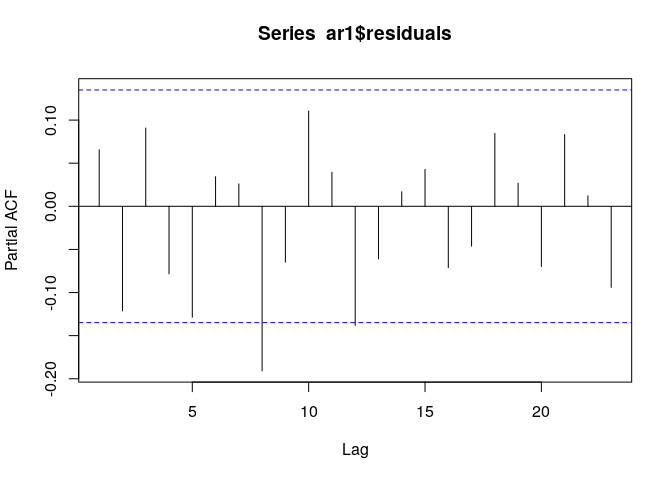
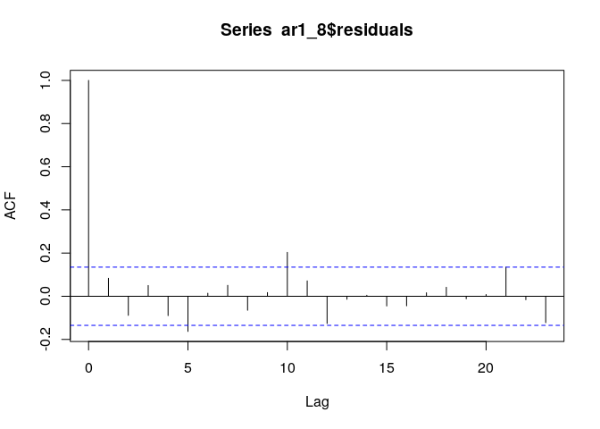
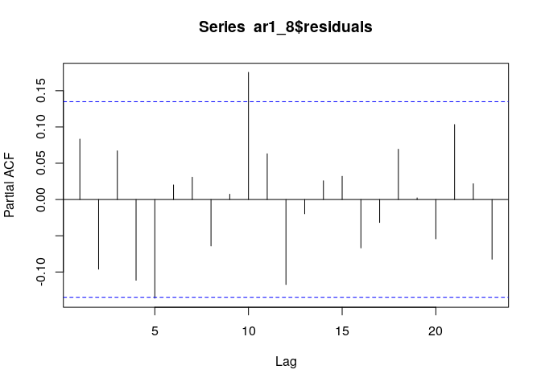
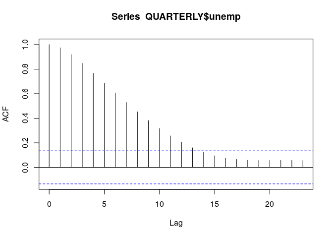
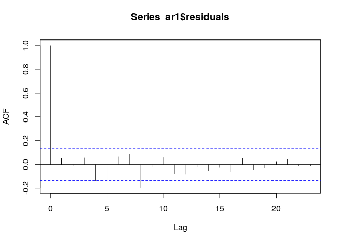
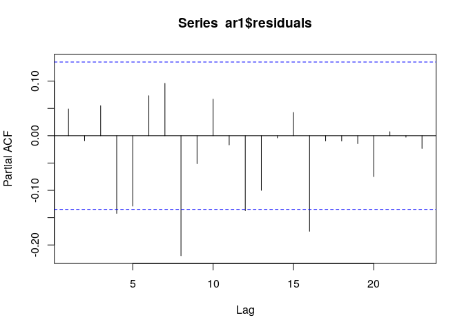

第2章 練習問題\[13\]
================

# \[13\]

QUARTERLY.XLSには鉱工業生産指数（indprod）、失業率（unemp）が含まれてる。

## (a)

yt = ln(indprot_t) - ln(indprod_t-1) とし、標本ACF, PACFを確認せよ。

``` r
library(data.table)
library(dplyr)
```

    ## 
    ##  次のパッケージを付け加えます: 'dplyr'

    ##  以下のオブジェクトは 'package:data.table' からマスクされています:
    ## 
    ##     between, first, last

    ##  以下のオブジェクトは 'package:stats' からマスクされています:
    ## 
    ##     filter, lag

    ##  以下のオブジェクトは 'package:base' からマスクされています:
    ## 
    ##     intersect, setdiff, setequal, union

``` r
library(ggplot2)

QUARTERLY <- fread("../data/QUARTERLY.csv")

# データのインデックス列に列名が無いためtimeを列名とする
QUARTERLY <- dplyr::rename(QUARTERLY, Q = V1)
```

``` r
yt <- log(QUARTERLY$indprod) - log(lag(QUARTERLY$indprod, n=1))
yt <- yt[2:length(yt)]
print(head(yt))
```

    ## [1] -0.02196962 -0.01679988 -0.02418232 -0.01524693  0.03856006  0.03166717

``` r
acf(yt)
```

<!-- -->

``` r
pacf(yt)
```

<!-- -->

-   ACFは低次で減衰
-   PACFは1次に大きな尖り→AR(1)モデルの可能性あり
    -   PACFは4, 8で有意なので、これらのAR項が存在する可能性あり

## (b)

低次のACFが高いことから、AR(1)として推定すると、  
yt = 0.0028 + 0.600yt-1 + et  
となることを確認せよ。（t値は2.96と10.95となる）

``` r
ar1 <- arima(yt, c(1, 0, 0))
print(ar1)
```

    ## 
    ## Call:
    ## arima(x = yt, order = c(1, 0, 0))
    ## 
    ## Coefficients:
    ##          ar1  intercept
    ##       0.6063     0.0065
    ## s.e.  0.0549     0.0022
    ## 
    ## sigma^2 estimated as 0.0001614:  log likelihood = 621.54,  aic = -1237.08

``` r
acf(ar1$residuals)
```

<!-- -->

``` r
pacf(ar1$residuals)
```

<!-- -->

定数項の結果が異なる…？  
こんなものか？

-   残差のACF,
    PACFともに有意なlagが残っており、残差に系列相関が残っていることを示唆している
    -   PACFでlag8が大きな値を取っているので、lag8の項を入れることを考慮する

## (c)

yt-8を説明変数に加えるとデータとの当てはまりが改善し、残差の系列相関も緩和されることを確認せよ。  
また、yt-8を説明変数に加えることに何らかの懸念があれば述べよ。

``` r
ar1_8 <- arima(yt, c(8, 0, 0),
               transform.pars = FALSE,
               fixed = c(NA, 0, 0, 0, 0, 0, 0, NA, NA))
print(ar1_8)
```

    ## 
    ## Call:
    ## arima(x = yt, order = c(8, 0, 0), transform.pars = FALSE, fixed = c(NA, 0, 0, 
    ##     0, 0, 0, 0, NA, NA))
    ## 
    ## Coefficients:
    ##          ar1  ar2  ar3  ar4  ar5  ar6  ar7      ar8  intercept
    ##       0.5943    0    0    0    0    0    0  -0.1416     0.0065
    ## s.e.  0.0543    0    0    0    0    0    0   0.0558     0.0016
    ## 
    ## sigma^2 estimated as 0.0001565:  log likelihood = 624.7,  aic = -1241.39

``` r
acf(ar1_8$residuals)
```

<!-- -->

``` r
pacf(ar1_8$residuals)
```

<!-- -->

-   AICは改善している
-   が、lag10に系列相関が残っている。
-   lag8の項を加える懸念は、以下の2点
    -   鉱工業生産指数が8期前に依存する理由が見当たらない
    -   過学習の懸念がある

## (d)

失業率をutと表示する。このとき、utの標本ACFを求めよ。  
その結果から、この毛列は定常といえそうかを述べよ。

``` r
acf(QUARTERLY$unemp)
```

<!-- -->

-   標本ACFは指数に比べるとゆっくり減衰している。AR, MA,
    ARMAなどの定常時系列であれば標本ACFは指数的に減衰するので、失業率の時系列は非定常である可能性がある。

## (e)

失業率をAR(2)モデルで推定すると、  
ut = 0.226 + 1.65ut-1 - 0.683ut-2 + et  
となることを確認せよ。特性根を求めて、この確率過程の特徴を述べよ。

``` r
ut <- QUARTERLY$unemp
ar2 <- arima(ut, c(2, 0, 0))
print(ar2)
```

    ## 
    ## Call:
    ## arima(x = ut, order = c(2, 0, 0))
    ## 
    ## Coefficients:
    ##          ar1     ar2  intercept
    ##       1.6404  -0.678     6.0866
    ## s.e.  0.0498   0.050     0.4341
    ## 
    ## sigma^2 estimated as 0.06044:  log likelihood = -5.54,  aic = 19.08

-   切片の値が書籍と大きく異なるが…ar1,
    ar2の係数は大体同じなので良しとする

``` r
# 特性方程式を解く関数
solve_quadratic_eqs <- function(a, b, c){
  d = b^2 - 4 * a * c
  rat = - b / (2 * a)
  irrat = sqrt(abs(d)) / 2 * a
  
  if(d > 0) {
    ans = c(rat + round(irrat, 3), rat - round(irrat, 3))
  } else if(d == 0) {
    ans = rat
  } else {
    ans = c(complex(real = rat, imaginary = round(irrat, 3)),
            complex(real = rat, imaginary = -round(irrat, 3)))
  }
  
  return(ans = ans)
}

# AR(2)の係数を代入して特性根を求める
solve_quadratic_eqs(1, -1.6404, 0.678)
```

    ## [1] 0.8202+0.073i 0.8202-0.073i

-   特性根は2つとも虚数であり、両方とも実部が1より小さいので、特性解は振動しつつ減衰する

## (f)

失業率の階差をAR(1)モデルで推定し、(d), (e)の結果と比較せよ。

``` r
ut <- QUARTERLY$unemp - lag(QUARTERLY$unemp, n = 1)
ut <- ut[2:length(ut)]
ar1 <- arima(ut, c(1, 0, 0))

print(ar1)
```

    ## 
    ## Call:
    ## arima(x = ut, order = c(1, 0, 0))
    ## 
    ## Coefficients:
    ##          ar1  intercept
    ##       0.6591     0.0117
    ## s.e.  0.0513     0.0507
    ## 
    ## sigma^2 estimated as 0.06406:  log likelihood = -9.77,  aic = 25.54

``` r
acf(ar1$residuals)
```

<!-- -->

``` r
pacf(ar1$residuals)
```

<!-- -->

-   AICがar(2)モデルよりも悪化しているので当てはまりが悪くなっている
-   残差のACF,
    PACFを見ると系列相関が残っているので、階差のAR(1)モデルは不適切なモデルであると考えられる。
