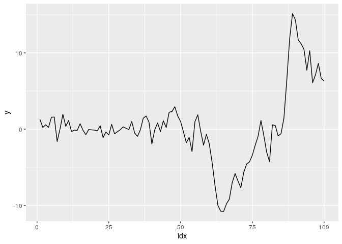
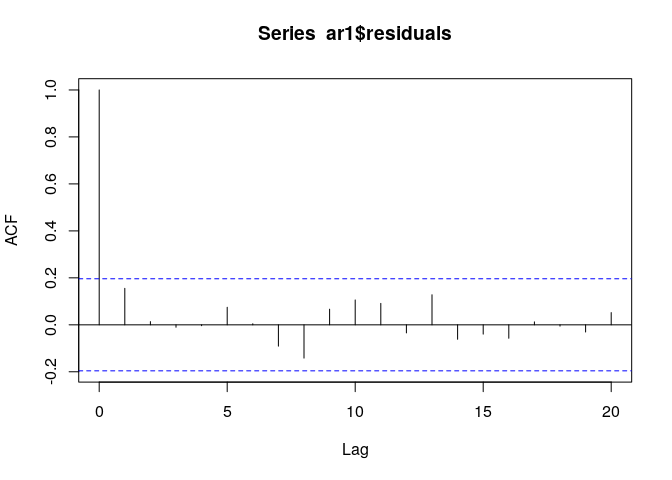
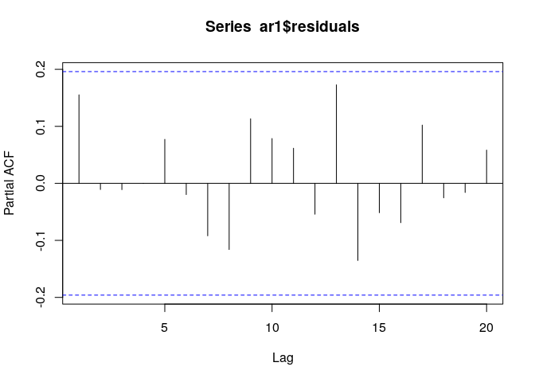
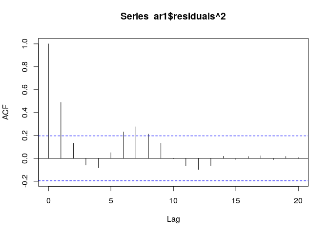
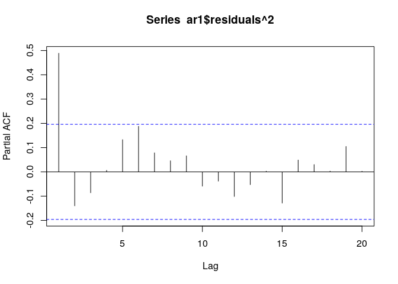

第3章 練習問題\[7\]
================

# \[7\]

`ARCH.XLS` の1列目の系列yはモデル  
yt = 0.9yt-1 + et,  
et = vt(1 + 0.8 et-1<sup>2)</sup>(1/2)  
から発生させたデータである。これを調べると、標本平均は
0.263、標本標準偏差は 4.894、 最小値、最大値はそれぞれ -10.8, 15.15
となる。

``` r
# まずはプロットしてみて基本統計量を計算してみる
library(data.table)
library(ggplot2)

ARCH <- fread("../data/ARCH.csv")
# とりあえずindex列を付け加えておく
ARCH$idx <- 1:nrow(ARCH)
print(head(ARCH))
```

    ##         y    y_m idx
    ## 1: 1.2730 1.4323   1
    ## 2: 0.2211 1.4064   2
    ## 3: 0.5709 0.6849   3
    ## 4: 0.2239 0.7005   4
    ## 5: 1.5600 1.1220   5
    ## 6: 1.5800 0.8773   6

``` r
# plot
g <- ggplot(data = ARCH, aes(x = idx, y = y)) +
     geom_line()
plot(g)
```

<!-- -->

``` r
# 基本統計量
print(list(
  mean = mean(ARCH$y),
  std = sqrt(var(ARCH$y)),
  max = max(ARCH$y),
  min = min(ARCH$y)
))
```

    ## $mean
    ## [1] 0.2633695
    ## 
    ## $std
    ## [1] 4.894091
    ## 
    ## $max
    ## [1] 15.15
    ## 
    ## $min
    ## [1] -10.8

-   プロットから明らかに不均一分散が生じている

## (a)

OLS推定をすると、以下の結果が得られることを確認せよ。  
yt = 0.944(26.51) yt-1 + et

``` r
# AR(1)モデルで推定する
ar1 <- arima(ARCH$y, c(1, 0, 0), include.mean = FALSE)
print(ar1)
```

    ## 
    ## Call:
    ## arima(x = ARCH$y, order = c(1, 0, 0), include.mean = FALSE)
    ## 
    ## Coefficients:
    ##          ar1
    ##       0.9357
    ## s.e.  0.0329
    ## 
    ## sigma^2 estimated as 2.913:  log likelihood = -196.39,  aic = 396.79

-   おおよそ書籍と同じ結果が得られた

## (b)

残差の標本ACF,
PACFを求めよ。修正Q統計量を用いて系列相関があるか確認せよ。

``` r
# ACF
acf(ar1$residuals)
```

<!-- -->

``` r
# PACF
pacf(ar1$residuals)
```

<!-- -->

``` r
# とりあえずlag5, lag10で修正Q統計量を計算してみる
print(list(
  Q5_pval = Box.test(ar1$residuals, lag = 5, type = "Ljung-Box")$p.value,
  Q10_pval = Box.test(ar1$residuals, lag = 10, type = "Ljung-Box")$p.value
))
```

    ## $Q5_pval
    ## [1] 0.6825352
    ## 
    ## $Q10_pval
    ## [1] 0.6274649

-   ACF, PACF, 修正Q統計量とも系列相関がないことを示している。

## (c)

残差2乗の標本ACF, PACFを求めよ。ARCH効果が無いと言えるか。

``` r
# ACF
acf(ar1$residuals^2)
```

<!-- -->

``` r
# PACF
pacf(ar1$residuals^2)
```

<!-- -->

-   残差2乗のACFはlag1,
    lag8で有意であるため、ARCH効果が存在する可能性がある

## (c)

残差2乗を1期前の残差2乗でOLS推定せよ。LM検定をすると TR^2 =
22.03となることを確認せよ。

``` r
library(dplyr)
```

    ## 
    ##  次のパッケージを付け加えます: 'dplyr'

    ##  以下のオブジェクトは 'package:data.table' からマスクされています:
    ## 
    ##     between, first, last

    ##  以下のオブジェクトは 'package:stats' からマスクされています:
    ## 
    ##     filter, lag

    ##  以下のオブジェクトは 'package:base' からマスクされています:
    ## 
    ##     intersect, setdiff, setequal, union

``` r
res2 <- as.vector(ar1$residuals^2)
df <- data.frame(res2 = res2) %>% mutate(res2_lag1 = lag(res2))

res_lag1_results <- lm(res2 ~ res2_lag1, df)
summary(res_lag1_results)
```

    ## 
    ## Call:
    ## lm(formula = res2 ~ res2_lag1, data = df)
    ## 
    ## Residuals:
    ##     Min      1Q  Median      3Q     Max 
    ## -11.679  -1.878  -1.114   0.278  21.679 
    ## 
    ## Coefficients:
    ##             Estimate Std. Error t value Pr(>|t|)    
    ## (Intercept)  1.49721    0.54093   2.768  0.00676 ** 
    ## res2_lag1    0.49047    0.08851   5.542 2.57e-07 ***
    ## ---
    ## Signif. codes:  0 '***' 0.001 '**' 0.01 '*' 0.05 '.' 0.1 ' ' 1
    ## 
    ## Residual standard error: 4.717 on 97 degrees of freedom
    ##   ( 1 個の観測値が欠損のため削除されました )
    ## Multiple R-squared:  0.2405, Adjusted R-squared:  0.2326 
    ## F-statistic: 30.71 on 1 and 97 DF,  p-value: 2.573e-07

-   TR^2 = 100 \* 0.24 = 24で値としては大きい。
    -   実際、F統計量のp値も小さく、上記の回帰式の係数は有意であるため、ARCH効果が存在する可能性がある。

## (d)

ARCH(1)モデルを推定せよ。以下の結果が得られることを確認せよ。  
yt = 0.886(32.79)yt-1 + et,  
ht = 1.19(4.02) + 0.663(2.89)et-1^2

``` r
library(fGarch)
```

    ## NOTE: Packages 'fBasics', 'timeDate', and 'timeSeries' are no longer
    ## attached to the search() path when 'fGarch' is attached.
    ## 
    ## If needed attach them yourself in your R script by e.g.,
    ##         require("timeSeries")

``` r
arch1 <- garchFit(formula = ~ arma(1, 0) + garch(1, 0), data = ARCH$y,
                  include.mean = FALSE, trace = FALSE)
print(arch1)
```

    ## 
    ## Title:
    ##  GARCH Modelling 
    ## 
    ## Call:
    ##  garchFit(formula = ~arma(1, 0) + garch(1, 0), data = ARCH$y, 
    ##     include.mean = FALSE, trace = FALSE) 
    ## 
    ## Mean and Variance Equation:
    ##  data ~ arma(1, 0) + garch(1, 0)
    ## <environment: 0x55ba63d074a0>
    ##  [data = ARCH$y]
    ## 
    ## Conditional Distribution:
    ##  norm 
    ## 
    ## Coefficient(s):
    ##     ar1    omega   alpha1  
    ## 0.88610  1.16475  0.65204  
    ## 
    ## Std. Errors:
    ##  based on Hessian 
    ## 
    ## Error Analysis:
    ##         Estimate  Std. Error  t value Pr(>|t|)    
    ## ar1      0.88610     0.02337   37.918  < 2e-16 ***
    ## omega    1.16475     0.28324    4.112 3.92e-05 ***
    ## alpha1   0.65204     0.22029    2.960  0.00308 ** 
    ## ---
    ## Signif. codes:  0 '***' 0.001 '**' 0.01 '*' 0.05 '.' 0.1 ' ' 1
    ## 
    ## Log Likelihood:
    ##  -183.0123    normalized:  -1.830123 
    ## 
    ## Description:
    ##  Mon Sep 12 23:00:34 2022 by user:

-   おおよそ書籍と同じ結果が得られた。
