第3章 練習問題\[8\]
================

# \[8\]

`ARCH.XLS` の2列目の系列 y_m はARCH-M 過程から発生させたデータである。

``` r
# まずはデータを基本統計量を算出してプロットする
library(data.table)
library(ggplot2)

ARCH <- fread("../data/ARCH.csv")
ARCH_ym <- ARCH$y_m

# 基本統計量とか
print(list(
  len = length(ARCH_ym),
  mean = mean(ARCH_ym),
  std = sqrt(var(ARCH_ym)),
  max = max(ARCH_ym),
  min = min(ARCH_ym)
))
```

    ## $len
    ## [1] 100
    ## 
    ## $mean
    ## [1] 1.069885
    ## 
    ## $std
    ## [1] 0.5167263
    ## 
    ## $max
    ## [1] 2.6682
    ## 
    ## $min
    ## [1] -0.4085

``` r
# プロット
plot(1:length(ARCH_ym), ARCH_ym, type = "l")
```

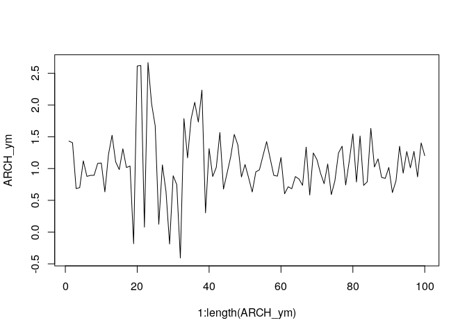<!-- -->

``` r
# ACF
acf(ARCH_ym)
```

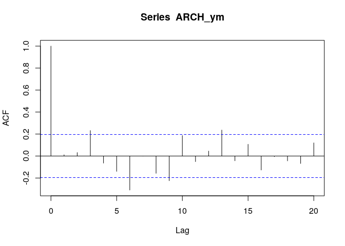<!-- -->

``` r
# PACF
pacf(ARCH_ym)
```

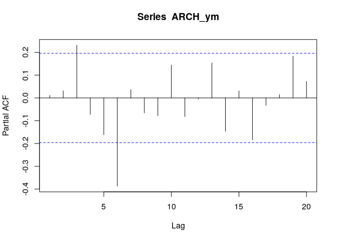<!-- -->

-   プロットから平均は期間を通して一定っぽいが、不均一分散が生じている
    -   細かく見ると、分散が大きいときにymの値も大きくなっている。ARCH-M効果がある可能性がある
-   ACFはlag0以外で小さな値を取っているのでεt の誤差項のみの可能性がある
    -   一方でlag3,
        lag6あたりで有意なため、これらのlagを含んだモデルを考慮しても良さそう

## (a)

ARCH-M過程を推定し、以下の結果を確認せよ。  
yt = 0.908(14.05) + 0.625(1.79)ht + et  
ht = 0.108(4.02) + 0.597(e_t-1)^2

``` r
# ARCH-Mを推定するためには rugarch パッケージが必要そう
library(rugarch)
```

    ##  要求されたパッケージ parallel をロード中です

    ## 
    ##  次のパッケージを付け加えます: 'rugarch'

    ##  以下のオブジェクトは 'package:stats' からマスクされています:
    ## 
    ##     sigma

``` r
arch_m_MA1 <- ugarchspec(mean.model = list(armaOrder = c(0, 0), archm = TRUE, archpow = 2),
                         variance.model = list(garchOrder = c(1, 0)))
fit_arch_m_MA1 <- ugarchfit(arch_m_MA1, data = ARCH_ym)

fit_arch_m_MA1
```

    ## 
    ## *---------------------------------*
    ## *          GARCH Model Fit        *
    ## *---------------------------------*
    ## 
    ## Conditional Variance Dynamics    
    ## -----------------------------------
    ## GARCH Model  : sGARCH(1,0)
    ## Mean Model   : ARFIMA(0,0,0)
    ## Distribution : norm 
    ## 
    ## Optimal Parameters
    ## ------------------------------------
    ##         Estimate  Std. Error  t value Pr(>|t|)
    ## mu       0.91680    0.061021  15.0243 0.000000
    ## archm    0.62466    0.265224   2.3552 0.018512
    ## omega    0.10864    0.025290   4.2958 0.000017
    ## alpha1   0.57891    0.234394   2.4698 0.013519
    ## 
    ## Robust Standard Errors:
    ##         Estimate  Std. Error  t value Pr(>|t|)
    ## mu       0.91680    0.061472  14.9141 0.000000
    ## archm    0.62466    0.186555   3.3484 0.000813
    ## omega    0.10864    0.034032   3.1923 0.001411
    ## alpha1   0.57891    0.218021   2.6553 0.007924
    ## 
    ## LogLikelihood : -57.66423 
    ## 
    ## Information Criteria
    ## ------------------------------------
    ##                    
    ## Akaike       1.2333
    ## Bayes        1.3375
    ## Shibata      1.2302
    ## Hannan-Quinn 1.2755
    ## 
    ## Weighted Ljung-Box Test on Standardized Residuals
    ## ------------------------------------
    ##                         statistic p-value
    ## Lag[1]                    0.07916  0.7784
    ## Lag[2*(p+q)+(p+q)-1][2]   0.07917  0.9345
    ## Lag[4*(p+q)+(p+q)-1][5]   2.15695  0.5818
    ## d.o.f=0
    ## H0 : No serial correlation
    ## 
    ## Weighted Ljung-Box Test on Standardized Squared Residuals
    ## ------------------------------------
    ##                         statistic  p-value
    ## Lag[1]                     0.2683 0.604447
    ## Lag[2*(p+q)+(p+q)-1][2]    0.4373 0.723765
    ## Lag[4*(p+q)+(p+q)-1][5]   12.5602 0.001984
    ## d.o.f=1
    ## 
    ## Weighted ARCH LM Tests
    ## ------------------------------------
    ##             Statistic Shape Scale   P-Value
    ## ARCH Lag[2]    0.3247 0.500 2.000 5.688e-01
    ## ARCH Lag[4]   14.5267 1.397 1.611 3.407e-04
    ## ARCH Lag[6]   19.2414 2.222 1.500 5.973e-05
    ## 
    ## Nyblom stability test
    ## ------------------------------------
    ## Joint Statistic:  0.9035
    ## Individual Statistics:              
    ## mu     0.18187
    ## archm  0.03351
    ## omega  0.34025
    ## alpha1 0.14631
    ## 
    ## Asymptotic Critical Values (10% 5% 1%)
    ## Joint Statistic:          1.07 1.24 1.6
    ## Individual Statistic:     0.35 0.47 0.75
    ## 
    ## Sign Bias Test
    ## ------------------------------------
    ##                    t-value   prob sig
    ## Sign Bias           1.1709 0.2446    
    ## Negative Sign Bias  0.1681 0.8669    
    ## Positive Sign Bias  0.5321 0.5959    
    ## Joint Effect        1.6572 0.6465    
    ## 
    ## 
    ## Adjusted Pearson Goodness-of-Fit Test:
    ## ------------------------------------
    ##   group statistic p-value(g-1)
    ## 1    20      24.4       0.1813
    ## 2    30      35.6       0.1855
    ## 3    40      42.4       0.3266
    ## 4    50      57.0       0.2020
    ## 
    ## 
    ## Elapsed time : 0.5620458

-   おおよそ書籍と同じ結果が得られた

## (b)

推定された{et}系列のACFとPACFを調べよ。この系列は適当と言えるか。もし不適当ならARCH-Mの他の定式化を試してみよ。

残差の系列相関をチェックする。

``` r
# ARCH系のモデル診断は標準化残差を用いる点に注意。P.151参照
# 残差を標準化するために、standardize = T のオプションをつける
res <- as.vector(residuals(fit_arch_m_MA1, standardize = T))

# 残差のACF
acf(res)
```

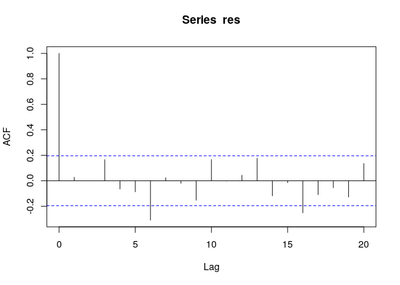<!-- -->

``` r
# 残差のPACF
pacf(res)
```

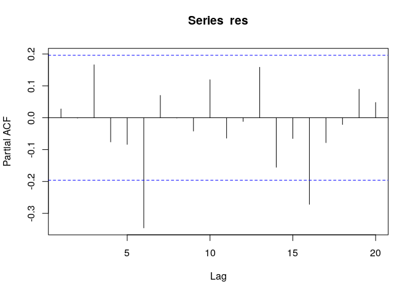<!-- -->

``` r
# 残差2乗のACF
acf(res^2)
```

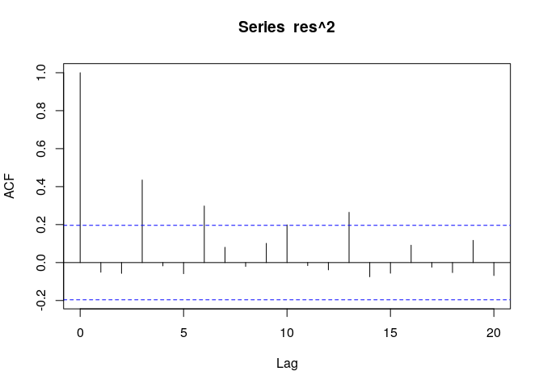<!-- -->

``` r
# 残差2乗のPACF
pacf(res^2)
```

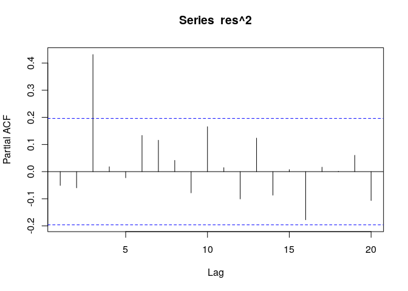<!-- -->

-   残差のACF, PACFにおいてlag6,
    lag16が有意であるため、系列相関が残っていると考えられる
-   残差2乗にも系列相関が残っている

他のモデルを試してみる。  
よく使われるらしいGARCH(1, 1)を試してみる。

``` r
arch_m_garch11 <- ugarchspec(mean.model = list(armaOrder = c(0, 0), archm = T, archpow = 2),
                             variance.model = list(garchOrder = c(1, 1)))
fit <- ugarchfit(arch_m_garch11, data = ARCH_ym)
print(fit)
```

    ## 
    ## *---------------------------------*
    ## *          GARCH Model Fit        *
    ## *---------------------------------*
    ## 
    ## Conditional Variance Dynamics    
    ## -----------------------------------
    ## GARCH Model  : sGARCH(1,1)
    ## Mean Model   : ARFIMA(0,0,0)
    ## Distribution : norm 
    ## 
    ## Optimal Parameters
    ## ------------------------------------
    ##         Estimate  Std. Error  t value Pr(>|t|)
    ## mu       0.91580    0.057286  15.9864 0.000000
    ## archm    0.66792    0.335694   1.9897 0.046627
    ## omega    0.02534    0.013108   1.9332 0.053210
    ## alpha1   0.26756    0.104358   2.5638 0.010353
    ## beta1    0.60513    0.122503   4.9397 0.000001
    ## 
    ## Robust Standard Errors:
    ##         Estimate  Std. Error  t value Pr(>|t|)
    ## mu       0.91580    0.077732  11.7816 0.000000
    ## archm    0.66792    0.377362   1.7700 0.076732
    ## omega    0.02534    0.018451   1.3733 0.169645
    ## alpha1   0.26756    0.108113   2.4748 0.013332
    ## beta1    0.60513    0.146306   4.1360 0.000035
    ## 
    ## LogLikelihood : -52.33949 
    ## 
    ## Information Criteria
    ## ------------------------------------
    ##                    
    ## Akaike       1.1468
    ## Bayes        1.2770
    ## Shibata      1.1421
    ## Hannan-Quinn 1.1995
    ## 
    ## Weighted Ljung-Box Test on Standardized Residuals
    ## ------------------------------------
    ##                         statistic p-value
    ## Lag[1]                     0.2002  0.6546
    ## Lag[2*(p+q)+(p+q)-1][2]    0.2092  0.8486
    ## Lag[4*(p+q)+(p+q)-1][5]    2.1268  0.5888
    ## d.o.f=0
    ## H0 : No serial correlation
    ## 
    ## Weighted Ljung-Box Test on Standardized Squared Residuals
    ## ------------------------------------
    ##                         statistic p-value
    ## Lag[1]                     0.9411  0.3320
    ## Lag[2*(p+q)+(p+q)-1][5]    2.5714  0.4909
    ## Lag[4*(p+q)+(p+q)-1][9]    4.6200  0.4873
    ## d.o.f=2
    ## 
    ## Weighted ARCH LM Tests
    ## ------------------------------------
    ##             Statistic Shape Scale P-Value
    ## ARCH Lag[3]     1.829 0.500 2.000  0.1762
    ## ARCH Lag[5]     2.848 1.440 1.667  0.3126
    ## ARCH Lag[7]     4.285 2.315 1.543  0.3073
    ## 
    ## Nyblom stability test
    ## ------------------------------------
    ## Joint Statistic:  1.0105
    ## Individual Statistics:              
    ## mu     0.15739
    ## archm  0.09629
    ## omega  0.20180
    ## alpha1 0.23527
    ## beta1  0.15428
    ## 
    ## Asymptotic Critical Values (10% 5% 1%)
    ## Joint Statistic:          1.28 1.47 1.88
    ## Individual Statistic:     0.35 0.47 0.75
    ## 
    ## Sign Bias Test
    ## ------------------------------------
    ##                    t-value   prob sig
    ## Sign Bias           1.4268 0.1569    
    ## Negative Sign Bias  0.7898 0.4316    
    ## Positive Sign Bias  0.6636 0.5085    
    ## Joint Effect        2.0854 0.5549    
    ## 
    ## 
    ## Adjusted Pearson Goodness-of-Fit Test:
    ## ------------------------------------
    ##   group statistic p-value(g-1)
    ## 1    20      13.6       0.8065
    ## 2    30      27.8       0.5286
    ## 3    40      29.6       0.8615
    ## 4    50      47.0       0.5546
    ## 
    ## 
    ## Elapsed time : 0.09443641

``` r
# ARCH系のモデル診断は標準化残差を用いる点に注意。P.151参照
# 残差を標準化するために、standardize = T のオプションをつける
res <- as.vector(residuals(fit, standardize = T))

# 残差のACF
acf(res)
```

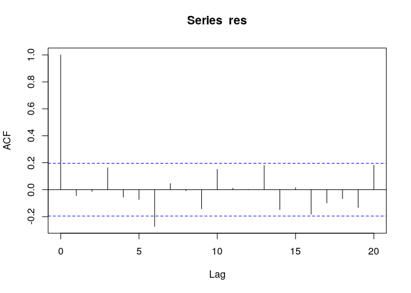<!-- -->

``` r
# 残差のPACF
pacf(res)
```

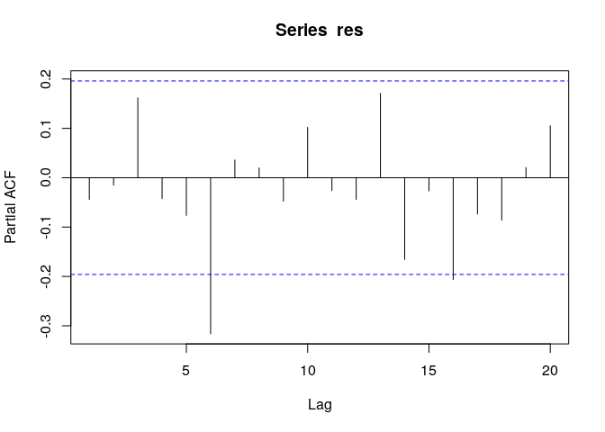<!-- -->

``` r
# 残差2乗のACF
acf(res^2)
```

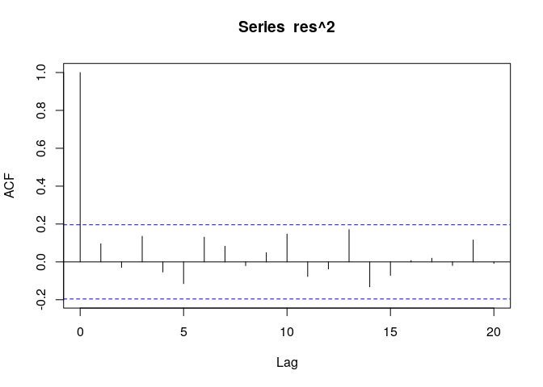<!-- -->

``` r
# 残差2乗のPACF
pacf(res^2)
```

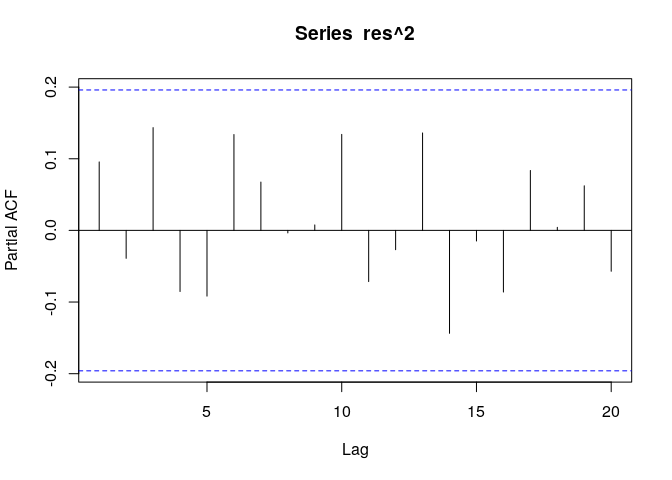<!-- -->

-   AIC,
    BIDが改善しており、モデルの当てはまりが良くなっていることがわかる
-   残差2乗から系列相関が消えており、GARCH(1,
    1)は分散をうまくモデル化できていると考えられる
-   一方、残差にはまだ系列相関が残っている

残差はうまくモデル化できていると判断し、平均をARMA過程でモデル化する。ARMAの次数は試行錯誤してみる。  
さらに、GARCH(1, 1)の係数の和が1に近いと考え、iGARCHモデルにしてみる。

``` r
# ARMA(3, 3)が良さそう。本当はet-6の項だけを入れたかったが方法がわからなかった...
m <- ugarchspec(mean.model = list(armaOrder = c(3, 3), archm = T, archpow = 2),
                             variance.model = list(garchOrder = c(1, 1), model = "iGARCH"))
fit <- ugarchfit(m, data = ARCH_ym)
print(fit)
```

    ## 
    ## *---------------------------------*
    ## *          GARCH Model Fit        *
    ## *---------------------------------*
    ## 
    ## Conditional Variance Dynamics    
    ## -----------------------------------
    ## GARCH Model  : iGARCH(1,1)
    ## Mean Model   : ARFIMA(3,0,3)
    ## Distribution : norm 
    ## 
    ## Optimal Parameters
    ## ------------------------------------
    ##         Estimate  Std. Error   t value Pr(>|t|)
    ## mu      1.006717    0.042401   23.7426 0.000000
    ## ar1    -0.173727    0.059039   -2.9426 0.003255
    ## ar2    -0.240576    0.075480   -3.1873 0.001436
    ## ar3    -0.629531    0.052841  -11.9136 0.000000
    ## ma1     0.057695    0.016950    3.4038 0.000665
    ## ma2     0.360169    0.001097  328.2397 0.000000
    ## ma3     0.950429    0.000306 3104.2340 0.000000
    ## archm   0.273097    0.157176    1.7375 0.082296
    ## omega   0.004789    0.005381    0.8901 0.373413
    ## alpha1  0.284116    0.104905    2.7083 0.006762
    ## beta1   0.715884          NA        NA       NA
    ## 
    ## Robust Standard Errors:
    ##         Estimate  Std. Error   t value Pr(>|t|)
    ## mu      1.006717    0.039052   25.7787 0.000000
    ## ar1    -0.173727    0.073003   -2.3797 0.017325
    ## ar2    -0.240576    0.070749   -3.4004 0.000673
    ## ar3    -0.629531    0.052773  -11.9291 0.000000
    ## ma1     0.057695    0.017535    3.2903 0.001001
    ## ma2     0.360169    0.001115  323.0954 0.000000
    ## ma3     0.950429    0.000819 1160.5354 0.000000
    ## archm   0.273097    0.142445    1.9172 0.055212
    ## omega   0.004789    0.004450    1.0763 0.281784
    ## alpha1  0.284116    0.100462    2.8281 0.004683
    ## beta1   0.715884          NA        NA       NA
    ## 
    ## LogLikelihood : -41.80358 
    ## 
    ## Information Criteria
    ## ------------------------------------
    ##                    
    ## Akaike       1.0361
    ## Bayes        1.2966
    ## Shibata      1.0184
    ## Hannan-Quinn 1.1415
    ## 
    ## Weighted Ljung-Box Test on Standardized Residuals
    ## ------------------------------------
    ##                          statistic p-value
    ## Lag[1]                    0.001364  0.9705
    ## Lag[2*(p+q)+(p+q)-1][17]  6.599720  1.0000
    ## Lag[4*(p+q)+(p+q)-1][29] 14.404424  0.5574
    ## d.o.f=6
    ## H0 : No serial correlation
    ## 
    ## Weighted Ljung-Box Test on Standardized Squared Residuals
    ## ------------------------------------
    ##                         statistic p-value
    ## Lag[1]                   0.002702  0.9585
    ## Lag[2*(p+q)+(p+q)-1][5]  0.459840  0.9637
    ## Lag[4*(p+q)+(p+q)-1][9]  1.930488  0.9131
    ## d.o.f=2
    ## 
    ## Weighted ARCH LM Tests
    ## ------------------------------------
    ##             Statistic Shape Scale P-Value
    ## ARCH Lag[3] 9.659e-07 0.500 2.000  0.9992
    ## ARCH Lag[5] 6.784e-01 1.440 1.667  0.8300
    ## ARCH Lag[7] 2.005e+00 2.315 1.543  0.7163
    ## 
    ## Nyblom stability test
    ## ------------------------------------
    ## Joint Statistic:  1.9287
    ## Individual Statistics:              
    ## mu     0.06045
    ## ar1    0.03984
    ## ar2    0.11800
    ## ar3    0.03486
    ## ma1    0.05065
    ## ma2    0.13059
    ## ma3    0.04470
    ## archm  0.08351
    ## omega  0.13235
    ## alpha1 0.07167
    ## 
    ## Asymptotic Critical Values (10% 5% 1%)
    ## Joint Statistic:          2.29 2.54 3.05
    ## Individual Statistic:     0.35 0.47 0.75
    ## 
    ## Sign Bias Test
    ## ------------------------------------
    ##                    t-value   prob sig
    ## Sign Bias          0.08461 0.9327    
    ## Negative Sign Bias 0.42384 0.6726    
    ## Positive Sign Bias 0.06233 0.9504    
    ## Joint Effect       0.30236 0.9596    
    ## 
    ## 
    ## Adjusted Pearson Goodness-of-Fit Test:
    ## ------------------------------------
    ##   group statistic p-value(g-1)
    ## 1    20      26.0      0.13019
    ## 2    30      41.6      0.06098
    ## 3    40      43.9      0.27160
    ## 4    50      58.0      0.17743
    ## 
    ## 
    ## Elapsed time : 0.5255125

``` r
# ARCH系のモデル診断は標準化残差を用いる点に注意。P.151参照
# 残差を標準化するために、standardize = T のオプションをつける
res <- as.vector(residuals(fit, standardize = T))

# 残差のACF
acf(res)
```

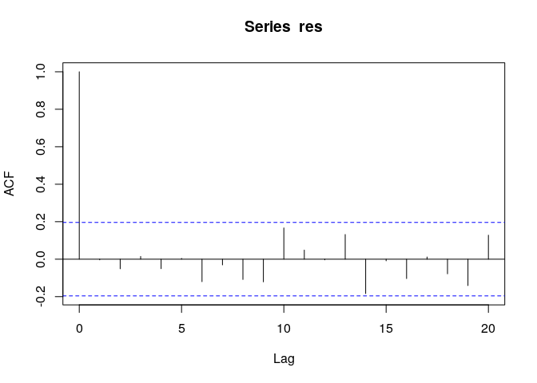<!-- -->

``` r
# 残差のPACF
pacf(res)
```

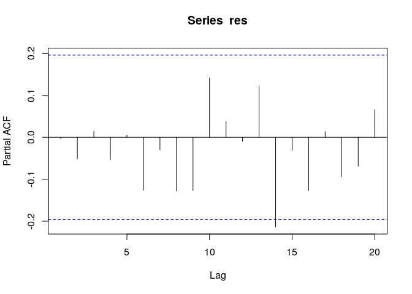<!-- -->

``` r
# 残差2乗のACF
acf(res^2)
```

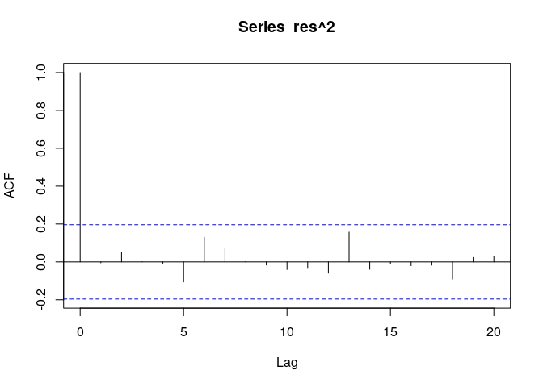<!-- -->

``` r
# 残差2乗のPACF
pacf(res^2)
```

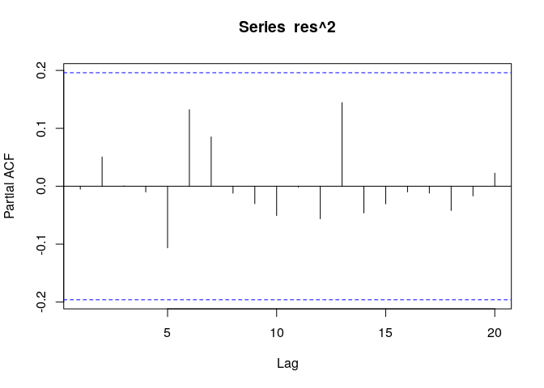<!-- -->

-   BICは若干悪化したが、AICが改善し、残差の系列相関も小さくなった。モデルが改善したと言える
-   GARCHの次数をいじってみたが、残差の系列相関はほとんど変化しなかった
  -   残差の系列相関は平均のモデルへの依存性が高いものと考えられる
