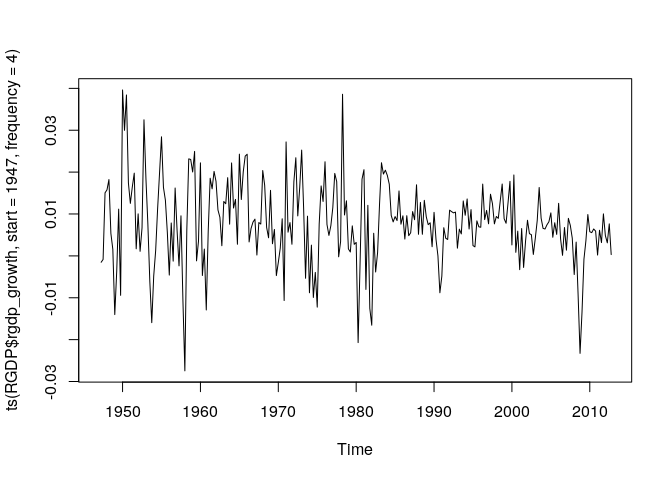

第3章 練習問題\[9\]
================

# \[9\]

`RGDP.XLS` の実質GDP（rgdp）を用いて以下の問いに答えよ。

## (a)

3.4「大いなる安定は存在していたか」（p.141 \~
p.142）の推定結果を再現せよ。  
D1は1983Q4まで0,
それ以降は1となるダミー変数とし、この変数を推定に用いること。

まずデータの前処理として、GDPの成長率yt = ln(RGDP_t /
RGDP_t-1)を算出し、  
与えられたダミー変数を作成する。

``` r
# まずはデータを基本統計量を算出してプロットする
library(data.table)
library(ggplot2)
library(dplyr)
```

    ## 
    ##  次のパッケージを付け加えます: 'dplyr'

    ##  以下のオブジェクトは 'package:data.table' からマスクされています:
    ## 
    ##     between, first, last

    ##  以下のオブジェクトは 'package:stats' からマスクされています:
    ## 
    ##     filter, lag

    ##  以下のオブジェクトは 'package:base' からマスクされています:
    ## 
    ##     intersect, setdiff, setequal, union

``` r
RGDP <- fread("../data/RGDP.csv")
# データのインデックスに列名が無いため日付dateとして設定する
RGDP <- dplyr::rename(RGDP, date = V1)
# timeを日付に変換
RGDP$date <- as.Date(RGDP$date)

# GDP成長率を算出
RGDP$rgdp_growth <- c(NA, diff(log(RGDP$rgdp)))

# ダミー変数を作成
# 書籍では初めの期間をD1=0, 後の期間をD1=1としていたが、
# Rでは初めの期間をD1=1, 後の期間をD1=0としないと書籍の結果を再現できなかった
# 謎
# 書籍の通りのダミー変数の設定にすると、ダミー変数の係数が0になってしまう。
# 謎
RGDP$D1 <- 0
RGDP$D1[1:which(RGDP$date == as.Date("1983-10-01"))] = 1

# 基本統計量とか
print(list(
  len = length(RGDP$rgdp_growth),
  mean = mean(RGDP$rgdp_growth),
  std = sqrt(var(RGDP$rgdp_growth)),
  max = max(RGDP$rgdp_growth),
  min = min(RGDP$rgdp_growth)
))
```

    ## $len
    ## [1] 264
    ## 
    ## $mean
    ## [1] NA
    ## 
    ## $std
    ## [1] NA
    ## 
    ## $max
    ## [1] NA
    ## 
    ## $min
    ## [1] NA

``` r
# プロット
ts.plot(ts(RGDP$rgdp_growth, start = 1947, frequency = 4))
```

<!-- -->

``` r
# 成長率の初年度がNAなので2年目からに絞り込む
RGDP <- RGDP[RGDP$date >= as.Date("1947-04-01")]
```

まずは平均をモデル化する。

``` r
# 書籍ではAR(1)モデルを用いているので、こちらでもそれを用いる
# auto.arimaなどを使えばこの結果も再現できるはず
ar1 <- arima(RGDP$rgdp_growth, c(1, 0, 0))
print(ar1)
```

    ## 
    ## Call:
    ## arima(x = RGDP$rgdp_growth, order = c(1, 0, 0))
    ## 
    ## Coefficients:
    ##          ar1  intercept
    ##       0.3704     0.0077
    ## s.e.  0.0573     0.0009
    ## 
    ## sigma^2 estimated as 8.349e-05:  log likelihood = 861.64,  aic = -1717.27

おおよそ書籍と同じ結果が得られた。

次にARCH効果の存在を残差2乗のLM検定で確かめる

``` r
# 残差2乗
res2 <- as.vector(ar1$residuals^2)

# 残差2乗のラグ4までで回帰する
df <- data.frame(
  et = res2,
  et_lag1 = lag(res2, n = 1),
  et_lag2 = lag(res2, n = 2),
  et_lag3 = lag(res2, n = 3),
  et_lag4 = lag(res2, n = 4)
)

LM_lag4 <- lm(formula = et ~ et_lag1 + et_lag2 + et_lag3 + et_lag4, data = df)
summary(LM_lag4)
```

    ## 
    ## Call:
    ## lm(formula = et ~ et_lag1 + et_lag2 + et_lag3 + et_lag4, data = df)
    ## 
    ## Residuals:
    ##        Min         1Q     Median         3Q        Max 
    ## -2.944e-04 -6.215e-05 -4.675e-05  1.730e-06  1.314e-03 
    ## 
    ## Coefficients:
    ##               Estimate Std. Error t value Pr(>|t|)    
    ## (Intercept)  5.550e-05  1.337e-05   4.151 4.51e-05 ***
    ## et_lag1      1.162e-01  6.226e-02   1.866   0.0632 .  
    ## et_lag2      1.275e-01  6.267e-02   2.035   0.0429 *  
    ## et_lag3     -2.909e-02  6.267e-02  -0.464   0.6429    
    ## et_lag4      1.224e-01  6.230e-02   1.965   0.0505 .  
    ## ---
    ## Signif. codes:  0 '***' 0.001 '**' 0.01 '*' 0.05 '.' 0.1 ' ' 1
    ## 
    ## Residual standard error: 0.0001616 on 254 degrees of freedom
    ##   ( 4 個の観測値が欠損のため削除されました )
    ## Multiple R-squared:  0.05201,    Adjusted R-squared:  0.03708 
    ## F-statistic: 3.484 on 4 and 254 DF,  p-value: 0.008614

F統計量が有意であるため、残差2乗に系列相関が無いという帰無仮説は棄却される。  
よって、ARCH効果が存在すると考えられる。

最後に、1984年以降のボラティリティ低下を導入したダミー変数により確かめる。

``` r
# 平均モデルをAR(1)、分散モデルARCH(1)で推定
library(rugarch)
```

    ##  要求されたパッケージ parallel をロード中です

    ## 
    ##  次のパッケージを付け加えます: 'rugarch'

    ##  以下のオブジェクトは 'package:stats' からマスクされています:
    ## 
    ##     sigma

``` r
ar1_arch1 <- ugarchspec(mean.model = list(armaOrder = c(1, 0)),
                        variance.model = list(garchOrder = c(1, 0), external.regressors = matrix(RGDP$D1)))
results_ar1_arch1 <- ugarchfit(ar1_arch1, RGDP$rgdp_growth, solver = "gosolnp")

print(results_ar1_arch1)
```

    ## 
    ## *---------------------------------*
    ## *          GARCH Model Fit        *
    ## *---------------------------------*
    ## 
    ## Conditional Variance Dynamics    
    ## -----------------------------------
    ## GARCH Model  : sGARCH(1,0)
    ## Mean Model   : ARFIMA(1,0,0)
    ## Distribution : norm 
    ## 
    ## Optimal Parameters
    ## ------------------------------------
    ##         Estimate  Std. Error  t value Pr(>|t|)
    ## mu      0.007400    0.000663  11.1668 0.000000
    ## ar1     0.398348    0.065756   6.0580 0.000000
    ## omega   0.000022    0.000004   6.2460 0.000000
    ## alpha1  0.182365    0.075997   2.3996 0.016412
    ## vxreg1  0.000088    0.000015   5.7857 0.000000
    ## 
    ## Robust Standard Errors:
    ##         Estimate  Std. Error  t value Pr(>|t|)
    ## mu      0.007400    0.000698  10.6068 0.000000
    ## ar1     0.398348    0.074145   5.3725 0.000000
    ## omega   0.000022    0.000004   5.9766 0.000000
    ## alpha1  0.182365    0.078401   2.3260 0.020016
    ## vxreg1  0.000088    0.000016   5.6398 0.000000
    ## 
    ## LogLikelihood : 896.1626 
    ## 
    ## Information Criteria
    ## ------------------------------------
    ##                     
    ## Akaike       -6.7769
    ## Bayes        -6.7090
    ## Shibata      -6.7776
    ## Hannan-Quinn -6.7496
    ## 
    ## Weighted Ljung-Box Test on Standardized Residuals
    ## ------------------------------------
    ##                         statistic   p-value
    ## Lag[1]                      1.315 0.2514286
    ## Lag[2*(p+q)+(p+q)-1][2]     5.422 0.0001611
    ## Lag[4*(p+q)+(p+q)-1][5]     8.714 0.0038749
    ## d.o.f=1
    ## H0 : No serial correlation
    ## 
    ## Weighted Ljung-Box Test on Standardized Squared Residuals
    ## ------------------------------------
    ##                         statistic p-value
    ## Lag[1]                     0.6545  0.4185
    ## Lag[2*(p+q)+(p+q)-1][2]    1.6311  0.3320
    ## Lag[4*(p+q)+(p+q)-1][5]    2.5714  0.4909
    ## d.o.f=1
    ## 
    ## Weighted ARCH LM Tests
    ## ------------------------------------
    ##             Statistic Shape Scale P-Value
    ## ARCH Lag[2]     1.924 0.500 2.000  0.1654
    ## ARCH Lag[4]     2.072 1.397 1.611  0.4244
    ## ARCH Lag[6]     2.976 2.222 1.500  0.4754
    ## 
    ## Nyblom stability test
    ## ------------------------------------
    ## Joint Statistic:  0.6722
    ## Individual Statistics:              
    ## mu     0.38658
    ## ar1    0.10251
    ## omega  0.05126
    ## alpha1 0.11832
    ## vxreg1 0.06086
    ## 
    ## Asymptotic Critical Values (10% 5% 1%)
    ## Joint Statistic:          1.28 1.47 1.88
    ## Individual Statistic:     0.35 0.47 0.75
    ## 
    ## Sign Bias Test
    ## ------------------------------------
    ##                    t-value   prob sig
    ## Sign Bias           0.5796 0.5627    
    ## Negative Sign Bias  0.4040 0.6866    
    ## Positive Sign Bias  1.3258 0.1861    
    ## Joint Effect        2.1368 0.5445    
    ## 
    ## 
    ## Adjusted Pearson Goodness-of-Fit Test:
    ## ------------------------------------
    ##   group statistic p-value(g-1)
    ## 1    20     9.928       0.9547
    ## 2    30    27.304       0.5553
    ## 3    40    21.259       0.9907
    ## 4    50    39.852       0.8213
    ## 
    ## 
    ## Elapsed time : 0.341073

おおよそ書籍と同じ結果が得られた。  
この結果は書籍とダミー変数の定義が異なることに注意。  
この推定では期間の初めの方が `D1 = 1` なので、1947年 \~
1983年のGDP成長率は、  
`0.000022 + 0.000088 = 1.1 * 10^(-4)` で、1984年以降のGDP成長率は、
`0.000022 = 2.2 * 10^(-5)` となる。  
1/5になっているので75%ほど変化した計算になる。

ダミー変数の定義で結果が変わるのはほんとに謎。数値がデカい方をダミー変数
1 にした方が良いのか？  
この辺りは試行錯誤が必要なのかもしれない…
