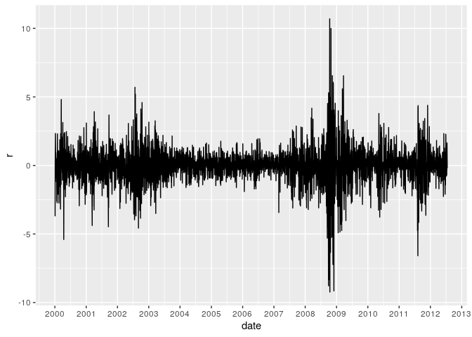
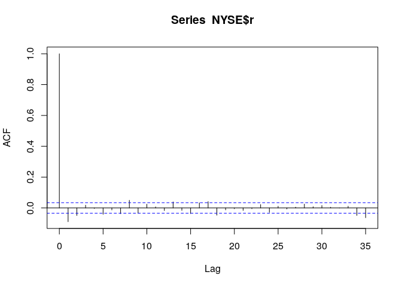
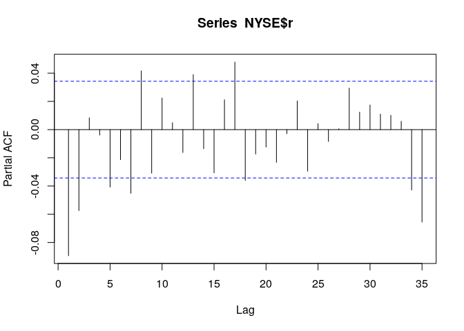
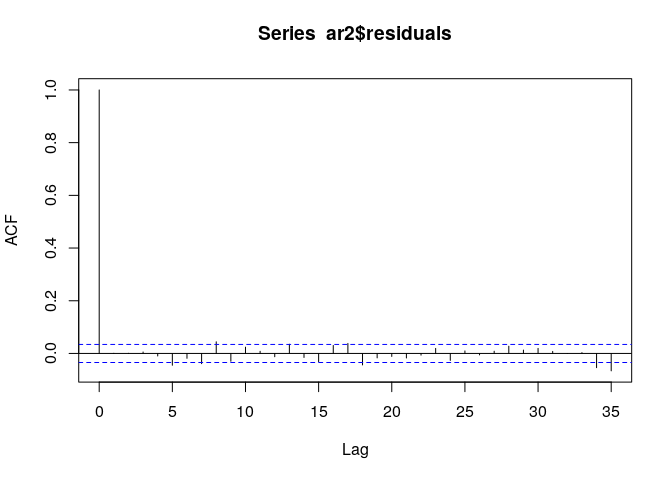
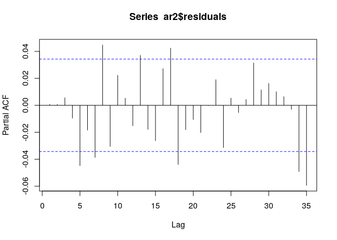
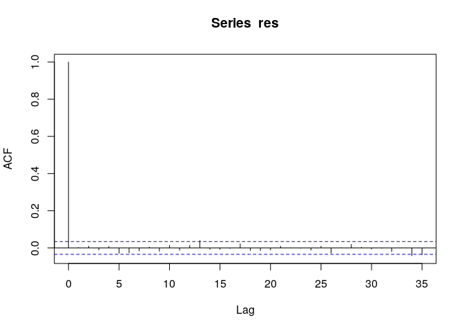
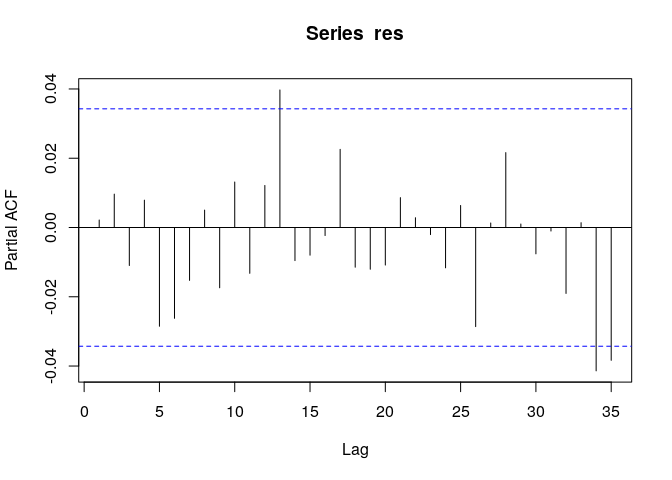
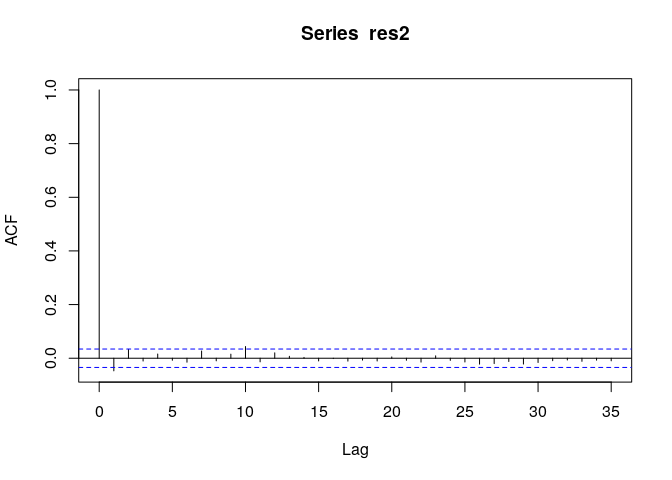
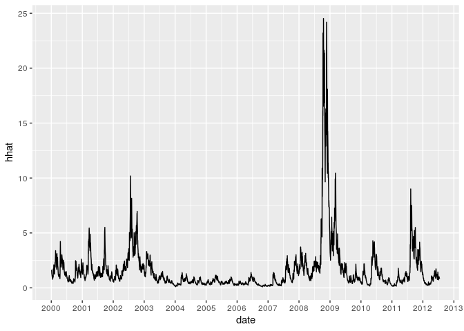

第3章 練習問題\[10\]
================

# \[10\]

`NYSE.XLS`の日次収益率rtを用いて3.9の推定結果を再現せよ。

## データのチェック

まずはデータを基本統計量、プロットを見る。

``` r
library(data.table)
library(ggplot2)
library(dplyr)
```

    ## 
    ##  次のパッケージを付け加えます: 'dplyr'

    ##  以下のオブジェクトは 'package:data.table' からマスクされています:
    ## 
    ##     between, first, last

    ##  以下のオブジェクトは 'package:stats' からマスクされています:
    ## 
    ##     filter, lag

    ##  以下のオブジェクトは 'package:base' からマスクされています:
    ## 
    ##     intersect, setdiff, setequal, union

``` r
NYSE <- fread("../data/NYSE.csv")
# データのインデックスに列名が無いため日付dateとして設定する
NYSE <- dplyr::rename(NYSE, date = V1)
# dateを日付に変換
NYSE$date <- as.Date(NYSE$date, format = "%Y:%m:%d")

# プロット
# 結局ggplot使うのが楽そう。慣れてるし
g <- ggplot(data = NYSE, aes(x = date, y = r)) +
     geom_line() +
     scale_x_date(breaks = "1 years", date_labels = "%Y")
plot(g)
```

<!-- -->

``` r
# 基本統計量
print(list(
  len = nrow(NYSE),
  mean = mean(NYSE$r),
  std = sqrt(var(NYSE$r)),
  max = max(NYSE$r),
  min = min(NYSE$r)
))
```

    ## $len
    ## [1] 3270
    ## 
    ## $mean
    ## [1] 0.0030251
    ## 
    ## $std
    ## [1] 1.279644
    ## 
    ## $max
    ## [1] 10.69876
    ## 
    ## $min
    ## [1] -9.236065

-   サンプルサイズが大きいことに注意。ACFなどを見ると有意になる可能性が高い
-   収益率は平均はほぼ0だが、分散が大きく変わっているように見える
    -   一方で、分散が大きくなると平均も大きくなるARCH-M効果は見た目では認められない

ACF, PACFをチェックする。

``` r
# ACF
acf(NYSE$r)
```

<!-- -->

``` r
# PACF
pacf(NYSE$r)
```

<!-- -->

-   ACF,
    PACFは値としては小さいが、サンプルサイズが大きいためか有意なlagがいくつかある

## 平均のモデル

書籍ではAR(2)モデルを採用しているのでここでもそれを用いる。  
`forecast::auto.arima()` などを用いればこの結果も再現可能と思われる。

``` r
ar2 <- arima(NYSE$r, c(2, 0, 0))
print(ar2)
```

    ## 
    ## Call:
    ## arima(x = NYSE$r, order = c(2, 0, 0))
    ## 
    ## Coefficients:
    ##           ar1      ar2  intercept
    ##       -0.0947  -0.0576     0.0032
    ## s.e.   0.0175   0.0175     0.0193
    ## 
    ## sigma^2 estimated as 1.618:  log likelihood = -5427.19,  aic = 10862.37

``` r
# 残差のACF
acf(ar2$residuals)
```

<!-- -->

``` r
# 残差のPACF
pacf(ar2$residuals)
```

<!-- -->

-   推定結果は書籍とほぼ同じ
-   ACF, PACFも小さい値でほとんど有意でない

## ARCH効果の検定

AR(2)モデルの残差2乗でLM検定を行い、ARCH効果が存在するかを確かめる。

``` r
# 書籍ではAR(5)でLM検定を行っているのでここでもそれを用いる
# F統計量をデフォルトで出してくれるlmを使う
res2 <- as.vector(ar2$residuals^2)
df <- data.frame(
  et = res2,
  etlag1 = lag(res2),
  etlag2 = lag(res2, n = 2),
  etlag3 = lag(res2, n = 3),
  etlag4 = lag(res2, n = 4),
  etlag5 = lag(res2, n = 5)
)

LM_test <- lm(et ~ etlag1 + etlag2 + etlag3 + etlag4 + etlag5, df)
summary(LM_test)
```

    ## 
    ## Call:
    ## lm(formula = et ~ etlag1 + etlag2 + etlag3 + etlag4 + etlag5, 
    ##     data = df)
    ## 
    ## Residuals:
    ##     Min      1Q  Median      3Q     Max 
    ## -34.430  -0.945  -0.557   0.049  79.120 
    ## 
    ## Coefficients:
    ##             Estimate Std. Error t value Pr(>|t|)    
    ## (Intercept) 0.486147   0.086475   5.622 2.05e-08 ***
    ## etlag1      0.047650   0.017033   2.798  0.00518 ** 
    ## etlag2      0.308734   0.016954  18.210  < 2e-16 ***
    ## etlag3      0.003874   0.017793   0.218  0.82765    
    ## etlag4      0.104421   0.016952   6.160 8.18e-10 ***
    ## etlag5      0.233007   0.017013  13.696  < 2e-16 ***
    ## ---
    ## Signif. codes:  0 '***' 0.001 '**' 0.01 '*' 0.05 '.' 0.1 ' ' 1
    ## 
    ## Residual standard error: 4.432 on 3259 degrees of freedom
    ##   ( 5 個の観測値が欠損のため削除されました )
    ## Multiple R-squared:  0.2435, Adjusted R-squared:  0.2423 
    ## F-statistic: 209.8 on 5 and 3259 DF,  p-value: < 2.2e-16

ARCH効果が無いという帰無仮説が帰無仮説が棄却されたため、ARCH効果をモデルに含めることを考える。

## 分散を含めたモデル化

倹約的なモデルとしてiGARCHモデルを推定する。  
また、株価収益率の分布がロングテールであることを考慮して、尤度を正規分布ではなくt分布で算出する。

``` r
library(rugarch)
```

    ##  要求されたパッケージ parallel をロード中です

    ## 
    ##  次のパッケージを付け加えます: 'rugarch'

    ##  以下のオブジェクトは 'package:stats' からマスクされています:
    ## 
    ##     sigma

``` r
igarch <- ugarchspec(mean.model = list(armaOrder = c(2, 0)),
                     variance.model = list(garchOrder = c(1, 1), model = "iGARCH"),
                     distribution.model = "std")
results_igarch <- ugarchfit(igarch, NYSE$r)

print(results_igarch)
```

    ## 
    ## *---------------------------------*
    ## *          GARCH Model Fit        *
    ## *---------------------------------*
    ## 
    ## Conditional Variance Dynamics    
    ## -----------------------------------
    ## GARCH Model  : iGARCH(1,1)
    ## Mean Model   : ARFIMA(2,0,0)
    ## Distribution : std 
    ## 
    ## Optimal Parameters
    ## ------------------------------------
    ##         Estimate  Std. Error  t value Pr(>|t|)
    ## mu      0.055161    0.012333   4.4726 0.000008
    ## ar1    -0.062156    0.017292  -3.5946 0.000325
    ## ar2    -0.045551    0.017711  -2.5718 0.010116
    ## omega   0.008644    0.002429   3.5586 0.000373
    ## alpha1  0.090409    0.009549   9.4676 0.000000
    ## beta1   0.909591          NA       NA       NA
    ## shape   6.002798    0.608158   9.8705 0.000000
    ## 
    ## Robust Standard Errors:
    ##         Estimate  Std. Error  t value Pr(>|t|)
    ## mu      0.055161    0.012370   4.4595 0.000008
    ## ar1    -0.062156    0.015721  -3.9536 0.000077
    ## ar2    -0.045551    0.018157  -2.5087 0.012118
    ## omega   0.008644    0.002497   3.4613 0.000537
    ## alpha1  0.090409    0.009522   9.4946 0.000000
    ## beta1   0.909591          NA       NA       NA
    ## shape   6.002798    0.645904   9.2936 0.000000
    ## 
    ## LogLikelihood : -4580.56 
    ## 
    ## Information Criteria
    ## ------------------------------------
    ##                    
    ## Akaike       2.8052
    ## Bayes        2.8164
    ## Shibata      2.8052
    ## Hannan-Quinn 2.8092
    ## 
    ## Weighted Ljung-Box Test on Standardized Residuals
    ## ------------------------------------
    ##                         statistic p-value
    ## Lag[1]                    0.01539  0.9013
    ## Lag[2*(p+q)+(p+q)-1][5]   1.11525  1.0000
    ## Lag[4*(p+q)+(p+q)-1][9]   3.62786  0.7747
    ## d.o.f=2
    ## H0 : No serial correlation
    ## 
    ## Weighted Ljung-Box Test on Standardized Squared Residuals
    ## ------------------------------------
    ##                         statistic  p-value
    ## Lag[1]                      7.227 0.007183
    ## Lag[2*(p+q)+(p+q)-1][5]    10.624 0.006360
    ## Lag[4*(p+q)+(p+q)-1][9]    12.547 0.013596
    ## d.o.f=2
    ## 
    ## Weighted ARCH LM Tests
    ## ------------------------------------
    ##             Statistic Shape Scale P-Value
    ## ARCH Lag[3]    0.3522 0.500 2.000  0.5529
    ## ARCH Lag[5]    1.1096 1.440 1.667  0.7007
    ## ARCH Lag[7]    2.6035 2.315 1.543  0.5913
    ## 
    ## Nyblom stability test
    ## ------------------------------------
    ## Joint Statistic:  1.8016
    ## Individual Statistics:             
    ## mu     0.4840
    ## ar1    0.2134
    ## ar2    0.2436
    ## omega  0.1274
    ## alpha1 0.1660
    ## shape  0.3990
    ## 
    ## Asymptotic Critical Values (10% 5% 1%)
    ## Joint Statistic:          1.49 1.68 2.12
    ## Individual Statistic:     0.35 0.47 0.75
    ## 
    ## Sign Bias Test
    ## ------------------------------------
    ##                    t-value      prob sig
    ## Sign Bias            3.016 2.579e-03 ***
    ## Negative Sign Bias   2.207 2.738e-02  **
    ## Positive Sign Bias   2.363 1.817e-02  **
    ## Joint Effect        28.117 3.432e-06 ***
    ## 
    ## 
    ## Adjusted Pearson Goodness-of-Fit Test:
    ## ------------------------------------
    ##   group statistic p-value(g-1)
    ## 1    20     92.37    1.256e-11
    ## 2    30    106.59    8.413e-11
    ## 3    40    123.71    9.643e-11
    ## 4    50    131.10    2.034e-09
    ## 
    ## 
    ## Elapsed time : 0.3000717

-   おおよそ書籍と同じ結果が得られた

## 診断

推定したIGARCH(1, 1)モデルの診断を行う。  
まずは標準化残差の診断を行う。

``` r
res <- as.vector(residuals(results_igarch, standardize = T))

# 修正Q統計量
print(list(
  Q5_pval = Box.test(res, lag = 5, type = "Ljung-Box")$p.value,
  Q10_pval = Box.test(res, lag = 10, type = "Ljung-Box")$p.value,
  Q15_pval = Box.test(res, lag = 15, type = "Ljung-Box")$p.value
))
```

    ## $Q5_pval
    ## [1] 0.6063855
    ## 
    ## $Q10_pval
    ## [1] 0.5886151
    ## 
    ## $Q15_pval
    ## [1] 0.4457016

``` r
# 残差のACF
acf(res)
```

<!-- -->

``` r
# 残差のPACF
pacf(res)
```

<!-- -->

-   修正Q統計量、ACF、 PACFから残差に系列相関は残っていないと考えられる
    よってiGARCH(1, 1)モデルは適当と言える。

次に、残差2乗を用いて診断する。

``` r
# 残差2乗についてLM検定を行う
res2 <- res^2

# 書籍と同様、n=2でLM検定
df <- data.frame(
  et = res2,
  etlag1 = lag(res2),
  etlag2 = lag(res2, n = 2)
)

LM_test <- lm(et ~ etlag1 + etlag2, df)
summary(LM_test)
```

    ## 
    ## Call:
    ## lm(formula = et ~ etlag1 + etlag2, data = df)
    ## 
    ## Residuals:
    ##    Min     1Q Median     3Q    Max 
    ## -2.570 -0.903 -0.655  0.176 53.516 
    ## 
    ## Coefficients:
    ##             Estimate Std. Error t value Pr(>|t|)    
    ## (Intercept)  0.99159    0.04202  23.596  < 2e-16 ***
    ## etlag1      -0.04517    0.01749  -2.582  0.00986 ** 
    ## etlag2       0.03074    0.01745   1.761  0.07831 .  
    ## ---
    ## Signif. codes:  0 '***' 0.001 '**' 0.01 '*' 0.05 '.' 0.1 ' ' 1
    ## 
    ## Residual standard error: 1.942 on 3265 degrees of freedom
    ##   ( 2 個の観測値が欠損のため削除されました )
    ## Multiple R-squared:  0.00312,    Adjusted R-squared:  0.00251 
    ## F-statistic:  5.11 on 2 and 3265 DF,  p-value: 0.006085

``` r
# 残差2乗のACFもチェックする
acf(res2)
```

<!-- -->

-   LM検定では残差2乗に系列相関が存在するという帰無仮説が棄却されてしまうが、サンプルサイズが大きいためあり得る結論である
    -   より複雑はモデルとすることも考えられるが、ここではiGARCH(1,
        1)で十分とする
-   残差2乗のACFはどれも値としては小さく、ほとんど有意ではない

## レバレッジ効果の調査

レバレッジ効果が存在しているかを調べる。  
レバレッジ効果が無ければ、 `s_t^2` を `s_t`
で回帰しても回帰係数は0となる。これを用いて検定する。

``` r
df <- data.frame(
  et_sq = res2,
  etlag1 = lag(res),
  etlag2 = lag(res, n = 2)
)
lev_test <- lm(et_sq ~ etlag1 + etlag2, df)
summary(lev_test)
```

    ## 
    ## Call:
    ## lm(formula = et_sq ~ etlag1 + etlag2, data = df)
    ## 
    ## Residuals:
    ##    Min     1Q Median     3Q    Max 
    ## -2.147 -0.865 -0.605  0.164 53.409 
    ## 
    ## Coefficients:
    ##             Estimate Std. Error t value Pr(>|t|)    
    ## (Intercept)  0.96068    0.03398  28.273  < 2e-16 ***
    ## etlag1      -0.09465    0.03430  -2.760  0.00582 ** 
    ## etlag2      -0.17700    0.03427  -5.165 2.55e-07 ***
    ## ---
    ## Signif. codes:  0 '***' 0.001 '**' 0.01 '*' 0.05 '.' 0.1 ' ' 1
    ## 
    ## Residual standard error: 1.935 on 3265 degrees of freedom
    ##   ( 2 個の観測値が欠損のため削除されました )
    ## Multiple R-squared:  0.01041,    Adjusted R-squared:  0.009806 
    ## F-statistic: 17.18 on 2 and 3265 DF,  p-value: 3.793e-08

F統計量が有意なので、レバレッジ効果が認められる。  
符号バイアス検定については省略。

## 非対称モデル

EGARCHモデルで推定する。

``` r
egarch <- ugarchspec(mean.model = list(armaOrder=c(2, 0)),
                     variance.model = list(model = "eGARCH", garchOrder = c(1, 1)),
                     distribution.model = "std")
results_egarch <- ugarchfit(egarch, NYSE$r)
print(results_egarch)
```

    ## 
    ## *---------------------------------*
    ## *          GARCH Model Fit        *
    ## *---------------------------------*
    ## 
    ## Conditional Variance Dynamics    
    ## -----------------------------------
    ## GARCH Model  : eGARCH(1,1)
    ## Mean Model   : ARFIMA(2,0,0)
    ## Distribution : std 
    ## 
    ## Optimal Parameters
    ## ------------------------------------
    ##         Estimate  Std. Error  t value Pr(>|t|)
    ## mu      0.035163    0.011290   3.1145 0.001843
    ## ar1    -0.060303    0.016763  -3.5974 0.000321
    ## ar2    -0.031849    0.017442  -1.8259 0.067858
    ## omega  -0.004720    0.002532  -1.8641 0.062307
    ## alpha1 -0.129200    0.011542 -11.1940 0.000000
    ## beta1   0.986079    0.001074 917.8511 0.000000
    ## gamma1  0.108049    0.014222   7.5974 0.000000
    ## shape   6.855945    0.834860   8.2121 0.000000
    ## 
    ## Robust Standard Errors:
    ##         Estimate  Std. Error   t value Pr(>|t|)
    ## mu      0.035163    0.011015    3.1923 0.001411
    ## ar1    -0.060303    0.014065   -4.2873 0.000018
    ## ar2    -0.031849    0.018256   -1.7445 0.081066
    ## omega  -0.004720    0.002715   -1.7382 0.082178
    ## alpha1 -0.129200    0.013339   -9.6860 0.000000
    ## beta1   0.986079    0.000589 1674.7426 0.000000
    ## gamma1  0.108049    0.015229    7.0949 0.000000
    ## shape   6.855945    0.831896    8.2414 0.000000
    ## 
    ## LogLikelihood : -4526.021 
    ## 
    ## Information Criteria
    ## ------------------------------------
    ##                    
    ## Akaike       2.7731
    ## Bayes        2.7880
    ## Shibata      2.7731
    ## Hannan-Quinn 2.7784
    ## 
    ## Weighted Ljung-Box Test on Standardized Residuals
    ## ------------------------------------
    ##                         statistic p-value
    ## Lag[1]                    0.08927  0.7651
    ## Lag[2*(p+q)+(p+q)-1][5]   0.95387  1.0000
    ## Lag[4*(p+q)+(p+q)-1][9]   3.64693  0.7706
    ## d.o.f=2
    ## H0 : No serial correlation
    ## 
    ## Weighted Ljung-Box Test on Standardized Squared Residuals
    ## ------------------------------------
    ##                         statistic  p-value
    ## Lag[1]                      9.558 0.001991
    ## Lag[2*(p+q)+(p+q)-1][5]    11.610 0.003523
    ## Lag[4*(p+q)+(p+q)-1][9]    15.289 0.003044
    ## d.o.f=2
    ## 
    ## Weighted ARCH LM Tests
    ## ------------------------------------
    ##             Statistic Shape Scale P-Value
    ## ARCH Lag[3]    0.5345 0.500 2.000  0.4647
    ## ARCH Lag[5]    1.0274 1.440 1.667  0.7248
    ## ARCH Lag[7]    4.9132 2.315 1.543  0.2335
    ## 
    ## Nyblom stability test
    ## ------------------------------------
    ## Joint Statistic:  2.6157
    ## Individual Statistics:             
    ## mu     0.8587
    ## ar1    0.1660
    ## ar2    0.2208
    ## omega  0.4041
    ## alpha1 0.2526
    ## beta1  0.1107
    ## gamma1 0.1079
    ## shape  0.2429
    ## 
    ## Asymptotic Critical Values (10% 5% 1%)
    ## Joint Statistic:          1.89 2.11 2.59
    ## Individual Statistic:     0.35 0.47 0.75
    ## 
    ## Sign Bias Test
    ## ------------------------------------
    ##                    t-value      prob sig
    ## Sign Bias            1.875 0.0608877   *
    ## Negative Sign Bias   2.770 0.0056303 ***
    ## Positive Sign Bias   2.150 0.0316350  **
    ## Joint Effect        17.071 0.0006834 ***
    ## 
    ## 
    ## Adjusted Pearson Goodness-of-Fit Test:
    ## ------------------------------------
    ##   group statistic p-value(g-1)
    ## 1    20     90.38    2.841e-11
    ## 2    30    109.56    2.735e-11
    ## 3    40    115.66    1.599e-09
    ## 4    50    130.03    2.878e-09
    ## 
    ## 
    ## Elapsed time : 0.4591537

書籍とほぼ同じ結果が得られた。  
この推定結果から負のショックの方が正のショックに比べて大きく条件付き分散を増加させることが分かった。

推定された条件付き分散を図示する。

``` r
hhat <- as.vector(results_egarch@fit$sigma^2)
df <- data.frame(
  date = NYSE$date,
  hhat = hhat
)

g <- ggplot(data = df, mapping = aes(x = date, y = hhat)) +
     geom_line() +
     scale_x_date(breaks = "1 years", date_labels = "%Y")
plot(g)
```

<!-- -->

2008年の金融危機後に分散が大きくなっていることがわかる。
