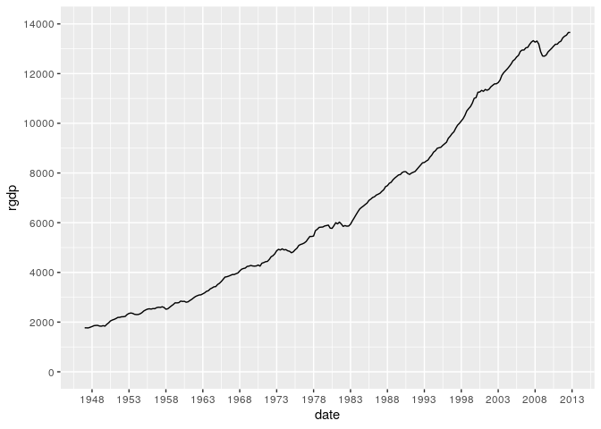

第4章 練習問題\[5\]
================

# \[5\]

`RGDP.XLS` には米国の実質GCPデータ `rgdp` が含まれる。

``` r
library(data.table)
library(ggplot2)
library(dplyr)
```

    ## 
    ##  次のパッケージを付け加えます: 'dplyr'

    ##  以下のオブジェクトは 'package:data.table' からマスクされています:
    ## 
    ##     between, first, last

    ##  以下のオブジェクトは 'package:stats' からマスクされています:
    ## 
    ##     filter, lag

    ##  以下のオブジェクトは 'package:base' からマスクされています:
    ## 
    ##     intersect, setdiff, setequal, union

``` r
RGDP <- fread("../data/RGDP.csv")
# データのインデックスに列名が無いため日付dateとして設定する
RGDP <- dplyr::rename(RGDP, date = V1)
# dateを日付に変換
RGDP$date <- as.Date(RGDP$date)

# プロット
g <- ggplot(data = RGDP, mapping = aes(x = date, y = rgdp)) +
     geom_line() +
     scale_x_date(breaks="5 years", date_labels = "%Y") +
     scale_y_continuous(breaks = seq(0, 18000, length = 10), limits = c(0, 14000))
plot(g)
```

<!-- -->

## (a)

4.1節の(4.1)式を再現せよ。

``` r
t <- seq(1, nrow(RGDP))
df <- data.frame(
  t <- t,
  t2 <- t^2,
  t3 <- t^3,
  rgdp <- RGDP$rgdp
)

poly <- lm(rgdp ~ t + t2 + t3, data = df)
poly
```

    ## 
    ## Call:
    ## lm(formula = rgdp ~ t + t2 + t3, data = df)
    ## 
    ## Coefficients:
    ## (Intercept)            t           t2           t3  
    ##   1890.2469       9.1080       0.1699      -0.0001

書籍とほぼ同じ結果が得られた。

## (b)

4.6節(4.29)式を推定し、統計量 $\tau_{t}$, $\Phi_{2}$, $\Phi_{3}$
を求めよ。  
この結果から何が言えるか。  
$y_{t} = lrgdp_{t}$ とすると、(4.29)式は以下のように書ける。

$$
\Delta y_{t} = a_{0} + \gamma y_{t-1} + a_{2} t + \beta_{1} \Delta y_{t-1} + \epsilon_{t}
$$

``` r
library(urca)

adf_test_lrgdp <- ur.df(log(RGDP$rgdp), lag = 1, type = "trend")
summary(adf_test_lrgdp)
```

    ## 
    ## ############################################### 
    ## # Augmented Dickey-Fuller Test Unit Root Test # 
    ## ############################################### 
    ## 
    ## Test regression trend 
    ## 
    ## 
    ## Call:
    ## lm(formula = z.diff ~ z.lag.1 + 1 + tt + z.diff.lag)
    ## 
    ## Residuals:
    ##       Min        1Q    Median        3Q       Max 
    ## -0.030533 -0.004380  0.000598  0.004866  0.034333 
    ## 
    ## Coefficients:
    ##               Estimate Std. Error t value Pr(>|t|)    
    ## (Intercept)  1.249e-01  7.919e-02   1.577    0.116    
    ## z.lag.1     -1.563e-02  1.050e-02  -1.489    0.138    
    ## tt           1.117e-04  8.506e-05   1.313    0.190    
    ## z.diff.lag   3.663e-01  5.848e-02   6.263 1.57e-09 ***
    ## ---
    ## Signif. codes:  0 '***' 0.001 '**' 0.01 '*' 0.05 '.' 0.1 ' ' 1
    ## 
    ## Residual standard error: 0.009106 on 258 degrees of freedom
    ## Multiple R-squared:  0.1569, Adjusted R-squared:  0.1471 
    ## F-statistic:    16 on 3 and 258 DF,  p-value: 1.43e-09
    ## 
    ## 
    ## Value of test-statistic is: -1.4891 17.6119 2.9657 
    ## 
    ## Critical values for test statistics: 
    ##       1pct  5pct 10pct
    ## tau3 -3.98 -3.42 -3.13
    ## phi2  6.15  4.71  4.05
    ## phi3  8.34  6.30  5.36

上記の `Value of test-statistic is: -1.4891 17.6119 2.9657`
の部分がADF検定の検定統計量を表している。  
つまり、

$$
\tau_t = -1.49 \\
\Phi_2 = 17.6 \\
\Phi_3 = 2.97
$$

となる。この値は書籍の値と一致する。  
この結果から $\tau_t$, $\Phi_3$ は有意ではないので、仮説 $\gamma = 0$,
$a_2 = \gamma = 0$ は棄却されない。  
一方、 $\Phi_2$ は有意なので、仮説 $a_0 = a_2 = \gamma = 0$
は棄却される。  
まとめると、今回のADF検定では $a_0$ のみが0と異なっており、 `lrgdp`
はドリフトを含むランダムウォークであると結論付けられる。
