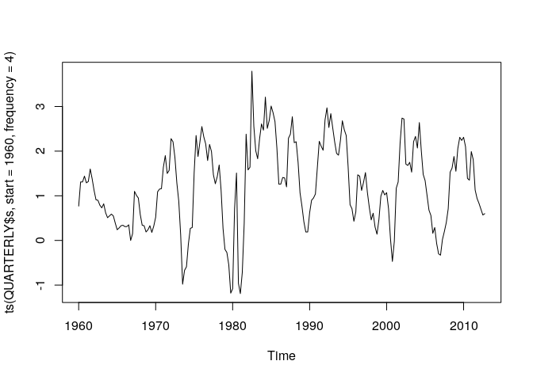

第4章 練習問題\[6\]
================

# \[6\]

`QUARTERLY.XLS` は2.10で用いた米国の金利データが含まれる。  
金利スプレッド `s` は長期金利 `r5` から短期金利 `t-bill`
を引いたものと定義される。

``` r
library(data.table)
library(ggplot2)
library(dplyr)
```

``` r
QUARTERLY <- fread("../data/QUARTERLY.csv")
# クオーターを表す列に列名が無いのでQと設定
QUARTERLY <- dplyr::rename(QUARTERLY, Q = V1)
# 金利スプレッドs列を作成
QUARTERLY <- QUARTERLY %>% mutate(s = r5 - tbill)

# 金利スプレッドをプロット
ts.plot(ts(QUARTERLY$s, start = 1960, frequency = 4))
```

<!-- -->

## (a)

モデル

$$
\Delta s_t = a_0 + \gamma s_{t-1} + \sum \beta_i \Delta s_{t-i+1} + \epsilon_t
$$

を推定せよ。ただし、ラグ次数はAIC, BIC,
一般化からの特定法によって選択せよ。

### AIC

``` r
library(urca)

# selectlags = "AIC"とすることでAIC基準でラグ次数を選択
# lags = 10で探索するラグの最大値を10に設定
df_test_aic <- ur.df(QUARTERLY$s, type = "drift", lags = 10, selectlags = "AIC")
summary(df_test_aic)
```

    ## 
    ## ############################################### 
    ## # Augmented Dickey-Fuller Test Unit Root Test # 
    ## ############################################### 
    ## 
    ## Test regression drift 
    ## 
    ## 
    ## Call:
    ## lm(formula = z.diff ~ z.lag.1 + 1 + z.diff.lag)
    ## 
    ## Residuals:
    ##      Min       1Q   Median       3Q      Max 
    ## -2.30142 -0.25117 -0.06549  0.23564  1.66204 
    ## 
    ## Coefficients:
    ##              Estimate Std. Error t value Pr(>|t|)    
    ## (Intercept)  0.288777   0.070031   4.124 5.57e-05 ***
    ## z.lag.1     -0.237969   0.050720  -4.692 5.17e-06 ***
    ## z.diff.lag1  0.327200   0.074571   4.388 1.90e-05 ***
    ## z.diff.lag2 -0.070870   0.078069  -0.908 0.365136    
    ## z.diff.lag3  0.275827   0.076472   3.607 0.000396 ***
    ## z.diff.lag4 -0.005262   0.075694  -0.070 0.944649    
    ## z.diff.lag5  0.175029   0.075531   2.317 0.021553 *  
    ## z.diff.lag6 -0.076021   0.074641  -1.018 0.309745    
    ## z.diff.lag7  0.011090   0.074818   0.148 0.882323    
    ## z.diff.lag8  0.169620   0.071635   2.368 0.018897 *  
    ## z.diff.lag9  0.124122   0.072416   1.714 0.088155 .  
    ## ---
    ## Signif. codes:  0 '***' 0.001 '**' 0.01 '*' 0.05 '.' 0.1 ' ' 1
    ## 
    ## Residual standard error: 0.4684 on 190 degrees of freedom
    ## Multiple R-squared:  0.2291, Adjusted R-squared:  0.1885 
    ## F-statistic: 5.645 on 10 and 190 DF,  p-value: 2.215e-07
    ## 
    ## 
    ## Value of test-statistic is: -4.6918 11.0071 
    ## 
    ## Critical values for test statistics: 
    ##       1pct  5pct 10pct
    ## tau2 -3.46 -2.88 -2.57
    ## phi1  6.52  4.63  3.81

AICを用いるとラグ次数は9が選択される。

### BIC

``` r
df_test_bic <- ur.df(QUARTERLY$s, type = "drift", lags = 10, selectlags = "BIC")
summary(df_test_bic)
```

    ## 
    ## ############################################### 
    ## # Augmented Dickey-Fuller Test Unit Root Test # 
    ## ############################################### 
    ## 
    ## Test regression drift 
    ## 
    ## 
    ## Call:
    ## lm(formula = z.diff ~ z.lag.1 + 1 + z.diff.lag)
    ## 
    ## Residuals:
    ##     Min      1Q  Median      3Q     Max 
    ## -2.5920 -0.2672 -0.0555  0.2071  2.2111 
    ## 
    ## Coefficients:
    ##             Estimate Std. Error t value Pr(>|t|)    
    ## (Intercept)  0.20706    0.05670   3.652 0.000333 ***
    ## z.lag.1     -0.17149    0.03691  -4.646 6.17e-06 ***
    ## z.diff.lag   0.21731    0.06943   3.130 0.002013 ** 
    ## ---
    ## Signif. codes:  0 '***' 0.001 '**' 0.01 '*' 0.05 '.' 0.1 ' ' 1
    ## 
    ## Residual standard error: 0.4919 on 198 degrees of freedom
    ## Multiple R-squared:  0.1138, Adjusted R-squared:  0.1048 
    ## F-statistic: 12.71 on 2 and 198 DF,  p-value: 6.403e-06
    ## 
    ## 
    ## Value of test-statistic is: -4.646 10.7931 
    ## 
    ## Critical values for test statistics: 
    ##       1pct  5pct 10pct
    ## tau2 -3.46 -2.88 -2.57
    ## phi1  6.52  4.63  3.81

BIC基準では、ラグ次数は1が選ばれる。  
(AICと違いすぎ…？こんなもんなの…？)

### 一般化からの特定法

`lags`引数を大きい値から順に小さくしていき、最大のラグが有意になった時のラグ次数を選択する。

``` r
lag9 <- ur.df(QUARTERLY$s, type = "drift", lags = 9)
summary(lag9)
```

    ## 
    ## ############################################### 
    ## # Augmented Dickey-Fuller Test Unit Root Test # 
    ## ############################################### 
    ## 
    ## Test regression drift 
    ## 
    ## 
    ## Call:
    ## lm(formula = z.diff ~ z.lag.1 + 1 + z.diff.lag)
    ## 
    ## Residuals:
    ##      Min       1Q   Median       3Q      Max 
    ## -2.30199 -0.25110 -0.06313  0.23431  1.66125 
    ## 
    ## Coefficients:
    ##              Estimate Std. Error t value Pr(>|t|)    
    ## (Intercept)  0.288302   0.069731   4.134 5.32e-05 ***
    ## z.lag.1     -0.237799   0.050568  -4.703 4.91e-06 ***
    ## z.diff.lag1  0.327415   0.074355   4.403 1.77e-05 ***
    ## z.diff.lag2 -0.070895   0.077867  -0.910 0.363726    
    ## z.diff.lag3  0.275893   0.076272   3.617 0.000381 ***
    ## z.diff.lag4 -0.005594   0.075444  -0.074 0.940975    
    ## z.diff.lag5  0.174880   0.075325   2.322 0.021306 *  
    ## z.diff.lag6 -0.075890   0.074440  -1.019 0.309264    
    ## z.diff.lag7  0.010776   0.074576   0.145 0.885256    
    ## z.diff.lag8  0.169783   0.071436   2.377 0.018457 *  
    ## z.diff.lag9  0.123421   0.071978   1.715 0.088019 .  
    ## ---
    ## Signif. codes:  0 '***' 0.001 '**' 0.01 '*' 0.05 '.' 0.1 ' ' 1
    ## 
    ## Residual standard error: 0.4671 on 191 degrees of freedom
    ## Multiple R-squared:  0.229,  Adjusted R-squared:  0.1886 
    ## F-statistic: 5.673 on 10 and 191 DF,  p-value: 1.995e-07
    ## 
    ## 
    ## Value of test-statistic is: -4.7026 11.0576 
    ## 
    ## Critical values for test statistics: 
    ##       1pct  5pct 10pct
    ## tau2 -3.46 -2.88 -2.57
    ## phi1  6.52  4.63  3.81

lag9は10%有意水準で有意だが、5%有意水準では有意でない。

``` r
lag8 <- ur.df(QUARTERLY$s, type = "drift", lags = 8)
summary(lag8)
```

    ## 
    ## ############################################### 
    ## # Augmented Dickey-Fuller Test Unit Root Test # 
    ## ############################################### 
    ## 
    ## Test regression drift 
    ## 
    ## 
    ## Call:
    ## lm(formula = z.diff ~ z.lag.1 + 1 + z.diff.lag)
    ## 
    ## Residuals:
    ##      Min       1Q   Median       3Q      Max 
    ## -2.34150 -0.24780 -0.05378  0.23118  1.66768 
    ## 
    ## Coefficients:
    ##             Estimate Std. Error t value Pr(>|t|)    
    ## (Intercept)  0.25496    0.06746   3.779 0.000209 ***
    ## z.lag.1     -0.21134    0.04841  -4.366 2.06e-05 ***
    ## z.diff.lag1  0.32405    0.07458   4.345 2.25e-05 ***
    ## z.diff.lag2 -0.10036    0.07619  -1.317 0.189353    
    ## z.diff.lag3  0.23953    0.07371   3.250 0.001364 ** 
    ## z.diff.lag4 -0.01394    0.07557  -0.184 0.853838    
    ## z.diff.lag5  0.14815    0.07381   2.007 0.046113 *  
    ## z.diff.lag6 -0.07464    0.07462  -1.000 0.318422    
    ## z.diff.lag7 -0.02631    0.07145  -0.368 0.713144    
    ## z.diff.lag8  0.17974    0.07105   2.530 0.012206 *  
    ## ---
    ## Signif. codes:  0 '***' 0.001 '**' 0.01 '*' 0.05 '.' 0.1 ' ' 1
    ## 
    ## Residual standard error: 0.4688 on 193 degrees of freedom
    ## Multiple R-squared:  0.2161, Adjusted R-squared:  0.1795 
    ## F-statistic: 5.912 on 9 and 193 DF,  p-value: 2.758e-07
    ## 
    ## 
    ## Value of test-statistic is: -4.3657 9.532 
    ## 
    ## Critical values for test statistics: 
    ##       1pct  5pct 10pct
    ## tau2 -3.46 -2.88 -2.57
    ## phi1  6.52  4.63  3.81

lag8は5%有意水準で有意。よって一般化からの特定法ではラグ次数8が選択される。

## (b)

ラグ次数として8を用いて推定する。この時、スプレッドは定常と言えるか。

(a)の一般化からの特定法でラグ次数8のモデルを推定し、ADF検定を行っている。  
この結果を見ると、 $\gamma$
の値は有意であるため、金利スプレッドは単位根を持たず、定常であると言える。

## (c)

`r5` にADF検定をしよう（ラグ次数は7）。この時、r5は定常か。

``` r
adf_r5 <- ur.df(QUARTERLY$r5, type = "drift", lags = 7)
summary(adf_r5)
```

    ## 
    ## ############################################### 
    ## # Augmented Dickey-Fuller Test Unit Root Test # 
    ## ############################################### 
    ## 
    ## Test regression drift 
    ## 
    ## 
    ## Call:
    ## lm(formula = z.diff ~ z.lag.1 + 1 + z.diff.lag)
    ## 
    ## Residuals:
    ##      Min       1Q   Median       3Q      Max 
    ## -2.20308 -0.30669  0.01928  0.30409  1.59199 
    ## 
    ## Coefficients:
    ##              Estimate Std. Error t value Pr(>|t|)    
    ## (Intercept)  0.056992   0.099278   0.574  0.56659    
    ## z.lag.1     -0.011221   0.014297  -0.785  0.43347    
    ## z.diff.lag1  0.295184   0.070882   4.164 4.68e-05 ***
    ## z.diff.lag2 -0.221835   0.073905  -3.002  0.00304 ** 
    ## z.diff.lag3  0.200897   0.074957   2.680  0.00799 ** 
    ## z.diff.lag4 -0.005137   0.076288  -0.067  0.94638    
    ## z.diff.lag5 -0.115490   0.075175  -1.536  0.12609    
    ## z.diff.lag6  0.038625   0.073518   0.525  0.59991    
    ## z.diff.lag7 -0.170038   0.070998  -2.395  0.01757 *  
    ## ---
    ## Signif. codes:  0 '***' 0.001 '**' 0.01 '*' 0.05 '.' 0.1 ' ' 1
    ## 
    ## Residual standard error: 0.5447 on 195 degrees of freedom
    ## Multiple R-squared:  0.1533, Adjusted R-squared:  0.1186 
    ## F-statistic: 4.414 on 8 and 195 DF,  p-value: 6.297e-05
    ## 
    ## 
    ## Value of test-statistic is: -0.7849 0.3845 
    ## 
    ## Critical values for test statistics: 
    ##       1pct  5pct 10pct
    ## tau2 -3.46 -2.88 -2.57
    ## phi1  6.52  4.63  3.81

$\gamma$の値が有意でないため、`r5`
系列は単位根を持つ。よって定常ではない。

## (d)

`t-bill` にADF検定をしよう（ラグ次数は11）。この時、`t-bill` は定常か。

``` r
adf_tbill <- ur.df(QUARTERLY$tbill, type = "drift", lags = 11)
summary(adf_tbill)
```

    ## 
    ## ############################################### 
    ## # Augmented Dickey-Fuller Test Unit Root Test # 
    ## ############################################### 
    ## 
    ## Test regression drift 
    ## 
    ## 
    ## Call:
    ## lm(formula = z.diff ~ z.lag.1 + 1 + z.diff.lag)
    ## 
    ## Residuals:
    ##     Min      1Q  Median      3Q     Max 
    ## -3.2893 -0.2243  0.0257  0.3198  3.1734 
    ## 
    ## Coefficients:
    ##               Estimate Std. Error t value Pr(>|t|)    
    ## (Intercept)   0.117002   0.107523   1.088  0.27793    
    ## z.lag.1      -0.024770   0.018426  -1.344  0.18048    
    ## z.diff.lag1   0.424109   0.072162   5.877 1.88e-08 ***
    ## z.diff.lag2  -0.379250   0.078414  -4.836 2.75e-06 ***
    ## z.diff.lag3   0.423605   0.082492   5.135 7.04e-07 ***
    ## z.diff.lag4  -0.170341   0.087615  -1.944  0.05337 .  
    ## z.diff.lag5   0.160991   0.085366   1.886  0.06086 .  
    ## z.diff.lag6  -0.003684   0.086122  -0.043  0.96592    
    ## z.diff.lag7  -0.280574   0.085649  -3.276  0.00126 ** 
    ## z.diff.lag8   0.170278   0.086771   1.962  0.05120 .  
    ## z.diff.lag9  -0.104602   0.083014  -1.260  0.20922    
    ## z.diff.lag10  0.098407   0.077581   1.268  0.20622    
    ## z.diff.lag11 -0.160962   0.072514  -2.220  0.02764 *  
    ## ---
    ## Signif. codes:  0 '***' 0.001 '**' 0.01 '*' 0.05 '.' 0.1 ' ' 1
    ## 
    ## Residual standard error: 0.6526 on 187 degrees of freedom
    ## Multiple R-squared:  0.3187, Adjusted R-squared:  0.275 
    ## F-statistic:  7.29 on 12 and 187 DF,  p-value: 6.729e-11
    ## 
    ## 
    ## Value of test-statistic is: -1.3443 0.9463 
    ## 
    ## Critical values for test statistics: 
    ##       1pct  5pct 10pct
    ## tau2 -3.46 -2.88 -2.57
    ## phi1  6.52  4.63  3.81

$\gamma$ は有意でないため、 `tbill`
系列は単位根を持つ。よって定常ではない。

## (e)

各金利は単位根を持っているにもかかわらず、スプレッドが定常になるのはなぜか。  
理由として考えられることを述べよ。

`r5` と `t-bill` が強い相関を持って動いているため。
