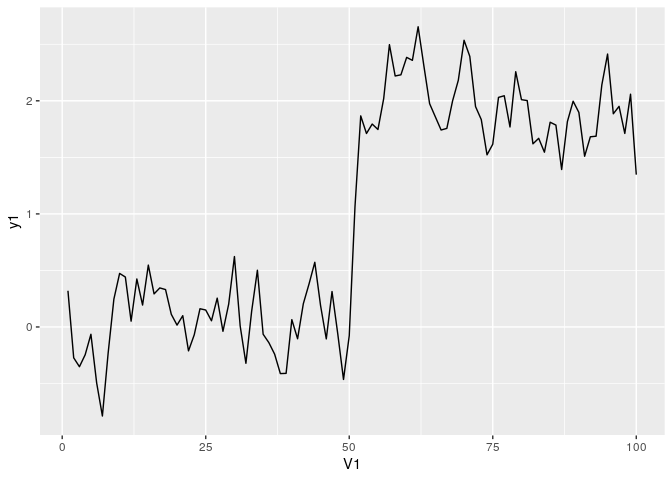
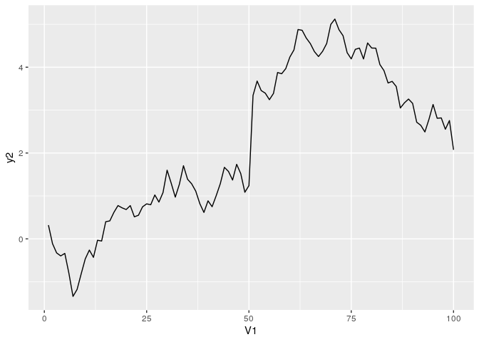
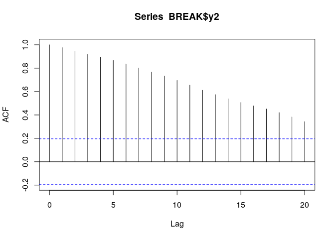
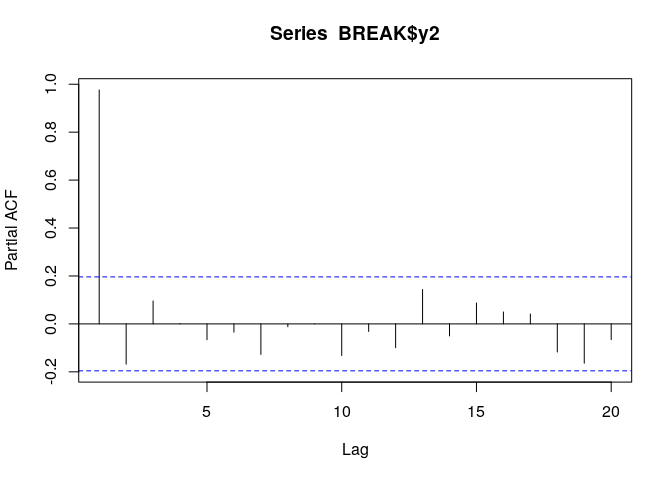
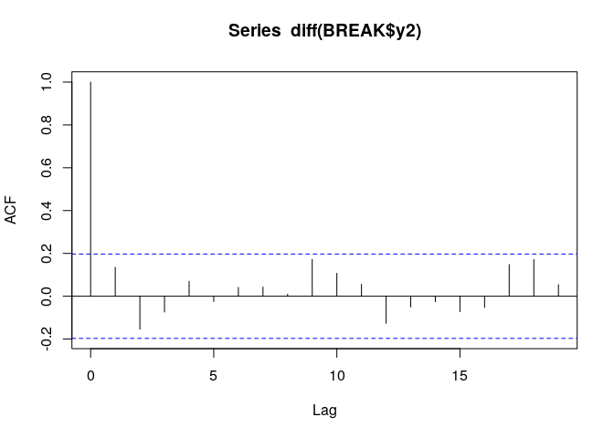
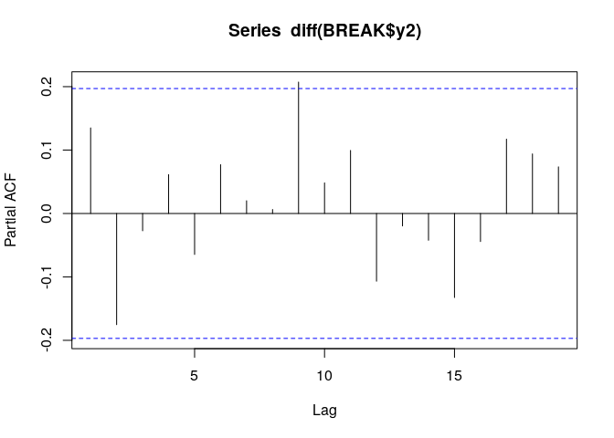

第4章 練習問題\[7\]
================

# \[7\]

## (a)

``` r
library(data.table)
library(dplyr)
library(ggplot2)
```

``` r
BREAK <- fread("../data/Break.csv")

# 基本統計量など
print(list(
  len = nrow(BREAK),
  mean = mean(BREAK$y1),
  std = sqrt(var(BREAK$y1)),
  max = max(BREAK$y1),
  min = min(BREAK$y1)
))
```

    ## $len
    ## [1] 100
    ## 
    ## $mean
    ## [1] 0.9880254
    ## 
    ## $std
    ## [1] 0.9937319
    ## 
    ## $max
    ## [1] 2.654697
    ## 
    ## $min
    ## [1] -0.78719

``` r
# プロット
g <- ggplot(data = BREAK, mapping = aes(x = V1, y = y1)) +
     geom_line()
plot(g)
```

<!-- -->

明らかに50期前後で構造変化が起きている。

## (b)

### ドリフト、確定トレンド両方なしモデル

``` r
library(urca)

no_drift_trend <- ur.df(BREAK$y1, type = "none", lags = 0)
summary(no_drift_trend)
```

    ## 
    ## ############################################### 
    ## # Augmented Dickey-Fuller Test Unit Root Test # 
    ## ############################################### 
    ## 
    ## Test regression none 
    ## 
    ## 
    ## Call:
    ## lm(formula = z.diff ~ z.lag.1 - 1)
    ## 
    ## Residuals:
    ##     Min      1Q  Median      3Q     Max 
    ## -0.6633 -0.2196  0.0294  0.2618  1.1389 
    ## 
    ## Coefficients:
    ##         Estimate Std. Error t value Pr(>|t|)
    ## z.lag.1 -0.02332    0.02368  -0.985    0.327
    ## 
    ## Residual standard error: 0.3294 on 98 degrees of freedom
    ## Multiple R-squared:  0.009802,   Adjusted R-squared:  -0.0003019 
    ## F-statistic: 0.9701 on 1 and 98 DF,  p-value: 0.3271
    ## 
    ## 
    ## Value of test-statistic is: -0.9849 
    ## 
    ## Critical values for test statistics: 
    ##      1pct  5pct 10pct
    ## tau1 -2.6 -1.95 -1.61

書籍の結果とほぼ一致している。

### ドリフトモデル

``` r
drift <- ur.df(BREAK$y1, type = "drift", lags = 0)
summary(drift)
```

    ## 
    ## ############################################### 
    ## # Augmented Dickey-Fuller Test Unit Root Test # 
    ## ############################################### 
    ## 
    ## Test regression drift 
    ## 
    ## 
    ## Call:
    ## lm(formula = z.diff ~ z.lag.1 + 1)
    ## 
    ## Residuals:
    ##      Min       1Q   Median       3Q      Max 
    ## -0.66085 -0.25652  0.01112  0.23370  1.07029 
    ## 
    ## Coefficients:
    ##             Estimate Std. Error t value Pr(>|t|)  
    ## (Intercept)  0.06608    0.04638   1.425   0.1574  
    ## z.lag.1     -0.05659    0.03317  -1.706   0.0912 .
    ## ---
    ## Signif. codes:  0 '***' 0.001 '**' 0.01 '*' 0.05 '.' 0.1 ' ' 1
    ## 
    ## Residual standard error: 0.3277 on 97 degrees of freedom
    ## Multiple R-squared:  0.02914,    Adjusted R-squared:  0.01913 
    ## F-statistic: 2.911 on 1 and 97 DF,  p-value: 0.09115
    ## 
    ## 
    ## Value of test-statistic is: -1.7063 1.5053 
    ## 
    ## Critical values for test statistics: 
    ##       1pct  5pct 10pct
    ## tau2 -3.51 -2.89 -2.58
    ## phi1  6.70  4.71  3.86

書籍の結果とほぼ一致している。

### ドリフト、確定トレンド両方ありモデル

``` r
drift_trend <- ur.df(BREAK$y1, type = "trend", lags = 0)
summary(drift_trend)
```

    ## 
    ## ############################################### 
    ## # Augmented Dickey-Fuller Test Unit Root Test # 
    ## ############################################### 
    ## 
    ## Test regression trend 
    ## 
    ## 
    ## Call:
    ## lm(formula = z.diff ~ z.lag.1 + 1 + tt)
    ## 
    ## Residuals:
    ##      Min       1Q   Median       3Q      Max 
    ## -0.75897 -0.21129  0.01312  0.22545  0.96877 
    ## 
    ## Coefficients:
    ##              Estimate Std. Error t value Pr(>|t|)   
    ## (Intercept) -0.044705   0.069365  -0.644  0.52080   
    ## z.lag.1     -0.152233   0.055682  -2.734  0.00745 **
    ## tt           0.004099   0.001935   2.118  0.03674 * 
    ## ---
    ## Signif. codes:  0 '***' 0.001 '**' 0.01 '*' 0.05 '.' 0.1 ' ' 1
    ## 
    ## Residual standard error: 0.322 on 96 degrees of freedom
    ## Multiple R-squared:  0.07249,    Adjusted R-squared:  0.05317 
    ## F-statistic: 3.752 on 2 and 96 DF,  p-value: 0.02699
    ## 
    ## 
    ## Value of test-statistic is: -2.734 2.5353 3.7515 
    ## 
    ## Critical values for test statistics: 
    ##       1pct  5pct 10pct
    ## tau3 -4.04 -3.45 -3.15
    ## phi2  6.50  4.88  4.16
    ## phi3  8.73  6.49  5.47

書籍の結果とほぼ一致している。

上記3モデルのいずれでも単位根が存在するという帰無仮説を棄却できず、系列
`y1` は階差定常であると判断されてしまう。

## (c)

``` r
g <- ggplot(data = BREAK, mapping = aes(x = V1, y = y2)) +
     geom_line()
plot(g)
```

<!-- -->

こちらも50期以降に構造変化していると見られる。  
図4.10の(a), (b)と比べると、(b)と似ている。

## (d)

### 水準

``` r
acf(BREAK$y2)
```

<!-- -->

``` r
pacf(BREAK$y2)
```

<!-- -->

### 階差

``` r
acf(diff(BREAK$y2))
```

<!-- -->

``` r
pacf(diff(BREAK$y2))
```

<!-- -->

- 水準のACFはゆっくり減衰しており、PACFはラグ1がほぼ1で他が有意でないほど小さい
- 階差はACF, PACFともにどのラグもほぼ有意でないほど小さい

以上から系列 `y2` は単位根過程であることが疑われる。

## (e)

``` r
y2_df_test <- ur.df(BREAK$y2, type = "trend", lags = 0)
summary(y2_df_test)
```

    ## 
    ## ############################################### 
    ## # Augmented Dickey-Fuller Test Unit Root Test # 
    ## ############################################### 
    ## 
    ## Test regression trend 
    ## 
    ## 
    ## Call:
    ## lm(formula = z.diff ~ z.lag.1 + 1 + tt)
    ## 
    ## Residuals:
    ##      Min       1Q   Median       3Q      Max 
    ## -0.68265 -0.20883 -0.04288  0.18502  2.06272 
    ## 
    ## Coefficients:
    ##               Estimate Std. Error t value Pr(>|t|)
    ## (Intercept)  0.0723442  0.0700994   1.032    0.305
    ## z.lag.1     -0.0223984  0.0340139  -0.659    0.512
    ## tt          -0.0001014  0.0021205  -0.048    0.962
    ## 
    ## Residual standard error: 0.3408 on 96 degrees of freedom
    ## Multiple R-squared:  0.01566,    Adjusted R-squared:  -0.004849 
    ## F-statistic: 0.7635 on 2 and 96 DF,  p-value: 0.4688
    ## 
    ## 
    ## Value of test-statistic is: -0.6585 0.5983 0.7635 
    ## 
    ## Critical values for test statistics: 
    ##       1pct  5pct 10pct
    ## tau3 -4.04 -3.45 -3.15
    ## phi2  6.50  4.88  4.16
    ## phi3  8.73  6.49  5.47

書籍の結果とほぼ一致している。  
`y2` の1次のラグの係数が有意でなく、単位根仮説を棄却できない。  
よって系列 `y2` には単位根が含まれると考えられる。

## (f)

``` r
# 構造変化点tauを階差が最も大きく変化する時点として推定する
tau <- which(abs(diff(BREAK$y2)) == max(abs(diff(BREAK$y2)))) + 1

# パルスDp
Dp <- rep(0, nrow(BREAK))
Dp[tau] <- 1

# 水準変化Dl
Dl <- rep(0, nrow(BREAK))
Dl[tau:length(Dl)] <- 1

# 目的変数 + 説明変数群のdf
df <- data.frame(
  y2 = BREAK$y2,
  lag1 = lag(BREAK$y2),
  t = BREAK$V1,
  Dp = Dp,
  Dl = Dl
)

# モデル推定
perron_test <- lm(
  formula = y2 ~ lag1 + t + Dp + Dl,
  data = df
)
summary(perron_test)
```

    ## 
    ## Call:
    ## lm(formula = y2 ~ lag1 + t + Dp + Dl, data = df)
    ## 
    ## Residuals:
    ##      Min       1Q   Median       3Q      Max 
    ## -0.63606 -0.16653 -0.03317  0.20352  0.52366 
    ## 
    ## Coefficients:
    ##              Estimate Std. Error t value Pr(>|t|)    
    ## (Intercept)  0.089896   0.064046   1.404    0.164    
    ## lag1         0.973727   0.036408  26.745  < 2e-16 ***
    ## t           -0.002127   0.001944  -1.094    0.277    
    ## Dp           2.006533   0.287863   6.970 4.31e-10 ***
    ## Dl           0.146854   0.148970   0.986    0.327    
    ## ---
    ## Signif. codes:  0 '***' 0.001 '**' 0.01 '*' 0.05 '.' 0.1 ' ' 1
    ## 
    ## Residual standard error: 0.2678 on 94 degrees of freedom
    ##   ( 1 個の観測値が欠損のため削除されました )
    ## Multiple R-squared:  0.9783, Adjusted R-squared:  0.9774 
    ## F-statistic:  1059 on 4 and 94 DF,  p-value: < 2.2e-16

1次のラグの係数が1に近く有意であるため、単位根を含むと考えられる。  
また、 `Dp` が有意である一方 `Dl`
は有意でないため、51期にパルスは含まれるが、水準変化は起きなかったと考えられる。  
以上から、系列 `y2` は51期にパルスを受けた単位根過程であると考えられる。
