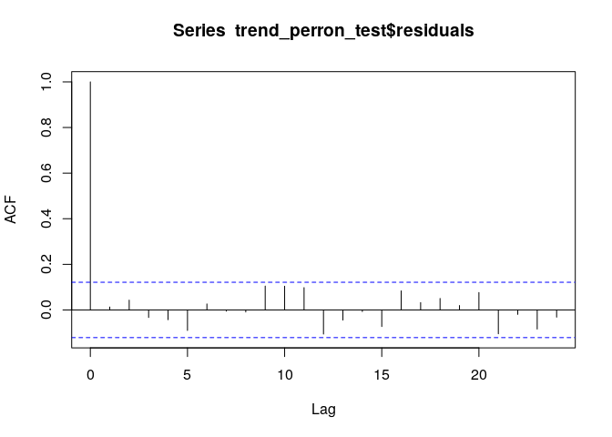
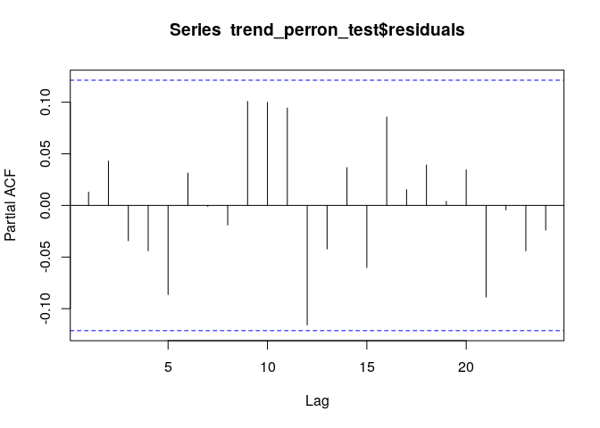
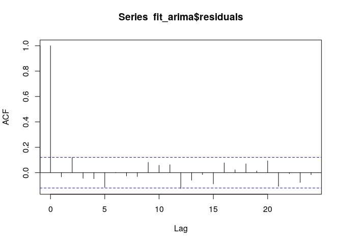
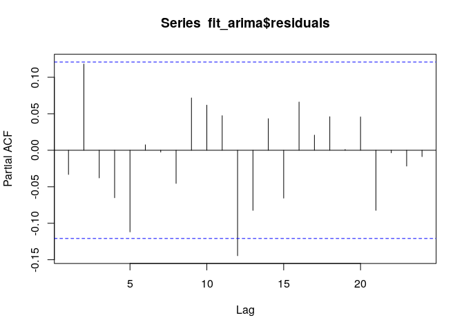
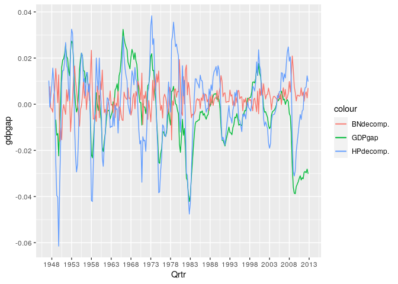
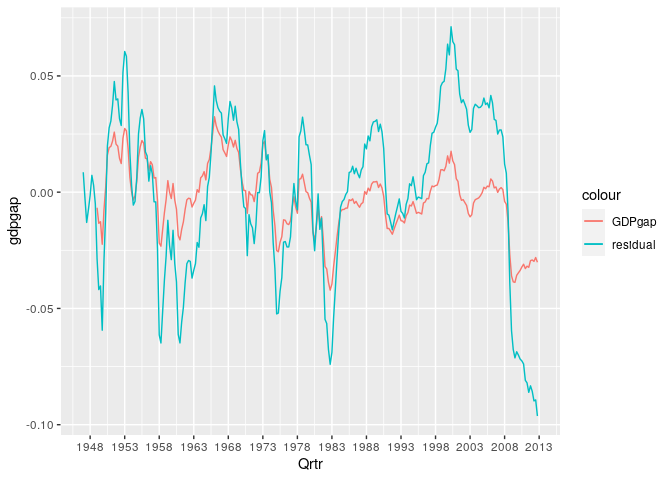

第4章 練習問題\[10\]
================

# \[10\]

## (a)

成長率について考えるため、 `rgdp`
のlogを取った値でトレンドの傾きに変化が生じたことを仮定したペロン検定を行う。

``` r
library(data.table)
library(dplyr)
```

    ## 
    ##  次のパッケージを付け加えます: 'dplyr'

    ##  以下のオブジェクトは 'package:data.table' からマスクされています:
    ## 
    ##     between, first, last

    ##  以下のオブジェクトは 'package:stats' からマスクされています:
    ## 
    ##     filter, lag

    ##  以下のオブジェクトは 'package:base' からマスクされています:
    ## 
    ##     intersect, setdiff, setequal, union

``` r
RGDP <- fread("../data/RGDP.csv")
setDF(RGDP)

# logを取る
lrgdp <- log(RGDP$rgdp)

# 1973Q2で構造変化が起きたと仮定し、Dp, Dlを生成する
## インデックス列idxを生成
RGDP$idx <- seq(1, nrow(RGDP))
## 1973Q2の行番号を取得
change_point <- filter(RGDP, V1 == "1973-04-01")$idx

## レベル変化
Dl <- rep(0, nrow(RGDP))
Dl[change_point:length(Dl)] <- 1

## トレンド変化
Dt <- seq(1, nrow(RGDP))
Dt <- Dt - change_point
Dt[1:change_point] <- 0

## ペロン検定
dYt <- c(NA, diff(lrgdp))
df <- data.frame(
  Yt = lrgdp,
  Yt_1 = dplyr::lag(lrgdp),
  t = RGDP$idx,
  Dl = Dl,
  Dt = Dt,
  DYt_1 = dplyr::lag(dYt), # Yt_1だけでは残差に系列相関が残ったためこの項も入れる
  DYt_2 = dplyr::lag(dplyr::lag(dYt)) # Yt_1だけでは残差に系列相関が残ったためこの項も入れる
)
trend_perron_test <- lm(
  formula = Yt ~ Yt_1 + t + Dl + Dt + DYt_1 + DYt_2,
  data = df
)
summary(trend_perron_test)
```

    ## 
    ## Call:
    ## lm(formula = Yt ~ Yt_1 + t + Dl + Dt + DYt_1 + DYt_2, data = df)
    ## 
    ## Residuals:
    ##       Min        1Q    Median        3Q       Max 
    ## -0.031751 -0.004954  0.000536  0.005129  0.033222 
    ## 
    ## Coefficients:
    ##               Estimate Std. Error t value Pr(>|t|)    
    ## (Intercept)  3.883e-01  1.245e-01   3.118  0.00203 ** 
    ## Yt_1         9.486e-01  1.674e-02  56.676  < 2e-16 ***
    ## t            4.970e-04  1.633e-04   3.044  0.00258 ** 
    ## Dl          -1.654e-03  2.292e-03  -0.722  0.47105    
    ## Dt          -1.324e-04  5.157e-05  -2.567  0.01084 *  
    ## DYt_1        3.384e-01  6.163e-02   5.490 9.72e-08 ***
    ## DYt_2        1.242e-01  6.306e-02   1.970  0.04990 *  
    ## ---
    ## Signif. codes:  0 '***' 0.001 '**' 0.01 '*' 0.05 '.' 0.1 ' ' 1
    ## 
    ## Residual standard error: 0.009 on 254 degrees of freedom
    ##   ( 3 個の観測値が欠損のため削除されました )
    ## Multiple R-squared:  0.9998, Adjusted R-squared:  0.9998 
    ## F-statistic: 1.979e+05 on 6 and 254 DF,  p-value: < 2.2e-16

残差診断

``` r
acf(trend_perron_test$residuals)
```

<!-- -->

``` r
pacf(trend_perron_test$residuals)
```

<!-- -->

残差のACF,
PACFにおいて系列相関認められないため、推定モデルは適切であると考えられる。  
`Dt` の係数は有意であり、トレンドに構造変化があったと考えられる。

## (b)

## BN分解

BN分解を行うために、まずはln(rgdp)の階差に最もフィットするARMA(p,
q)を求める。  
…が、書籍で既に ARMA(1, 0) を推定しているのでここでもそちらを用いる。

``` r
lrgdp <- log(RGDP$rgdp)
dlrgdp <- diff(lrgdp)

# 書籍で推定しているのと同じ ARMA(1, 0)モデル
fit_arima <- arima(dlrgdp, c(1, 0, 0))
print(summary(fit_arima))
```

    ##           Length Class  Mode     
    ## coef        2    -none- numeric  
    ## sigma2      1    -none- numeric  
    ## var.coef    4    -none- numeric  
    ## mask        2    -none- logical  
    ## loglik      1    -none- numeric  
    ## aic         1    -none- numeric  
    ## arma        7    -none- numeric  
    ## residuals 263    ts     numeric  
    ## call        3    -none- call     
    ## series      1    -none- character
    ## code        1    -none- numeric  
    ## n.cond      1    -none- numeric  
    ## nobs        1    -none- numeric  
    ## model      10    -none- list

``` r
# 残差診断
acf(fit_arima$residuals)
```

<!-- -->

``` r
pacf(fit_arima$residuals)
```

<!-- -->

lrgdpの階差について ARMA(1, 0)
モデルを推定したが、残差診断からこのモデルで問題はないことが分かる。  
次に推定されたモデルから各時点tについて s = $\infty$
期先までの予測値を基に、トレンド成分と循環成分に分解する。  
（書籍のp.249 例11を参照。訳注25）

``` r
# 推定モデルの係数
a1 <- coefficients(fit_arima)["ar1"]
a0 <- coefficients(fit_arima)["intercept"]
# MA過程に反転した際のドリフト項
mu <- a0 / (1 - a1)

# BN分解
BNtrend <- NA
BNcycle <- NA
s = 100
for(i in 2:length(dlrgdp)){
  BNtrend[i] <- a1 / (1 - a1) * (dlrgdp[i] - mu) + lrgdp[i]
  BNcycle[i] <- lrgdp[i] - BNtrend[i]
}
```

### HP分解

``` r
library(mFilter)

HP_decompose <- hpfilter(lrgdp, freq = 1600, type = "lambda")
HPtrend <- HP_decompose$trend
HPcycle <- HP_decompose$cycle
```

### プロット

GDPギャップとBN分解、HP分解の定常成分を図示する。

``` r
library(ggplot2)

# GDPギャップ
gdpgap <- log(RGDP$rgdp / RGDP$potential) # 解答を見る限り、このままだとなぜかGDPギャップが2倍？
gdpgap <- gdpgap / 2

# グラフ
df <- data.frame(
  Qrtr = RGDP$V1[-1],
  gdpgap = gdpgap[-1],
  BNcycle = BNcycle,
  HPcycle = HPcycle[-1]
)
g <- ggplot(data = df, mapping = aes(x = Qrtr)) +
     geom_line(mapping = aes(y = gdpgap, colour = "GDPgap")) +
     geom_line(mapping = aes(y = BNcycle, colour = "BNdecomp.")) +
     geom_line(mapping = aes(y = HPcycle, colour = "HPdecomp.")) +
     scale_x_date(breaks="5 years", date_labels = "%Y")
plot(g)
```

    ## Warning: Removed 7 row(s) containing missing values (geom_path).

    ## Warning: Removed 1 row(s) containing missing values (geom_path).

<!-- -->

書籍とほぼ同じ結果が得られた。  
BN分解、HP分解の特徴は 書籍の4.12節例11を参照。

GDPギャップとの比較についてはHP分解の方が近い動きをしているように見える。

## (c)

$t$, `Dl`, `Dt`で `lrgdp` を回帰してそれをトレンドとする。

``` r
df <- data.frame(
  lrgdp = lrgdp,
  t = RGDP$idx,
  Dl = Dl,
  Dt = Dt
)
trend <- lm(lrgdp ~ t + Dl + Dt, df)
res <- as.vector(trend$residuals)

# プロット
df <- data.frame(
  Qrtr = RGDP$V1,
  gdpgap = gdpgap,
  res = res
)
g <- ggplot(data = df, mapping = aes(x = Qrtr)) +
     geom_line(mapping = aes(y = gdpgap, colour = "GDPgap")) +
     geom_line(mapping = aes(y = res, colour = "residual")) +
     scale_x_date(breaks="5 years", date_labels = "%Y")
plot(g)
```

    ## Warning: Removed 8 row(s) containing missing values (geom_path).

<!-- -->

残差は景気循環に追随しているようには見えるが、ボラティリティが大きい。  
また、2010年以降の金融危機からの回復を捉えられていない。
