第4章 練習問題\[11\]
================

# \[11\]

## (a)

$y_t = a_1 y_{t-1} + \epsilon_t$
についてモンテカルロ法でディッキーフラー分布（ $a_1$ の分布）を求める。

``` r
library(dplyr)
library(ggplot2)

# 乱数のseed
set.seed(1234)
# 初期値
y0 <- 0
# 時系列の長さ
T <- 100
# モンテカルロ法の繰り返し回数
N <- 5000
# 帰無仮説：単位根仮説
a1_act <- 1

# モンテカルロ法
a1_pred <- c() # モンテカルロ法で求めたAR(1)の係数a1
t_stat <- c() # モンテカルロ法で求めたAR(1)のT統計量
for(i in 1:N){
  # 標準正規乱数
  et <- rnorm(100)
  # 系列ytを生成
  yt <- y0
  for(j in 1:T){
    yt[j+1] <- a1_act * yt[j] + et[j]
  }
  
  # 系列ytをyt ~ yt-1で推定
  df <- data.frame(yt = yt[2:T+1], yt_1 = dplyr::lag(yt)[2:T+1])
  fit_lm <- lm(yt ~ yt_1, df)
  
  # a1の推定量
  a1_pred <- append(a1_pred, summary(fit_lm)[["coefficients"]][2, 1])
  # T統計量T = (a1 - 1) / std(a1)
  t_stat <- append(t_stat, (summary(fit_lm)[["coefficients"]][2, 1] - 1) / summary(fit_lm)[["coefficients"]][2, 2])
}

# ヒストグラム
df <- data.frame(a1_pred = a1_pred, t_stat = t_stat)
# a1推定量のヒストグラム
g <- ggplot(data = df, mapping = aes(x = a1_pred)) +
     geom_histogram()
plot(g)
```


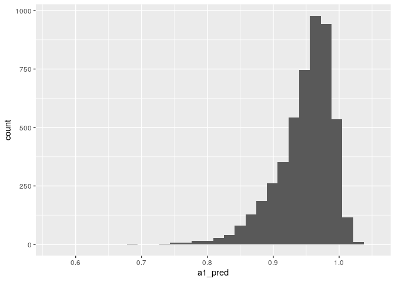<!-- -->

``` r
# T統計量のヒストグラム
g <- ggplot(data = df, mapping = aes(x = t_stat)) +
     geom_histogram()
plot(g)
```


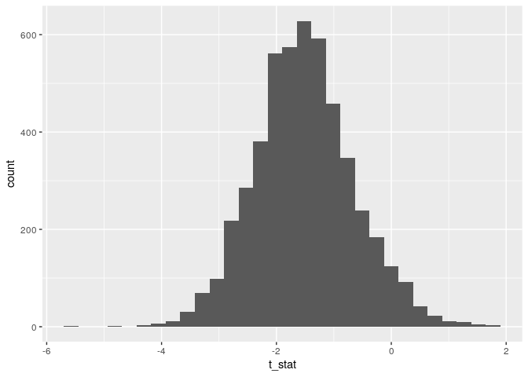<!-- -->

## (b)

``` r
# 乱数のseed
set.seed(1234)
# 初期値
y0 <- 0
# 時系列の長さ
T <- 100
# モンテカルロ法の繰り返し回数
N <- 5000
# 帰無仮説：単位根仮説
a1_act <- 1

# モンテカルロ法
a1_pred <- c() # モンテカルロ法で求めたAR(1)の係数a1
t_stat <- c() # モンテカルロ法で求めたAR(1)のT統計量
for(i in 1:N){
  # 標準正規乱数
  et <- rnorm(100)
  # 系列ytを生成
  yt <- y0
  for(j in 1:T){
    yt[j+1] <- a1_act * yt[j] + et[j]
  }
  
  # 系列ytをyt ~ yt-1で推定
  df <- data.frame(yt = yt[2:T+1], yt_1 = dplyr::lag(yt)[2:T+1], t = 1:(T-1))
  fit_lm <- lm(yt ~ yt_1 + t, df)
  
  # a1の推定量
  a1_pred <- append(a1_pred, summary(fit_lm)[["coefficients"]][2, 1])
  # T統計量T = (a1 - 1) / std(a1)
  t_stat <- append(t_stat, (summary(fit_lm)[["coefficients"]][2, 1] - 1) / summary(fit_lm)[["coefficients"]][2, 2])
}

# ヒストグラム
df <- data.frame(a1_pred = a1_pred, t_stat = t_stat)
# a1推定量のヒストグラム
g <- ggplot(data = df, mapping = aes(x = a1_pred)) +
     geom_histogram()
plot(g)
```


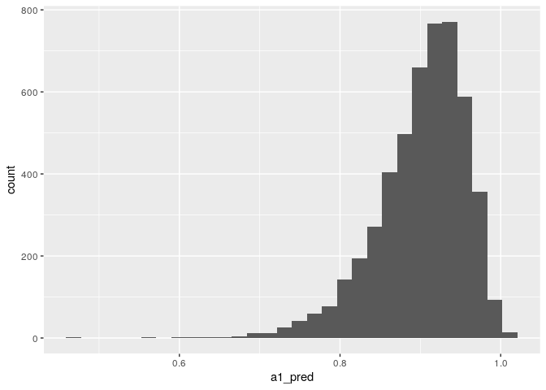<!-- -->

``` r
# T統計量のヒストグラム
g <- ggplot(data = df, mapping = aes(x = t_stat)) +
     geom_histogram()
plot(g)
```


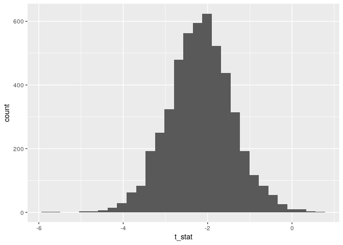<!-- -->

## (c)

``` r
set.seed(1234)
# a1を変えながらモンテカルロ法を行う関数
montecarlo <- function(a1_act){
  # 初期値
  y0 <- 0
  # 時系列の長さ
  T <- 100
  # モンテカルロ法の繰り返し回数
  N <- 5000
  
  # モンテカルロ法
  a1_pred <- c() # モンテカルロ法で求めたAR(1)の係数a1
  t_stat <- c() # モンテカルロ法で求めたAR(1)のT統計量
  for(i in 1:N){
    # 標準正規乱数
    et <- rnorm(100)
    # 系列ytを生成
    yt <- y0
    for(j in 1:T){
      yt[j+1] <- a1_act * yt[j] + et[j]
    }
    
    # 系列ytをyt ~ yt-1で推定
    df <- data.frame(yt = yt[2:T+1], yt_1 = dplyr::lag(yt)[2:T+1])
    fit_lm <- lm(yt ~ yt_1, df)
    
    # a1の推定量
    a1_pred <- append(a1_pred, summary(fit_lm)[["coefficients"]][2, 1])
    # T統計量T = (a1 - 1) / std(a1)
    t_stat <- append(t_stat, (summary(fit_lm)[["coefficients"]][2, 1] - a1_act) / summary(fit_lm)[["coefficients"]][2, 2])
  } 
  
  return(list(a1_pred = a1_pred, t_stat = t_stat))
}

# a1 = 0.5
results <- montecarlo(0.5)
a1_pred <- results$a1_pred
t_stat <- results$t_stat

# ヒストグラム
df <- data.frame(a1_pred = a1_pred, t_stat = t_stat)
# a1推定量のヒストグラム
g <- ggplot(data = df, mapping = aes(x = a1_pred)) +
     geom_histogram() + 
     ggtitle("a1 estimates for a1 = 0.5")
plot(g)
```


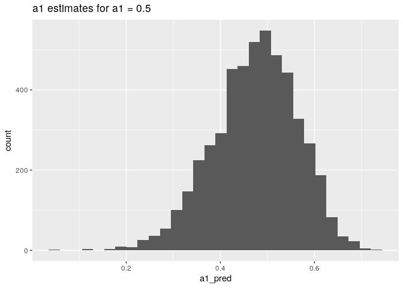<!-- -->

``` r
# T統計量のヒストグラム
g <- ggplot(data = df, mapping = aes(x = t_stat)) +
     geom_histogram() +
     ggtitle("T stat for a1 = 0.5")
plot(g)
```


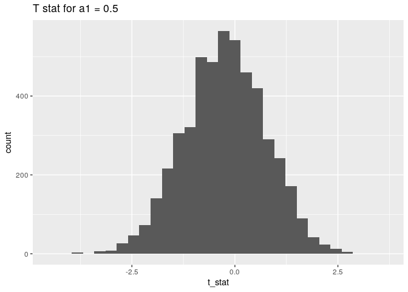<!-- -->

``` r
# a1 = 0.95
results <- montecarlo(0.95)
a1_pred <- results$a1_pred
t_stat <- results$t_stat

# ヒストグラム
df <- data.frame(a1_pred = a1_pred, t_stat = t_stat)
# a1推定量のヒストグラム
g <- ggplot(data = df, mapping = aes(x = a1_pred)) +
     geom_histogram() + 
     ggtitle("a1 estimates for a1 = 0.95")
plot(g)
```


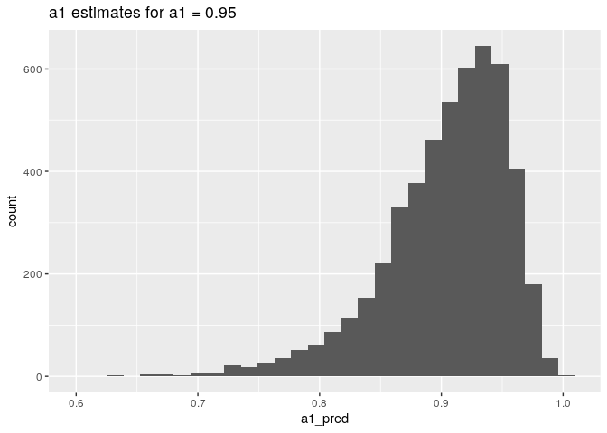<!-- -->

``` r
# T統計量のヒストグラム
g <- ggplot(data = df, mapping = aes(x = t_stat)) +
     geom_histogram() +
     ggtitle("T stat for a1 = 0.95")
plot(g)
```


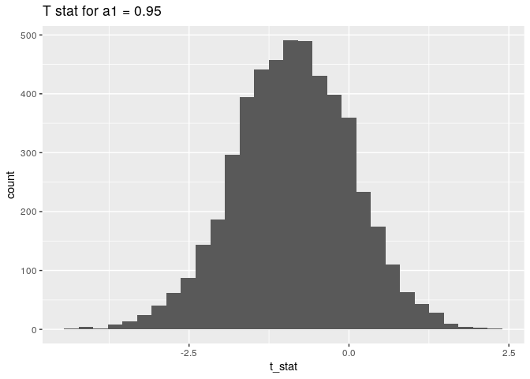<!-- -->

## (d)

``` r
# レベル変化Dtを生成
Dl <- rep(0, 100)
Dl[51:100] <- 1

set.seed(1234)
# deltaを変えながらモンテカルロ法を行う関数
montecarlo <- function(d){
  # 初期値
  y0 <- 0
  # 時系列の長さ
  T <- 100
  # モンテカルロ法の繰り返し回数
  N <- 5000
  
  # モンテカルロ法
  a1_pred <- c() # モンテカルロ法で求めたAR(1)の係数a1
  for(i in 1:N){
    # 標準正規乱数
    et <- rnorm(T)
    # 系列ytを生成
    yt <- y0
    for(j in 1:T){
      yt[j+1] <- 0.5 * yt[j] + et[j] + d * Dl[j]
    }
    
    # 系列ytをyt ~ yt-1で推定
    df <- data.frame(yt = yt[2:T+1], yt_1 = dplyr::lag(yt)[2:T+1])
    fit_lm <- lm(yt ~ yt_1, df)
    
    # a1の推定量
    a1_pred <- append(a1_pred, summary(fit_lm)[["coefficients"]][2, 1])
  } 
  
  return(a1_pred)
}

for(i in 0:3){
  a1_pred <- montecarlo(i)
  df <- data.frame(a1_pred = a1_pred)
  g <- ggplot(data = df, mapping = aes(x = a1_pred)) +
       geom_histogram() +
       ggtitle(paste("delta = ", as.character(i))) 
  plot(g)
}
```


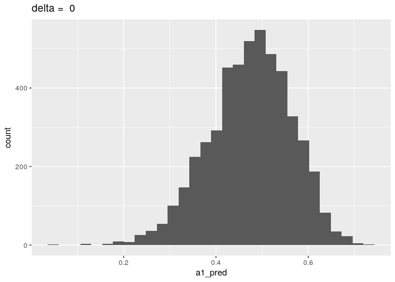<!-- -->


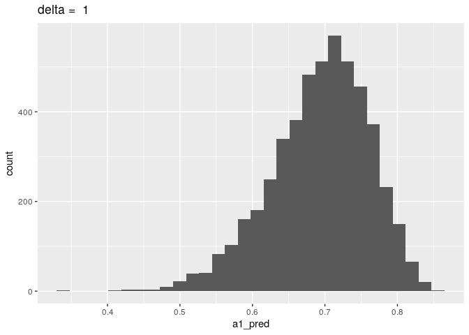<!-- -->


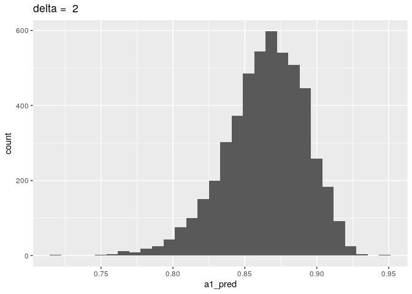<!-- -->


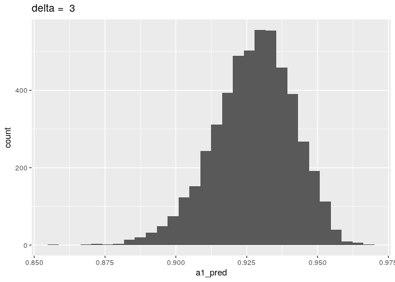<!-- -->

$\delta$ の値が大きくなるほど、 $a_1$ の係数が 1
に近づくバイアスを持つことが分かる。
