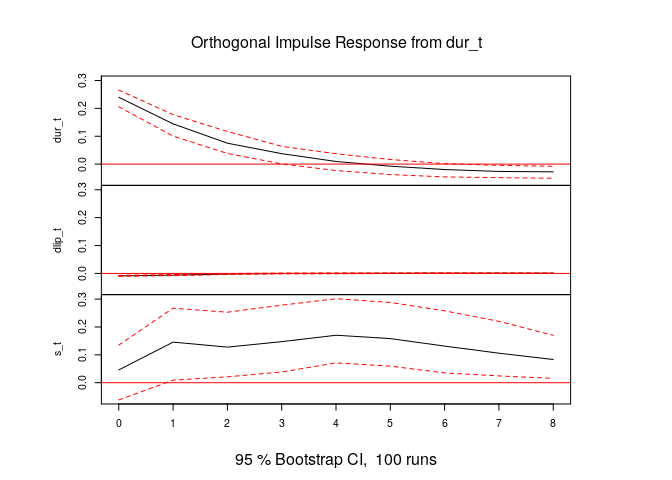

第5章 練習問題\[7\]
================

# \[7\]

問題\[6\]の結果からはラグ1が選択されるような気もするが…  
ここでは書籍の通りラグ3のVARモデルを採用する。  
ラグ3なので、1961Q1を初期として推定する。

``` r
library(readr)
library(dplyr)
library(ggplot2)
library(vars)

QUARTERLY <- read_csv("../data/QUARTERLY.csv")

# 四半期の列名を付与
QUARTERLY <- dplyr::rename(QUARTERLY, Qtr = ...1)

# 時系列のインデックス作成
Qtr <- QUARTERLY$Qtr
# st系列作成
s_t <- QUARTERLY$r5 - QUARTERLY$tbill
# Δlip_t系列作成
dlip_t <- diff(log(QUARTERLY$indprod))
# Δur_t系列作成
dur_t <- diff(QUARTERLY$unemp)

# 1961Q1から始まるデータを作成
# 変数の並び順に注意。後述
df <- data.frame(
  Qtr = Qtr[5:length(Qtr)],
  dlip_t = dlip_t[4:length(dlip_t)],
  dur_t = dur_t[4:length(dur_t)],
  s_t = s_t[5:length(s_t)]
)

# 3次のVARモデル
var_lag3 <- VAR(df[, 2:4], p = 3, type = "const")
summary(var_lag3)
```

    ## 
    ## VAR Estimation Results:
    ## ========================= 
    ## Endogenous variables: dlip_t, dur_t, s_t 
    ## Deterministic variables: const 
    ## Sample size: 205 
    ## Log Likelihood: 573.391 
    ## Roots of the characteristic polynomial:
    ## 0.7842 0.7552 0.7552 0.5207 0.5207 0.5122 0.5122 0.3813 0.3813
    ## Call:
    ## VAR(y = df[, 2:4], p = 3, type = "const")
    ## 
    ## 
    ## Estimation results for equation dlip_t: 
    ## ======================================= 
    ## dlip_t = dlip_t.l1 + dur_t.l1 + s_t.l1 + dlip_t.l2 + dur_t.l2 + s_t.l2 + dlip_t.l3 + dur_t.l3 + s_t.l3 + const 
    ## 
    ##             Estimate Std. Error t value Pr(>|t|)    
    ## dlip_t.l1  0.5462851  0.1034736   5.279 3.44e-07 ***
    ## dur_t.l1  -0.0068706  0.0052099  -1.319   0.1888    
    ## s_t.l1     0.0017331  0.0017999   0.963   0.3368    
    ## dlip_t.l2 -0.0844825  0.1042805  -0.810   0.4188    
    ## dur_t.l2   0.0056383  0.0052800   1.068   0.2869    
    ## s_t.l2     0.0004340  0.0025476   0.170   0.8649    
    ## dlip_t.l3  0.2118072  0.0996565   2.125   0.0348 *  
    ## dur_t.l3   0.0059985  0.0047232   1.270   0.2056    
    ## s_t.l3     0.0004481  0.0018418   0.243   0.8080    
    ## const     -0.0010699  0.0018661  -0.573   0.5671    
    ## ---
    ## Signif. codes:  0 '***' 0.001 '**' 0.01 '*' 0.05 '.' 0.1 ' ' 1
    ## 
    ## 
    ## Residual standard error: 0.01212 on 195 degrees of freedom
    ## Multiple R-Squared: 0.4186,  Adjusted R-squared: 0.3917 
    ## F-statistic:  15.6 on 9 and 195 DF,  p-value: < 2.2e-16 
    ## 
    ## 
    ## Estimation results for equation dur_t: 
    ## ====================================== 
    ## dur_t = dlip_t.l1 + dur_t.l1 + s_t.l1 + dlip_t.l2 + dur_t.l2 + s_t.l2 + dlip_t.l3 + dur_t.l3 + s_t.l3 + const 
    ## 
    ##            Estimate Std. Error t value Pr(>|t|)    
    ## dlip_t.l1 -6.994784   2.047495  -3.416 0.000773 ***
    ## dur_t.l1   0.346565   0.103092   3.362 0.000932 ***
    ## s_t.l1    -0.012660   0.035616  -0.355 0.722628    
    ## dlip_t.l2  0.449406   2.063463   0.218 0.827819    
    ## dur_t.l2  -0.058911   0.104478  -0.564 0.573499    
    ## s_t.l2     0.003537   0.050411   0.070 0.944142    
    ## dlip_t.l3 -2.593067   1.971964  -1.315 0.190065    
    ## dur_t.l3  -0.044020   0.093461  -0.471 0.638169    
    ## s_t.l3    -0.070093   0.036444  -1.923 0.055902 .  
    ## const      0.165380   0.036925   4.479 1.28e-05 ***
    ## ---
    ## Signif. codes:  0 '***' 0.001 '**' 0.01 '*' 0.05 '.' 0.1 ' ' 1
    ## 
    ## 
    ## Residual standard error: 0.2397 on 195 degrees of freedom
    ## Multiple R-Squared: 0.5136,  Adjusted R-squared: 0.4912 
    ## F-statistic: 22.88 on 9 and 195 DF,  p-value: < 2.2e-16 
    ## 
    ## 
    ## Estimation results for equation s_t: 
    ## ==================================== 
    ## s_t = dlip_t.l1 + dur_t.l1 + s_t.l1 + dlip_t.l2 + dur_t.l2 + s_t.l2 + dlip_t.l3 + dur_t.l3 + s_t.l3 + const 
    ## 
    ##           Estimate Std. Error t value Pr(>|t|)    
    ## dlip_t.l1 -2.28235    4.02960  -0.566 0.571776    
    ## dur_t.l1   0.32578    0.20289   1.606 0.109960    
    ## s_t.l1     1.03151    0.07010  14.716  < 2e-16 ***
    ## dlip_t.l2 -0.80022    4.06103  -0.197 0.843994    
    ## dur_t.l2  -0.31450    0.20562  -1.530 0.127754    
    ## s_t.l2    -0.34288    0.09921  -3.456 0.000673 ***
    ## dlip_t.l3 -3.67784    3.88095  -0.948 0.344473    
    ## dur_t.l3   0.15007    0.18394   0.816 0.415560    
    ## s_t.l3     0.17590    0.07172   2.452 0.015069 *  
    ## const      0.20682    0.07267   2.846 0.004901 ** 
    ## ---
    ## Signif. codes:  0 '***' 0.001 '**' 0.01 '*' 0.05 '.' 0.1 ' ' 1
    ## 
    ## 
    ## Residual standard error: 0.4718 on 195 degrees of freedom
    ## Multiple R-Squared: 0.7736,  Adjusted R-squared: 0.7632 
    ## F-statistic: 74.05 on 9 and 195 DF,  p-value: < 2.2e-16 
    ## 
    ## 
    ## 
    ## Covariance matrix of residuals:
    ##            dlip_t     dur_t        s_t
    ## dlip_t  0.0001468 -0.002119 -0.0006227
    ## dur_t  -0.0021188  0.057472  0.0110069
    ## s_t    -0.0006227  0.011007  0.2226054
    ## 
    ## Correlation matrix of residuals:
    ##         dlip_t    dur_t      s_t
    ## dlip_t  1.0000 -0.72950 -0.10893
    ## dur_t  -0.7295  1.00000  0.09731
    ## s_t    -0.1089  0.09731  1.00000

ここで、 `df` 内の変数の並び順に注意。  
Rの `var::irf()`
でインパルス応答関数を計算する際、どうやら変数の並び順を基に因果関係の先行性を決めているらしい。  
（具体的には、残差の分散共分散行列をコレスキー分解する際、varモデルで指定する変数の並び順で変数を並べた後で下三角行列のコレスキー分解をしているらしい。）

- [直交化インパルス応答値を求める際の内生変数の順序について](https://saecanet.com/saecanet-tips-order-of-endogenous-variables-in-orthogonal-impulse-response-function.html)
- [VARモデル補遺（備忘録）](https://tjo.hatenablog.com/entry/2022/08/30/170000)

正直この辺り怪しいので有識者の方いらっしゃいましたら教えてください…

## (a), (b)

**注意!!**  
以下ではRの `vars::causality()`
関数を用いてグレンジャー因果性検定を行っている。  
この関数は3変数以上のVARモデルの場合は特定の系列が他 **全て**
の系列にグレンジャー因果を持っているか否かを検定する。  
そのため書籍の問いの答えとは異なる解を導いていることに注意。  
（だれかきちんと書籍の問題に答えられる方法ご存じであれば教えてくださいmm）

``` r
causality(var_lag3, cause = "s_t")
```

    ## $Granger
    ## 
    ##  Granger causality H0: s_t do not Granger-cause dlip_t dur_t
    ## 
    ## data:  VAR object var_lag3
    ## F-Test = 3.659, df1 = 6, df2 = 585, p-value = 0.001415
    ## 
    ## 
    ## $Instant
    ## 
    ##  H0: No instantaneous causality between: s_t and dlip_t dur_t
    ## 
    ## data:  VAR object var_lag3
    ## Chi-squared = 2.5402, df = 2, p-value = 0.2808

有意水準1%でグレンジャー因果性が無いという帰無仮説が棄却される。  
よって、 `s_t` は `dlip_t`, `dur_t` の両方にグレンジャー因果性を持つ。

（普通に考えて片方にはグレンジャー因果性があるが、もう一方には無いということが起こりうる気がする。  
このパターンを検定できないのは困らないのだろうか…）

## (c)

$e_{1t}$ ( $\Delta lip_t$ の残差系列)と $e_{2t}$ ( $\Delta ur_t$
の残差系列) に着目する。  
$\Delta lip_t$ が $\Delta ur_t$
よりも因果関係で先行する順序付けを採用した場合、 $e_{1t}$ と $e_{2t}$
の相関係数が負なので、 $\Delta lip_t$ のショックは $\Delta ur_t$
のインパルス応答関数に 負の影響を与える。

一方、$\Delta ur_t$ が $\Delta lip_t$
よりも因果関係で先行する順序付けを採用した場合、 $\Delta lip_t$
のショックは $\Delta ur_t$ のインパルス応答関数に影響を与えない。

このように、順序付けによってインパルス応答関数が異なってしまうため、コレスキー分解の順序付けはモデルの識別において重要である。

## (d)

``` r
fevd(var_lag3, n.ahead = 8)
```

    ## $dlip_t
    ##         dlip_t       dur_t        s_t
    ## [1,] 1.0000000 0.000000000 0.00000000
    ## [2,] 0.9909714 0.005860863 0.00316773
    ## [3,] 0.9807966 0.005578617 0.01362477
    ## [4,] 0.9585413 0.013946095 0.02751261
    ## [5,] 0.9362536 0.018686000 0.04506041
    ## [6,] 0.9178632 0.020700748 0.06143604
    ## [7,] 0.9070039 0.022165779 0.07083036
    ## [8,] 0.9017521 0.022850865 0.07539704
    ## 
    ## $dur_t
    ##         dlip_t     dur_t          s_t
    ## [1,] 0.5321730 0.4678270 0.0000000000
    ## [2,] 0.6309742 0.3685944 0.0004314545
    ## [3,] 0.6590088 0.3389365 0.0020547187
    ## [4,] 0.6535584 0.3187647 0.0276768276
    ## [5,] 0.6260898 0.3042856 0.0696245715
    ## [6,] 0.6014466 0.2947042 0.1038492374
    ## [7,] 0.5853521 0.2880846 0.1265632048
    ## [8,] 0.5768985 0.2827513 0.1403501419
    ## 
    ## $s_t
    ##          dlip_t        dur_t       s_t
    ## [1,] 0.01186557 0.0006809566 0.9874535
    ## [2,] 0.04498915 0.0094274881 0.9455834
    ## [3,] 0.06892130 0.0091929936 0.9218857
    ## [4,] 0.10346422 0.0089630327 0.8875727
    ## [5,] 0.14492249 0.0090931732 0.8459843
    ## [6,] 0.17784894 0.0089661963 0.8131849
    ## [7,] 0.20111035 0.0086085969 0.7902811
    ## [8,] 0.21756122 0.0083395684 0.7740992

``` r
# ちなみにplotした方が分かりやすい
plot(fevd(var_lag3, n.ahead = 8))
```

<!-- -->

## (e)

``` r
# lip_t系列作成
lip_t <- log(QUARTERLY$indprod)
# ur_t系列作成
ur_t <- QUARTERLY$unemp

# 1961Q1から始まるデータを作成
df_nondiff <- data.frame(
  Qtr = Qtr[5:length(Qtr)],
  s_t = s_t[5:length(s_t)],
  lip_t = lip_t[5:length(lip_t)],
  ur_t = ur_t[5:length(ur_t)]
)

# 3次のVARモデル推定
var_nondiff_lag3 <- VAR(df[, 2:4], p = 3, type = "const")

# 予測誤差分解のプロット
plot(fevd(var_nondiff_lag3, n.ahead = 8))
```

<!-- -->

予測誤差分解の結果はあまり変わらない。

## (f)

``` r
# インパルス応答関数のプロット
plot(irf(var_lag3, n.ahead = 8))
```

<!-- --><!-- --><!-- -->

`Orthogonal Impulse Response from dlip_t` の縦軸 `dur_t`
のグラフが鉱工業指数に対する正のショックの失業率のインパルス応答関数。  
グラフを見ると6四半期くらいまでインパルス応答関数が負になっているので、鉱工業指数の正のショックは6四半期の失業率を低下させる。

## (g)

`df` の変数の並び順を変えて推定しなおし、インパルス応答関数を描く。

``` r
# 因果関係の先行性(=変数の並び順)を変える
df <- data.frame(
  Qtr = Qtr[5:length(Qtr)],
  dur_t = dur_t[4:length(dur_t)],
  dlip_t = dlip_t[4:length(dlip_t)],
  s_t = s_t[5:length(s_t)]
)

# 3次のVARモデル
var_lag3 <- VAR(df[, 2:4], p = 3, type = "const")

# インパルス応答関数
plot(irf(var_lag3, n.ahead = 8))
```

<!-- --><!-- --><!-- -->

先ほどと同様、`Orthogonal Impulse Response from dlip_t` の縦軸 `dur_t`
のグラフが鉱工業指数に対する正のショックの失業率のインパルス応答関数。  
グラフを見ると6四半期くらいまでインパルス応答関数が負になっているのは変わらないが、縦軸の値は
(f) よりも小さい。  
また、0期のインパルス応答関数の値が0である点も（因果関係の先行性を変えたから当然だが）異なる。
