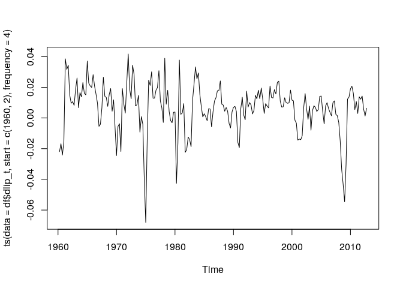
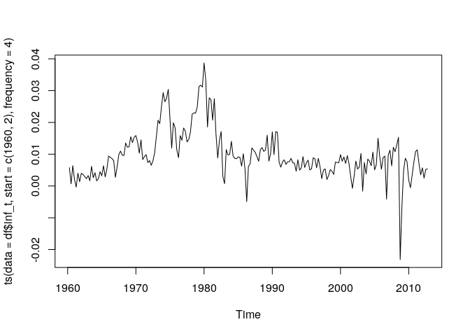
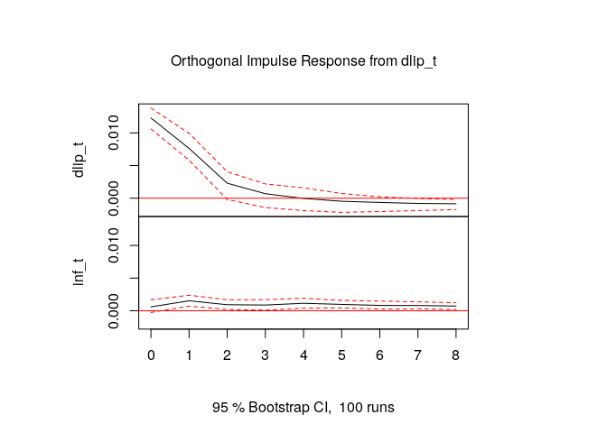
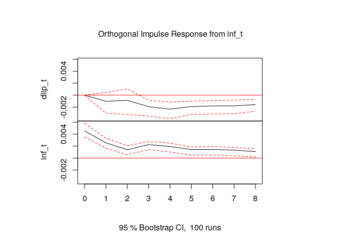
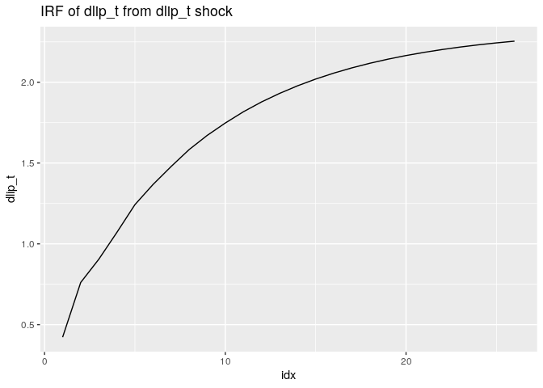
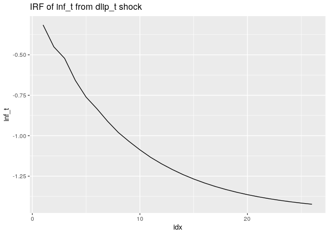
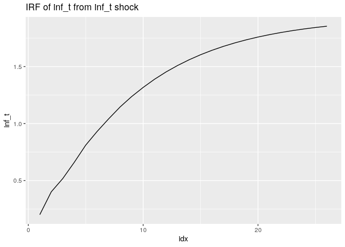
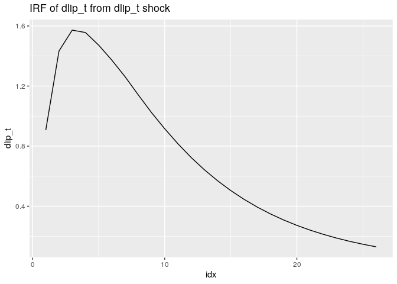

第5章 練習問題\[8\]
================

# \[8\]

``` r
library(readr)
library(dplyr)
library(ggplot2)
library(vars)
library(urca)

QUARTERLY <- read_csv("../data/QUARTERLY.csv")

# 四半期の列名を付与
QUARTERLY <- dplyr::rename(QUARTERLY, Qtr = ...1)

# 時系列のインデックス作成
Qtr <- QUARTERLY$Qtr
# Δlip_t系列作成
dlip_t <- diff(log(QUARTERLY$indprod))
# Δinf_t系列作成
inf_t <- diff(log(QUARTERLY$cpi))

# 階差のNA分を除いた1960Q2から始まるデータを作成
df <- data.frame(
  Qtr = Qtr[2:length(Qtr)],
  dlip_t = dlip_t,
  inf_t = inf_t
)

head(df)
```

    ##      Qtr      dlip_t         inf_t
    ## 1 1960Q2 -0.02196962  0.0057656595
    ## 2 1960Q3 -0.01679988  0.0006761325
    ## 3 1960Q4 -0.02418232  0.0064005608
    ## 4 1961Q1 -0.01524693  0.0020127481
    ## 5 1961Q2  0.03856006 -0.0003351768
    ## 6 1961Q3  0.03166717  0.0040147260

``` r
# プロット
# dlip_t
ts.plot(ts(data = df$dlip_t, start = c(1960, 2), frequency = 4))
```

<!-- -->

``` r
# inf_t
ts.plot(ts(data = df$inf_t, start = c(1960, 2), frequency = 4))
```

<!-- -->

`dlip_t, inf_t`
ともに単位根を持つ可能性はあるが、トレンドは存在していないように見える。

## (a)

dlit_tとinf_tが定常であるかどうかを調べるため、ADF検定を行う。

### dlip_t

``` r
# dlip_t
summary(ur.df(df$dlip_t, type = "drift", lags = 5, selectlags = "AIC"))
```

    ## 
    ## ############################################### 
    ## # Augmented Dickey-Fuller Test Unit Root Test # 
    ## ############################################### 
    ## 
    ## Test regression drift 
    ## 
    ## 
    ## Call:
    ## lm(formula = z.diff ~ z.lag.1 + 1 + z.diff.lag)
    ## 
    ## Residuals:
    ##       Min        1Q    Median        3Q       Max 
    ## -0.047402 -0.006256  0.000554  0.006261  0.041425 
    ## 
    ## Coefficients:
    ##               Estimate Std. Error t value Pr(>|t|)    
    ## (Intercept)  0.0031259  0.0009989   3.129  0.00201 ** 
    ## z.lag.1     -0.4611333  0.0734775  -6.276 2.12e-09 ***
    ## z.diff.lag1  0.1467783  0.0797823   1.840  0.06729 .  
    ## z.diff.lag2 -0.0326983  0.0705436  -0.464  0.64350    
    ## z.diff.lag3  0.1444253  0.0673574   2.144  0.03323 *  
    ## ---
    ## Signif. codes:  0 '***' 0.001 '**' 0.01 '*' 0.05 '.' 0.1 ' ' 1
    ## 
    ## Residual standard error: 0.01223 on 200 degrees of freedom
    ## Multiple R-squared:  0.2331, Adjusted R-squared:  0.2178 
    ## F-statistic:  15.2 on 4 and 200 DF,  p-value: 7.197e-11
    ## 
    ## 
    ## Value of test-statistic is: -6.2758 19.7031 
    ## 
    ## Critical values for test statistics: 
    ##       1pct  5pct 10pct
    ## tau2 -3.46 -2.88 -2.57
    ## phi1  6.52  4.63  3.81

ラグ1の項の係数が有意に0でないので、単位根を持つという帰無仮説は棄却される。  
よって $\Delta lip_t$ は定常であると判断される。

### inf_t

``` r
# inf_t
summary(ur.df(df$inf_t, type = "drift", lags = 5, selectlags = "AIC"))
```

    ## 
    ## ############################################### 
    ## # Augmented Dickey-Fuller Test Unit Root Test # 
    ## ############################################### 
    ## 
    ## Test regression drift 
    ## 
    ## 
    ## Call:
    ## lm(formula = z.diff ~ z.lag.1 + 1 + z.diff.lag)
    ## 
    ## Residuals:
    ##       Min        1Q    Median        3Q       Max 
    ## -0.036411 -0.002109  0.000258  0.002651  0.011091 
    ## 
    ## Coefficients:
    ##               Estimate Std. Error t value Pr(>|t|)    
    ## (Intercept)  0.0014490  0.0005815   2.492 0.013518 *  
    ## z.lag.1     -0.1439223  0.0480509  -2.995 0.003087 ** 
    ## z.diff.lag1 -0.2745743  0.0706467  -3.887 0.000138 ***
    ## z.diff.lag2 -0.2943912  0.0672343  -4.379 1.92e-05 ***
    ## ---
    ## Signif. codes:  0 '***' 0.001 '**' 0.01 '*' 0.05 '.' 0.1 ' ' 1
    ## 
    ## Residual standard error: 0.004742 on 201 degrees of freedom
    ## Multiple R-squared:  0.2205, Adjusted R-squared:  0.2089 
    ## F-statistic: 18.96 on 3 and 201 DF,  p-value: 7.247e-11
    ## 
    ## 
    ## Value of test-statistic is: -2.9952 4.487 
    ## 
    ## Critical values for test statistics: 
    ##       1pct  5pct 10pct
    ## tau2 -3.46 -2.88 -2.57
    ## phi1  6.52  4.63  3.81

ラグ1の項の係数が有意に0でないので、単位根を持つという帰無仮説は棄却される。  
よって $inf_t$ は定常であると判断される。

## (b)

### AIC

``` r
var_aic <- VAR(df[, 2:3], type = "const", lag.max = 10, ic = "AIC")
summary(var_aic)
```

    ## 
    ## VAR Estimation Results:
    ## ========================= 
    ## Endogenous variables: dlip_t, inf_t 
    ## Deterministic variables: const 
    ## Sample size: 206 
    ## Log Likelihood: 1451.691 
    ## Roots of the characteristic polynomial:
    ## 0.9162 0.754 0.754 0.6808 0.6808 0.6577 0.6577 0.6475 0.6475 0.374
    ## Call:
    ## VAR(y = df[, 2:3], type = "const", lag.max = 10, ic = "AIC")
    ## 
    ## 
    ## Estimation results for equation dlip_t: 
    ## ======================================= 
    ## dlip_t = dlip_t.l1 + inf_t.l1 + dlip_t.l2 + inf_t.l2 + dlip_t.l3 + inf_t.l3 + dlip_t.l4 + inf_t.l4 + dlip_t.l5 + inf_t.l5 + const 
    ## 
    ##            Estimate Std. Error t value Pr(>|t|)    
    ## dlip_t.l1  0.633728   0.070430   8.998  < 2e-16 ***
    ## inf_t.l1  -0.174458   0.187485  -0.931 0.353255    
    ## dlip_t.l2 -0.157348   0.083212  -1.891 0.060117 .  
    ## inf_t.l2  -0.112799   0.214368  -0.526 0.599351    
    ## dlip_t.l3  0.166397   0.082968   2.006 0.046286 *  
    ## inf_t.l3  -0.271786   0.205065  -1.325 0.186600    
    ## dlip_t.l4 -0.074300   0.083233  -0.893 0.373130    
    ## inf_t.l4  -0.016607   0.211461  -0.079 0.937484    
    ## dlip_t.l5 -0.068187   0.068130  -1.001 0.318145    
    ## inf_t.l5   0.205072   0.188467   1.088 0.277891    
    ## const      0.007073   0.001805   3.918 0.000124 ***
    ## ---
    ## Signif. codes:  0 '***' 0.001 '**' 0.01 '*' 0.05 '.' 0.1 ' ' 1
    ## 
    ## 
    ## Residual standard error: 0.01197 on 195 degrees of freedom
    ## Multiple R-Squared: 0.4393,  Adjusted R-squared: 0.4106 
    ## F-statistic: 15.28 on 10 and 195 DF,  p-value: < 2.2e-16 
    ## 
    ## 
    ## Estimation results for equation inf_t: 
    ## ====================================== 
    ## inf_t = dlip_t.l1 + inf_t.l1 + dlip_t.l2 + inf_t.l2 + dlip_t.l3 + inf_t.l3 + dlip_t.l4 + inf_t.l4 + dlip_t.l5 + inf_t.l5 + const 
    ## 
    ##             Estimate Std. Error t value Pr(>|t|)    
    ## dlip_t.l1  9.574e-02  2.676e-02   3.578 0.000438 ***
    ## inf_t.l1   5.435e-01  7.124e-02   7.629 1.02e-12 ***
    ## dlip_t.l2 -4.243e-02  3.162e-02  -1.342 0.181224    
    ## inf_t.l2  -1.984e-02  8.145e-02  -0.244 0.807784    
    ## dlip_t.l3  3.449e-03  3.153e-02   0.109 0.912983    
    ## inf_t.l3   3.202e-01  7.792e-02   4.110 5.83e-05 ***
    ## dlip_t.l4  3.427e-02  3.163e-02   1.084 0.279921    
    ## inf_t.l4  -9.173e-02  8.035e-02  -1.142 0.255000    
    ## dlip_t.l5  2.451e-02  2.589e-02   0.947 0.344973    
    ## inf_t.l5   1.664e-01  7.161e-02   2.323 0.021186 *  
    ## const      2.633e-05  6.860e-04   0.038 0.969428    
    ## ---
    ## Signif. codes:  0 '***' 0.001 '**' 0.01 '*' 0.05 '.' 0.1 ' ' 1
    ## 
    ## 
    ## Residual standard error: 0.004549 on 195 degrees of freedom
    ## Multiple R-Squared: 0.6638,  Adjusted R-squared: 0.6466 
    ## F-statistic:  38.5 on 10 and 195 DF,  p-value: < 2.2e-16 
    ## 
    ## 
    ## 
    ## Covariance matrix of residuals:
    ##           dlip_t     inf_t
    ## dlip_t 1.433e-04 8.320e-06
    ## inf_t  8.320e-06 2.069e-05
    ## 
    ## Correlation matrix of residuals:
    ##        dlip_t  inf_t
    ## dlip_t 1.0000 0.1528
    ## inf_t  0.1528 1.0000

AICではラグ5が選択された。

### BIC

``` r
var_bic <- VAR(df[, 2:3], type = "const", lag.max = 10, ic = "SC")
summary(var_bic)
```

    ## 
    ## VAR Estimation Results:
    ## ========================= 
    ## Endogenous variables: dlip_t, inf_t 
    ## Deterministic variables: const 
    ## Sample size: 208 
    ## Log Likelihood: 1453.694 
    ## Roots of the characteristic polynomial:
    ## 0.8835 0.6223 0.6067 0.6067 0.3988 0.3988
    ## Call:
    ## VAR(y = df[, 2:3], type = "const", lag.max = 10, ic = "SC")
    ## 
    ## 
    ## Estimation results for equation dlip_t: 
    ## ======================================= 
    ## dlip_t = dlip_t.l1 + inf_t.l1 + dlip_t.l2 + inf_t.l2 + dlip_t.l3 + inf_t.l3 + const 
    ## 
    ##            Estimate Std. Error t value Pr(>|t|)    
    ## dlip_t.l1  0.631566   0.069512   9.086  < 2e-16 ***
    ## inf_t.l1  -0.228092   0.178703  -1.276   0.2033    
    ## dlip_t.l2 -0.180745   0.082902  -2.180   0.0304 *  
    ## inf_t.l2   0.078858   0.206024   0.383   0.7023    
    ## dlip_t.l3  0.072784   0.067978   1.071   0.2856    
    ## inf_t.l3  -0.317861   0.180763  -1.758   0.0802 .  
    ## const      0.008056   0.001648   4.888 2.08e-06 ***
    ## ---
    ## Signif. codes:  0 '***' 0.001 '**' 0.01 '*' 0.05 '.' 0.1 ' ' 1
    ## 
    ## 
    ## Residual standard error: 0.01228 on 201 degrees of freedom
    ## Multiple R-Squared: 0.4094,  Adjusted R-squared: 0.3917 
    ## F-statistic: 23.22 on 6 and 201 DF,  p-value: < 2.2e-16 
    ## 
    ## 
    ## Estimation results for equation inf_t: 
    ## ====================================== 
    ## inf_t = dlip_t.l1 + inf_t.l1 + dlip_t.l2 + inf_t.l2 + dlip_t.l3 + inf_t.l3 + const 
    ## 
    ##             Estimate Std. Error t value Pr(>|t|)    
    ## dlip_t.l1  0.0973472  0.0259673   3.749 0.000232 ***
    ## inf_t.l1   0.5597111  0.0667574   8.384 8.86e-15 ***
    ## dlip_t.l2 -0.0554487  0.0309694  -1.790 0.074889 .  
    ## inf_t.l2   0.0161987  0.0769635   0.210 0.833512    
    ## dlip_t.l3  0.0277964  0.0253942   1.095 0.275003    
    ## inf_t.l3   0.3208133  0.0675268   4.751 3.85e-06 ***
    ## const      0.0005338  0.0006157   0.867 0.386927    
    ## ---
    ## Signif. codes:  0 '***' 0.001 '**' 0.01 '*' 0.05 '.' 0.1 ' ' 1
    ## 
    ## 
    ## Residual standard error: 0.004588 on 201 degrees of freedom
    ## Multiple R-Squared: 0.6523,  Adjusted R-squared: 0.6419 
    ## F-statistic: 62.84 on 6 and 201 DF,  p-value: < 2.2e-16 
    ## 
    ## 
    ## 
    ## Covariance matrix of residuals:
    ##           dlip_t     inf_t
    ## dlip_t 1.508e-04 7.323e-06
    ## inf_t  7.323e-06 2.105e-05
    ## 
    ## Correlation matrix of residuals:
    ##        dlip_t inf_t
    ## dlip_t   1.00  0.13
    ## inf_t    0.13  1.00

BICではラグ3が選択された。

### 一般化からの特定法

省略。 `ch06.md` 参照。

## (c)

### inf_t -\> dlip_t

``` r
var_lag3 <- VAR(df[, 2:3], p = 3, type = "const")
causality(var_lag3, cause = "inf_t")
```

    ## $Granger
    ## 
    ##  Granger causality H0: inf_t do not Granger-cause dlip_t
    ## 
    ## data:  VAR object var_lag3
    ## F-Test = 4.8191, df1 = 3, df2 = 402, p-value = 0.002619
    ## 
    ## 
    ## $Instant
    ## 
    ##  H0: No instantaneous causality between: inf_t and dlip_t
    ## 
    ## data:  VAR object var_lag3
    ## Chi-squared = 3.4551, df = 1, p-value = 0.06306

インフレ率は鉱工業指数に対してグレンジャー因果を持つと判断された。

### dlip_t -\> inf_t

``` r
causality(var_lag3, cause = "dlip_t")
```

    ## $Granger
    ## 
    ##  Granger causality H0: dlip_t do not Granger-cause inf_t
    ## 
    ## data:  VAR object var_lag3
    ## F-Test = 5.105, df1 = 3, df2 = 402, p-value = 0.001775
    ## 
    ## 
    ## $Instant
    ## 
    ##  H0: No instantaneous causality between: dlip_t and inf_t
    ## 
    ## data:  VAR object var_lag3
    ## Chi-squared = 3.4551, df = 1, p-value = 0.06306

鉱工業指数はインフレ率に対してグレンジャー因果を持つと判断された。

## (d)

``` r
fevd(var_lag3, n.ahead = 8)
```

    ## $dlip_t
    ##         dlip_t       inf_t
    ## [1,] 1.0000000 0.000000000
    ## [2,] 0.9948729 0.005127074
    ## [3,] 0.9914523 0.008547660
    ## [4,] 0.9746892 0.025310771
    ## [5,] 0.9508489 0.049151067
    ## [6,] 0.9358435 0.064156502
    ## [7,] 0.9228408 0.077159175
    ## [8,] 0.9104460 0.089553980
    ## 
    ## $inf_t
    ##          dlip_t     inf_t
    ## [1,] 0.01689170 0.9831083
    ## [2,] 0.09020054 0.9097995
    ## [3,] 0.10870279 0.8912972
    ## [4,] 0.11212667 0.8878733
    ## [5,] 0.12933060 0.8706694
    ## [6,] 0.14151574 0.8584843
    ## [7,] 0.14729840 0.8527016
    ## [8,] 0.15307262 0.8469274

## (e)

``` r
plot(irf(var_lag3, n.ahead = 8))
```

<!-- --><!-- -->

$\Delta lip_t$ に対する正のショックによる $inf_t$
のインパルス応答関数は正であることから、鉱工業指数に対する正のショックはインフレ率を増加させることが分かる。  
$inf_t$ に対する正のショックによる $\Delta lip_t$
のインパルス応答関数は負であることから、インフレ率に対する正のショックは鉱工業指数を減少させることが分かる。

この結果はAS-ADモデルとは不整合である（p.321で触れられているモデルがAS-ADモデルらしい）。  
今の場合、鉱工業指数に対する正のショックは総供給ショック、インフレ率に対する正のショックは総需要ショックとみなせる。  
この時、AS-ADモデルによると総供給ショックは長期的には需要、つまりインフレ率を低下させる。  
逆に、総需要ショックは生産、つまり鉱工業指数を増加させる。

## (f)

以下のコードで `var_lag3` の `dlip_t`
残差の標準偏差を確認すると、0.01228 であることが分かる。
この値でBQ分解ごとのインパルス応答関数の各値を割り、問題のインパルス応答関数を求める。

``` r
summary(var_lag3)
```

    ## 
    ## VAR Estimation Results:
    ## ========================= 
    ## Endogenous variables: dlip_t, inf_t 
    ## Deterministic variables: const 
    ## Sample size: 208 
    ## Log Likelihood: 1453.694 
    ## Roots of the characteristic polynomial:
    ## 0.8835 0.6223 0.6067 0.6067 0.3988 0.3988
    ## Call:
    ## VAR(y = df[, 2:3], p = 3, type = "const")
    ## 
    ## 
    ## Estimation results for equation dlip_t: 
    ## ======================================= 
    ## dlip_t = dlip_t.l1 + inf_t.l1 + dlip_t.l2 + inf_t.l2 + dlip_t.l3 + inf_t.l3 + const 
    ## 
    ##            Estimate Std. Error t value Pr(>|t|)    
    ## dlip_t.l1  0.631566   0.069512   9.086  < 2e-16 ***
    ## inf_t.l1  -0.228092   0.178703  -1.276   0.2033    
    ## dlip_t.l2 -0.180745   0.082902  -2.180   0.0304 *  
    ## inf_t.l2   0.078858   0.206024   0.383   0.7023    
    ## dlip_t.l3  0.072784   0.067978   1.071   0.2856    
    ## inf_t.l3  -0.317861   0.180763  -1.758   0.0802 .  
    ## const      0.008056   0.001648   4.888 2.08e-06 ***
    ## ---
    ## Signif. codes:  0 '***' 0.001 '**' 0.01 '*' 0.05 '.' 0.1 ' ' 1
    ## 
    ## 
    ## Residual standard error: 0.01228 on 201 degrees of freedom
    ## Multiple R-Squared: 0.4094,  Adjusted R-squared: 0.3917 
    ## F-statistic: 23.22 on 6 and 201 DF,  p-value: < 2.2e-16 
    ## 
    ## 
    ## Estimation results for equation inf_t: 
    ## ====================================== 
    ## inf_t = dlip_t.l1 + inf_t.l1 + dlip_t.l2 + inf_t.l2 + dlip_t.l3 + inf_t.l3 + const 
    ## 
    ##             Estimate Std. Error t value Pr(>|t|)    
    ## dlip_t.l1  0.0973472  0.0259673   3.749 0.000232 ***
    ## inf_t.l1   0.5597111  0.0667574   8.384 8.86e-15 ***
    ## dlip_t.l2 -0.0554487  0.0309694  -1.790 0.074889 .  
    ## inf_t.l2   0.0161987  0.0769635   0.210 0.833512    
    ## dlip_t.l3  0.0277964  0.0253942   1.095 0.275003    
    ## inf_t.l3   0.3208133  0.0675268   4.751 3.85e-06 ***
    ## const      0.0005338  0.0006157   0.867 0.386927    
    ## ---
    ## Signif. codes:  0 '***' 0.001 '**' 0.01 '*' 0.05 '.' 0.1 ' ' 1
    ## 
    ## 
    ## Residual standard error: 0.004588 on 201 degrees of freedom
    ## Multiple R-Squared: 0.6523,  Adjusted R-squared: 0.6419 
    ## F-statistic: 62.84 on 6 and 201 DF,  p-value: < 2.2e-16 
    ## 
    ## 
    ## 
    ## Covariance matrix of residuals:
    ##           dlip_t     inf_t
    ## dlip_t 1.508e-04 7.323e-06
    ## inf_t  7.323e-06 2.105e-05
    ## 
    ## Correlation matrix of residuals:
    ##        dlip_t inf_t
    ## dlip_t   1.00  0.13
    ## inf_t    0.13  1.00

``` r
# dlip_t推定式の残差の標準偏差
dlip_t_std <- 0.01228

# BQ分解後のインパルス応答関数
# 累積和を計算する
irf_bq_decomp <- irf(BQ(var_lag3), cumulative = T, n.ahead = 25)

# dlip_tのショックに対するインパルス応答関数を計算してプロット
dlip_t_irf <- irf_bq_decomp$irf$dlip_t / dlip_t_std
dlip_t_irf <- as.data.frame(dlip_t_irf) %>% mutate(idx = 1:26)
# dlip_tのショックに対するdlip_tのインパルス応答関数
g <- ggplot(data = dlip_t_irf, mapping = aes(x = idx, y = dlip_t)) + 
     geom_line() +
     ggtitle("IRF of dlip_t from dlip_t shock")
plot(g)
```

<!-- -->

``` r
# dlip_tのショックに対するinf_tのインパルス応答関数
g <- ggplot(data = dlip_t_irf, mapping = aes(x = idx, y = inf_t)) + 
     geom_line() +
     ggtitle("IRF of inf_t from dlip_t shock")
plot(g)
```

<!-- -->

``` r
# inf_tのショックに対するインパルス応答関数を計算してプロット
inf_t_irf <- irf_bq_decomp$irf$inf_t / dlip_t_std
inf_t_irf <- as.data.frame(inf_t_irf) %>% mutate(idx = 1:26)
# inf_tのショックに対するinf_tのインパルス応答関数
g <- ggplot(data = inf_t_irf, mapping = aes(x = idx, y = inf_t)) + 
     geom_line() +
     ggtitle("IRF of inf_t from inf_t shock")
plot(g)
```

<!-- -->

``` r
# inf_tのショックに対するdlip_tのインパルス応答関数
g <- ggplot(data = inf_t_irf, mapping = aes(x = idx, y = dlip_t)) + 
     geom_line() +
     ggtitle("IRF of dlip_t from dlip_t shock")
plot(g)
```

<!-- -->

## (g)

(f)のグラフは(e)のグラフと異なり、AS-ADモデルと整合的である。
