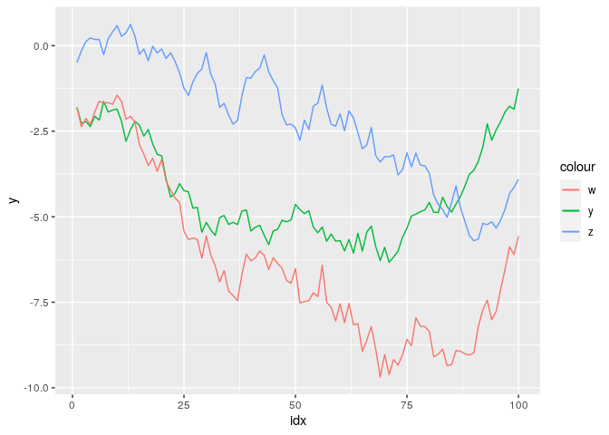
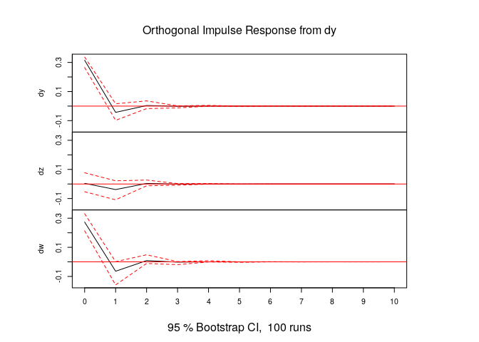
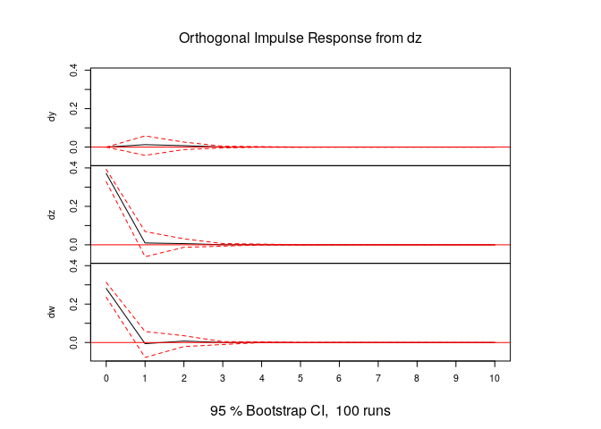
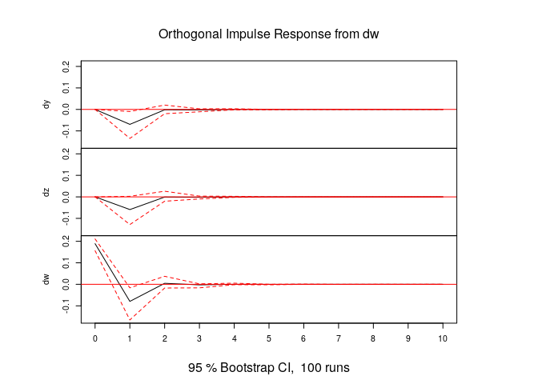
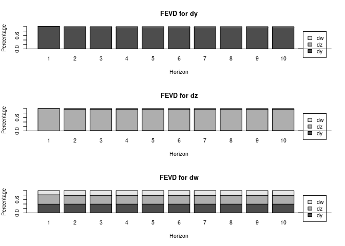

第6章 練習問題[3](#section-3)
================

# [3](#section-3)

``` r
library(dplyr)
library(ggplot2)

COINT6 <- read.csv("../data/COINT6.csv")
COINT6 <- COINT6 %>% mutate(idx = 1:nrow(COINT6))
head(COINT6)
```

    ##          y          z        w idx
    ## 1 -1.80156 -0.4969500 -1.79957   1
    ## 2 -2.27002 -0.1490799 -2.36988   2
    ## 3 -2.21743  0.1181677 -2.12782   3
    ## 4 -2.36609  0.2260346 -2.30212   4
    ## 5 -2.06364  0.1829068 -1.93444   5
    ## 6 -2.17761  0.1754546 -1.62233   6

``` r
g <- ggplot(data = COINT6, mapping = aes(x = idx)) +
     geom_line(mapping = aes(y = y, colour = "y")) +
     geom_line(mapping = aes(y = z, colour = "z")) +
     geom_line(mapping = aes(y = w, colour = "w"))
plot(g)
```

<!-- -->

## (a)

### 第1段階：変数の単位根検定

ラグなしの場合のDF検定

``` r
library(urca)

results_lag0 <- data.frame()

# y
adftest <- ur.df(COINT6$y, type ="drift", lags = 0)
results_lag0 <- rbind(results_lag0,
                      data.frame(v = "y",
                                 est = adftest@testreg$coefficients[2, 1],
                                 tval = adftest@testreg$coefficients[2, 3]))

# z
adftest <- ur.df(COINT6$z, type ="drift", lags = 0)
results_lag0 <- rbind(results_lag0,
                      data.frame(v = "z",
                                 est = adftest@testreg$coefficients[2, 1],
                                 tval = adftest@testreg$coefficients[2, 3]))

# w
adftest <- ur.df(COINT6$w, type ="drift", lags = 0)
results_lag0 <- rbind(results_lag0,
                      data.frame(v = "w",
                                 est = adftest@testreg$coefficients[2, 1],
                                 tval = adftest@testreg$coefficients[2, 3]))

print(results_lag0)
```

    ##   v         est       tval
    ## 1 y -0.01995197 -0.8324861
    ## 2 z -0.02069799 -0.9921303
    ## 3 w -0.03501365 -1.9078111

ラグ4の場合のDF検定

``` r
library(urca)

results_lag4 <- data.frame()

# y
adftest <- ur.df(COINT6$y, type ="drift", lags = 4)
results_lag4 <- rbind(results_lag4,
                      data.frame(v = "y",
                                 est = adftest@testreg$coefficients[2, 1],
                                 tval = adftest@testreg$coefficients[2, 3]))

# z
adftest <- ur.df(COINT6$z, type ="drift", lags = 4)
results_lag4 <- rbind(results_lag4,
                      data.frame(v = "z",
                                 est = adftest@testreg$coefficients[2, 1],
                                 tval = adftest@testreg$coefficients[2, 3]))

# w
adftest <- ur.df(COINT6$w, type ="drift", lags = 4)
results_lag4 <- rbind(results_lag4,
                      data.frame(v = "w",
                                 est = adftest@testreg$coefficients[2, 1],
                                 tval = adftest@testreg$coefficients[2, 3]))

print(results_lag4)
```

    ##   v         est      tval
    ## 1 y -0.02690779 -1.046503
    ## 2 z -0.02584160 -1.143731
    ## 3 w -0.03746938 -1.933501

ラグ0, 4のいずれでも `y, w, z` の系列で単位根仮説を棄却できない。

### 第2段階：長期均衡関係の推定

`y` を `z, w` で回帰し、残差のADF検定を行う。  
ADF検定では先ほどと同様、ラグ0とラグ4の両方で検定を行う。

``` r
reg_y <- lm(formula = y ~ z + w, data = COINT6)
summary(reg_y)
```

    ## 
    ## Call:
    ## lm(formula = y ~ z + w, data = COINT6)
    ## 
    ## Residuals:
    ##      Min       1Q   Median       3Q      Max 
    ## -0.57132 -0.13148 -0.01558  0.16405  0.61446 
    ## 
    ## Coefficients:
    ##             Estimate Std. Error t value Pr(>|t|)    
    ## (Intercept) -0.04843    0.08422  -0.575    0.567    
    ## z           -0.92731    0.02434 -38.095   <2e-16 ***
    ## w            0.97688    0.01827  53.463   <2e-16 ***
    ## ---
    ## Signif. codes:  0 '***' 0.001 '**' 0.01 '*' 0.05 '.' 0.1 ' ' 1
    ## 
    ## Residual standard error: 0.2557 on 97 degrees of freedom
    ## Multiple R-squared:  0.968,  Adjusted R-squared:  0.9673 
    ## F-statistic:  1467 on 2 and 97 DF,  p-value: < 2.2e-16

``` r
# 残差の定常性検定
# 残差なので定数項はないものと仮定する
# ラグ0
summary(ur.df(reg_y$residuals, type = "none", lags = 0))
```

    ## 
    ## ############################################### 
    ## # Augmented Dickey-Fuller Test Unit Root Test # 
    ## ############################################### 
    ## 
    ## Test regression none 
    ## 
    ## 
    ## Call:
    ## lm(formula = z.diff ~ z.lag.1 - 1)
    ## 
    ## Residuals:
    ##     Min      1Q  Median      3Q     Max 
    ## -0.4910 -0.1181  0.0143  0.1477  0.4371 
    ## 
    ## Coefficients:
    ##         Estimate Std. Error t value Pr(>|t|)    
    ## z.lag.1 -0.44301    0.08561  -5.175 1.21e-06 ***
    ## ---
    ## Signif. codes:  0 '***' 0.001 '**' 0.01 '*' 0.05 '.' 0.1 ' ' 1
    ## 
    ## Residual standard error: 0.209 on 98 degrees of freedom
    ## Multiple R-squared:  0.2146, Adjusted R-squared:  0.2066 
    ## F-statistic: 26.78 on 1 and 98 DF,  p-value: 1.213e-06
    ## 
    ## 
    ## Value of test-statistic is: -5.1749 
    ## 
    ## Critical values for test statistics: 
    ##      1pct  5pct 10pct
    ## tau1 -2.6 -1.95 -1.61

``` r
# ラグ4
summary(ur.df(reg_y$residuals, type = "none", lags = 4))
```

    ## 
    ## ############################################### 
    ## # Augmented Dickey-Fuller Test Unit Root Test # 
    ## ############################################### 
    ## 
    ## Test regression none 
    ## 
    ## 
    ## Call:
    ## lm(formula = z.diff ~ z.lag.1 - 1 + z.diff.lag)
    ## 
    ## Residuals:
    ##      Min       1Q   Median       3Q      Max 
    ## -0.46750 -0.14126  0.01941  0.16700  0.40763 
    ## 
    ## Coefficients:
    ##             Estimate Std. Error t value Pr(>|t|)    
    ## z.lag.1     -0.59525    0.14610  -4.074 9.93e-05 ***
    ## z.diff.lag1  0.28612    0.13873   2.062   0.0421 *  
    ## z.diff.lag2  0.05408    0.12814   0.422   0.6740    
    ## z.diff.lag3  0.07724    0.11431   0.676   0.5010    
    ## z.diff.lag4  0.04111    0.10631   0.387   0.6999    
    ## ---
    ## Signif. codes:  0 '***' 0.001 '**' 0.01 '*' 0.05 '.' 0.1 ' ' 1
    ## 
    ## Residual standard error: 0.2106 on 90 degrees of freedom
    ## Multiple R-squared:  0.2405, Adjusted R-squared:  0.1983 
    ## F-statistic: 5.699 on 5 and 90 DF,  p-value: 0.0001299
    ## 
    ## 
    ## Value of test-statistic is: -4.0742 
    ## 
    ## Critical values for test statistics: 
    ##      1pct  5pct 10pct
    ## tau1 -2.6 -1.95 -1.61

ここで、ADF検定の結果を解釈する際に上記のp値で判断してはならないことに注意（詳細は書籍p.357を参照）。  
T値を書籍の巻末付表Cの値と比べて判断する。  
巻末の付表Cから、T値の臨界値は -3.828
なので、上記のADF検定では単位根仮説が棄却され、残差は定常であると考えられる。

`z`, `w` についても同様の操作を行うことで書籍の結果を再現できる。

### 第3段階：誤差修正モデルの推定

``` r
library(vars)

# wを従属変数とした回帰の残差を求めておく
ew <- lm(formula = w ~ y + z, data = COINT6)$residuals

# y, z, wの階差系列を求める
diff_df <- data.frame(
  dy = diff(COINT6$y),
  dz = diff(COINT6$z),
  dw = diff(COINT6$w)
)

# ewを外政変数としたVARモデルを推定
# ラグは書籍に合わせて1とする
err_corr_mdl <- VAR(diff_df, p = 1, exogen = ew[-length(ew)])
summary(err_corr_mdl)
```

    ## 
    ## VAR Estimation Results:
    ## ========================= 
    ## Endogenous variables: dy, dz, dw 
    ## Deterministic variables: const 
    ## Sample size: 98 
    ## Log Likelihood: -35.933 
    ## Roots of the characteristic polynomial:
    ##  0.19 0.1704 0.001603
    ## Call:
    ## VAR(y = diff_df, p = 1, exogen = ew[-length(ew)])
    ## 
    ## 
    ## Estimation results for equation dy: 
    ## =================================== 
    ## dy = dy.l1 + dz.l1 + dw.l1 + const + exo1 
    ## 
    ##        Estimate Std. Error t value Pr(>|t|)   
    ## dy.l1  0.178277   0.164689   1.083  0.28183   
    ## dz.l1  0.312995   0.161102   1.943  0.05506 . 
    ## dw.l1 -0.367720   0.161968  -2.270  0.02550 * 
    ## const  0.006065   0.032079   0.189  0.85045   
    ## exo1   0.417974   0.150047   2.786  0.00647 **
    ## ---
    ## Signif. codes:  0 '***' 0.001 '**' 0.01 '*' 0.05 '.' 0.1 ' ' 1
    ## 
    ## 
    ## Residual standard error: 0.3151 on 93 degrees of freedom
    ## Multiple R-Squared: 0.1098,  Adjusted R-squared: 0.07148 
    ## F-statistic: 2.867 on 4 and 93 DF,  p-value: 0.02738 
    ## 
    ## 
    ## Estimation results for equation dz: 
    ## =================================== 
    ## dz = dy.l1 + dz.l1 + dw.l1 + const + exo1 
    ## 
    ##       Estimate Std. Error t value Pr(>|t|)
    ## dy.l1  0.14594    0.19408   0.752    0.454
    ## dz.l1  0.26246    0.18985   1.382    0.170
    ## dw.l1 -0.31263    0.19087  -1.638    0.105
    ## const -0.04221    0.03780  -1.117    0.267
    ## exo1   0.07410    0.17682   0.419    0.676
    ## 
    ## 
    ## Residual standard error: 0.3714 on 93 degrees of freedom
    ## Multiple R-Squared: 0.03741, Adjusted R-squared: -0.003993 
    ## F-statistic: 0.9035 on 4 and 93 DF,  p-value: 0.4653 
    ## 
    ## 
    ## Estimation results for equation dw: 
    ## =================================== 
    ## dw = dy.l1 + dz.l1 + dw.l1 + const + exo1 
    ## 
    ##       Estimate Std. Error t value Pr(>|t|)  
    ## dy.l1  0.15577    0.22754   0.685    0.495  
    ## dz.l1  0.30122    0.22259   1.353    0.179  
    ## dw.l1 -0.41953    0.22378  -1.875    0.064 .
    ## const -0.03980    0.04432  -0.898    0.371  
    ## exo1  -0.06908    0.20731  -0.333    0.740  
    ## ---
    ## Signif. codes:  0 '***' 0.001 '**' 0.01 '*' 0.05 '.' 0.1 ' ' 1
    ## 
    ## 
    ## Residual standard error: 0.4354 on 93 degrees of freedom
    ## Multiple R-Squared: 0.06646, Adjusted R-squared: 0.02631 
    ## F-statistic: 1.655 on 4 and 93 DF,  p-value: 0.1671 
    ## 
    ## 
    ## 
    ## Covariance matrix of residuals:
    ##          dy       dz      dw
    ## dy 0.099301 0.001328 0.08611
    ## dz 0.001328 0.137906 0.10563
    ## dw 0.086114 0.105635 0.18956
    ## 
    ## Correlation matrix of residuals:
    ##         dy      dz     dw
    ## dy 1.00000 0.01135 0.6277
    ## dz 0.01135 1.00000 0.6533
    ## dw 0.62766 0.65334 1.0000

書籍と同様の結果が得られた。

## (b)

インパルス応答関数

``` r
plot(irf(err_corr_mdl, n.ahead = 10))
```

<!-- --><!-- --><!-- -->

分散分解

``` r
plot(fevd(err_corr_mdl, n.ahead = 10))
```

<!-- -->

## (c)

### 第1段階：単位根検定とラグ次数選択

(a)の第1段階で単位根検定は済んでおり、単位根仮説を棄却できないという結果であった。  
ここではラグ次数選択のみ行う。

``` r
# AICでラグ次数を選択する
var_aic <- VAR(COINT6[, 1:3], type = "const", lag.max = 8, ic = "AIC")
summary(var_aic)
```

    ## 
    ## VAR Estimation Results:
    ## ========================= 
    ## Endogenous variables: y, z, w 
    ## Deterministic variables: const 
    ## Sample size: 98 
    ## Log Likelihood: -24.709 
    ## Roots of the characteristic polynomial:
    ## 0.9848 0.9848 0.4046 0.4046 0.2581 0.0265
    ## Call:
    ## VAR(y = COINT6[, 1:3], type = "const", lag.max = 8, ic = "AIC")
    ## 
    ## 
    ## Estimation results for equation y: 
    ## ================================== 
    ## y = y.l1 + z.l1 + w.l1 + y.l2 + z.l2 + w.l2 + const 
    ## 
    ##       Estimate Std. Error t value Pr(>|t|)    
    ## y.l1   0.67607    0.16881   4.005 0.000127 ***
    ## z.l1  -0.09164    0.14379  -0.637 0.525529    
    ## w.l1   0.01780    0.15963   0.111 0.911467    
    ## y.l2  -0.08653    0.15706  -0.551 0.583029    
    ## z.l2  -0.37609    0.15245  -2.467 0.015500 *  
    ## w.l2   0.39900    0.15152   2.633 0.009936 ** 
    ## const -0.09864    0.10216  -0.966 0.336834    
    ## ---
    ## Signif. codes:  0 '***' 0.001 '**' 0.01 '*' 0.05 '.' 0.1 ' ' 1
    ## 
    ## 
    ## Residual standard error: 0.2939 on 91 degrees of freedom
    ## Multiple R-Squared: 0.9581,  Adjusted R-squared: 0.9554 
    ## F-statistic: 347.1 on 6 and 91 DF,  p-value: < 2.2e-16 
    ## 
    ## 
    ## Estimation results for equation z: 
    ## ================================== 
    ## z = y.l1 + z.l1 + w.l1 + y.l2 + z.l2 + w.l2 + const 
    ## 
    ##       Estimate Std. Error t value Pr(>|t|)    
    ## y.l1   0.05472    0.20889   0.262    0.794    
    ## z.l1   1.16287    0.17793   6.536 3.59e-09 ***
    ## w.l1  -0.26368    0.19753  -1.335    0.185    
    ## y.l2  -0.04697    0.19435  -0.242    0.810    
    ## z.l2  -0.24843    0.18865  -1.317    0.191    
    ## w.l2   0.30870    0.18750   1.646    0.103    
    ## const  0.09682    0.12642   0.766    0.446    
    ## ---
    ## Signif. codes:  0 '***' 0.001 '**' 0.01 '*' 0.05 '.' 0.1 ' ' 1
    ## 
    ## 
    ## Residual standard error: 0.3637 on 91 degrees of freedom
    ## Multiple R-Squared: 0.9614,  Adjusted R-squared: 0.9589 
    ## F-statistic: 378.2 on 6 and 91 DF,  p-value: < 2.2e-16 
    ## 
    ## 
    ## Estimation results for equation w: 
    ## ================================== 
    ## w = y.l1 + z.l1 + w.l1 + y.l2 + z.l2 + w.l2 + const 
    ## 
    ##        Estimate Std. Error t value Pr(>|t|)  
    ## y.l1   0.136320   0.234484   0.581   0.5624  
    ## z.l1   0.337549   0.199729   1.690   0.0944 .
    ## w.l1   0.463401   0.221738   2.090   0.0394 *
    ## y.l2   0.003516   0.218170   0.016   0.9872  
    ## z.l2  -0.341250   0.211766  -1.611   0.1105  
    ## w.l2   0.441935   0.210470   2.100   0.0385 *
    ## const -0.048781   0.141909  -0.344   0.7318  
    ## ---
    ## Signif. codes:  0 '***' 0.001 '**' 0.01 '*' 0.05 '.' 0.1 ' ' 1
    ## 
    ## 
    ## Residual standard error: 0.4083 on 91 degrees of freedom
    ## Multiple R-Squared: 0.9713,  Adjusted R-squared: 0.9694 
    ## F-statistic: 513.4 on 6 and 91 DF,  p-value: < 2.2e-16 
    ## 
    ## 
    ## 
    ## Covariance matrix of residuals:
    ##           y         z       w
    ## y  0.086382 -0.006265 0.06913
    ## z -0.006265  0.132269 0.09435
    ## w  0.069128  0.094346 0.16667
    ## 
    ## Correlation matrix of residuals:
    ##          y        z      w
    ## y  1.00000 -0.05861 0.5761
    ## z -0.05861  1.00000 0.6354
    ## w  0.57612  0.63543 1.0000

書籍と同様、ラグ2が選択された。

## 共和分階数の決定

``` r
co_vecm<- ca.jo(COINT6[, 1:3], type = "trace", ecdet = "const", K = 2, spec = "longrun")
summary(co_vecm)
```

    ## 
    ## ###################### 
    ## # Johansen-Procedure # 
    ## ###################### 
    ## 
    ## Test type: trace statistic , without linear trend and constant in cointegration 
    ## 
    ## Eigenvalues (lambda):
    ## [1]  3.259969e-01  1.403221e-01  3.316760e-02 -1.506677e-16
    ## 
    ## Values of teststatistic and critical values of test:
    ## 
    ##           test 10pct  5pct  1pct
    ## r <= 2 |  3.31  7.52  9.24 12.97
    ## r <= 1 | 18.12 17.85 19.96 24.60
    ## r = 0  | 56.79 32.00 34.91 41.07
    ## 
    ## Eigenvectors, normalised to first column:
    ## (These are the cointegration relations)
    ## 
    ##                 y.l2       z.l2      w.l2   constant
    ## y.l2      1.00000000  1.0000000   1.00000  1.0000000
    ## z.l2      1.03503392  0.6311482 -10.56888  0.4870359
    ## w.l2     -1.01623492 -0.8975117  14.49491 -0.5814598
    ## constant  0.01330783 -0.1824907  62.10215  2.5209372
    ## 
    ## Weights W:
    ## (This is the loading matrix)
    ## 
    ##           y.l2      z.l2          w.l2      constant
    ## y.d -0.5462838 0.1368894 -0.0010690648 -1.374975e-15
    ## z.d -0.1657818 0.1714410  0.0020984017 -3.560501e-17
    ## w.d -0.2189536 0.3584752  0.0003148283 -1.142323e-16

5%有意水準では帰無仮説：共和分ベクトルが1個以下、対立仮説：共和分ベクトルが2以上(2か3)で帰無仮説を棄却できないため、共和分ベクトルは1個と考えられる。  
（10%有意水準では上記で帰無仮説が棄却されてしまう。）

## 共和分ベクトルの推定

上記の `co_vecm`
の推定結果に推定された共和分ベクトルと調整速度係数が含まれている。  
今共和分ベクトルは1個なので、最大固有値に対応する固有ベクトルが共和分ベクトルとなる。  
よって `co_vecm` の `Eigenvectors, normalised to first column:`
の欄で最初の固有ベクトル( `y.l2` の列)
が推定された共和分ベクトルとなる。  
併せて、 `Weights W:` の対応する列 (こちらも `y.l2`
の列)が調整速度係数となる。

共和分ベクトルの制約検定を行う。  
$\beta$ に対する制約なので `blrtest()` 関数を用いる。  
`blrtest()` 関数における制約行列 `H` の考え方は以下を参照。

[Some Interesting Issues in VECM using
R](https://www.r-bloggers.com/2021/12/some-interesting-issues-in-vecm-using-r/)

### 1

$\beta_0 = 0$ の制約を検定する。 これ以降の検定でも同様だが、書籍では
$\beta_1 = -1$ と基準化しているため、その制約も含める。

``` r
H <- matrix(
  c(-1, 0, 0,
     0, 1, 0,
     0, 0, 1,
     0, 0, 0),
  c(4, 3), byrow = T
)
summary(blrtest(co_vecm, H = H, r = 1))
```

    ## 
    ## ###################### 
    ## # Johansen-Procedure # 
    ## ###################### 
    ## 
    ## Estimation and testing under linear restrictions on beta 
    ## 
    ## The VECM has been estimated subject to: 
    ## beta=H*phi and/or alpha=A*psi
    ## 
    ##      [,1] [,2] [,3]
    ## [1,]   -1    0    0
    ## [2,]    0    1    0
    ## [3,]    0    0    1
    ## [4,]    0    0    0
    ## 
    ## Eigenvalues of restricted VAR (lambda):
    ## [1] 0.3259 0.1385 0.0167
    ## 
    ## The value of the likelihood ratio test statistic:
    ## 0.01 distributed as chi square with 1 df.
    ## The p-value of the test statistic is: 0.92 
    ## 
    ## Eigenvectors, normalised to first column
    ## of the restricted VAR:
    ## 
    ##         [,1]    [,2]    [,3]
    ## [1,]  1.0000  1.0000  1.0000
    ## [2,]  1.0369  0.6079  0.9344
    ## [3,] -1.0188 -0.8629 -1.1998
    ## [4,]  0.0000  0.0000  0.0000
    ## 
    ## Weights W of the restricted VAR:
    ## 
    ##        [,1]   [,2]    [,3]
    ## y.d -0.5436 0.1329  0.0142
    ## z.d -0.1672 0.1868 -0.0255
    ## w.d -0.2171 0.3660 -0.0022

$\beta_0 = 0$ の制約は棄却できない。

### 2

$\beta_2 = -1, \beta_3 = 1$ の制約を検定する。

``` r
H <- matrix(
  c(-1, 0,
    -1, 0,
     1, 0,
     0, 1),
  c(4, 2), byrow = T
)
summary(blrtest(co_vecm, H = H, r = 1))
```

    ## 
    ## ###################### 
    ## # Johansen-Procedure # 
    ## ###################### 
    ## 
    ## Estimation and testing under linear restrictions on beta 
    ## 
    ## The VECM has been estimated subject to: 
    ## beta=H*phi and/or alpha=A*psi
    ## 
    ##      [,1] [,2]
    ## [1,]   -1    0
    ## [2,]   -1    0
    ## [3,]    1    0
    ## [4,]    0    1
    ## 
    ## Eigenvalues of restricted VAR (lambda):
    ## [1] 0.3222 0.0156
    ## 
    ## The value of the likelihood ratio test statistic:
    ## 0.55 distributed as chi square with 2 df.
    ## The p-value of the test statistic is: 0.76 
    ## 
    ## Eigenvectors, normalised to first column
    ## of the restricted VAR:
    ## 
    ##         [,1]    [,2]
    ## [1,]  1.0000  1.0000
    ## [2,]  1.0000  1.0000
    ## [3,] -1.0000 -1.0000
    ## [4,]  0.0398  3.3595
    ## 
    ## Weights W of the restricted VAR:
    ## 
    ##        [,1]    [,2]
    ## y.d -0.5508 -0.0009
    ## z.d -0.1262 -0.0134
    ## w.d -0.1444 -0.0127

制約 $\beta_2 = -1, \beta_3 = 1$ は棄却できない。

### 3

$\beta_0 = 0, \beta_2 = -1, \beta_3 = 1$ を検定する。

``` r
H <- matrix(
  c(-1,
    -1,
     1,
     0),
  c(4, 2), byrow = T
)
summary(blrtest(co_vecm, H = H, r = 1))
```

    ## 
    ## ###################### 
    ## # Johansen-Procedure # 
    ## ###################### 
    ## 
    ## Estimation and testing under linear restrictions on beta 
    ## 
    ## The VECM has been estimated subject to: 
    ## beta=H*phi and/or alpha=A*psi
    ## 
    ##      [,1]
    ## [1,]   -1
    ## [2,]   -1
    ## [3,]    1
    ## [4,]    0
    ## 
    ## Eigenvalues of restricted VAR (lambda):
    ## [1] 0.3134
    ## 
    ## The value of the likelihood ratio test statistic:
    ## 1.81 distributed as chi square with 3 df.
    ## The p-value of the test statistic is: 0.61 
    ## 
    ## Eigenvectors, normalised to first column
    ## of the restricted VAR:
    ## 
    ##      [,1]
    ## [1,]    1
    ## [2,]    1
    ## [3,]   -1
    ## [4,]    0
    ## 
    ## Weights W of the restricted VAR:
    ## 
    ##        [,1]
    ## y.d -0.5265
    ## z.d -0.0892
    ## w.d -0.1083

制約 $\beta_0 = 0, \beta_2 = -1, \beta_3 = 1$ は棄却できない。
