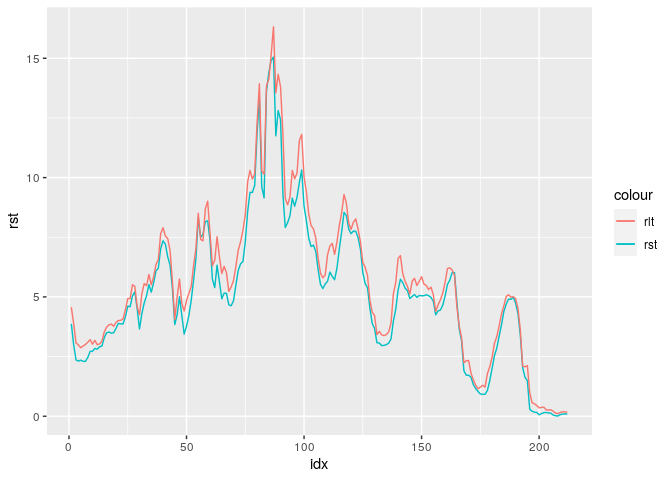
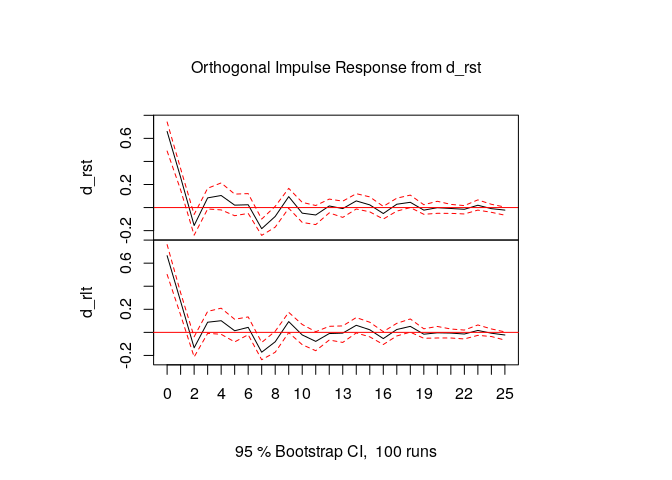
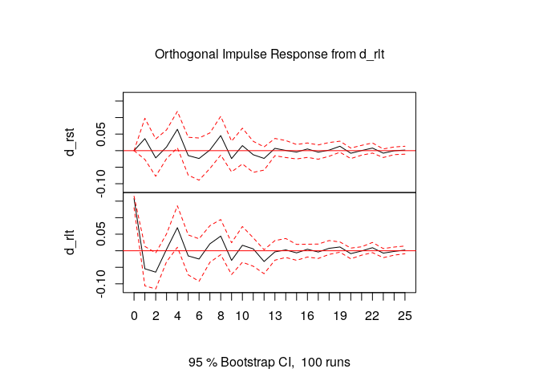

第6章 練習問題\[4\]
================

# \[4\]

``` r
library(ggplot2)
library(dplyr)

QUARTERLY <- read.csv("../data/QUARTERLY.csv")
df <- data.frame(
  rst = pull(QUARTERLY, tbill),
  rlt = pull(QUARTERLY, tb1yr)
)

head(df)
```

    ##    rst  rlt
    ## 1 3.87 4.57
    ## 2 2.99 3.87
    ## 3 2.36 3.07
    ## 4 2.31 2.99
    ## 5 2.35 2.87
    ## 6 2.30 2.94

``` r
g <- ggplot(data = df %>% mutate(idx = 1:nrow(df)), 
            mapping = aes(x = idx)) +
     geom_line(mapping = aes(y = rst, colour = "rst")) +
     geom_line(mapping = aes(y = rlt, colour = "rlt"))
plot(g)
```

<!-- -->

## (a)

``` r
library(urca)

# ADF test for rst
summary(ur.df(df$rst, type = "drift", lags = 7))
```

    ## 
    ## ############################################### 
    ## # Augmented Dickey-Fuller Test Unit Root Test # 
    ## ############################################### 
    ## 
    ## Test regression drift 
    ## 
    ## 
    ## Call:
    ## lm(formula = z.diff ~ z.lag.1 + 1 + z.diff.lag)
    ## 
    ## Residuals:
    ##     Min      1Q  Median      3Q     Max 
    ## -3.3369 -0.2444  0.0342  0.3196  3.1815 
    ## 
    ## Coefficients:
    ##             Estimate Std. Error t value Pr(>|t|)    
    ## (Intercept)  0.13162    0.09999   1.316  0.18960    
    ## z.lag.1     -0.02765    0.01714  -1.613  0.10835    
    ## z.diff.lag1  0.40005    0.06964   5.745 3.50e-08 ***
    ## z.diff.lag2 -0.36675    0.07488  -4.898 2.03e-06 ***
    ## z.diff.lag3  0.41895    0.07835   5.347 2.48e-07 ***
    ## z.diff.lag4 -0.14465    0.08289  -1.745  0.08256 .  
    ## z.diff.lag5  0.21361    0.07898   2.705  0.00744 ** 
    ## z.diff.lag6 -0.07430    0.07502  -0.990  0.32320    
    ## z.diff.lag7 -0.19845    0.07045  -2.817  0.00535 ** 
    ## ---
    ## Signif. codes:  0 '***' 0.001 '**' 0.01 '*' 0.05 '.' 0.1 ' ' 1
    ## 
    ## Residual standard error: 0.651 on 195 degrees of freedom
    ## Multiple R-squared:  0.2936, Adjusted R-squared:  0.2646 
    ## F-statistic: 10.13 on 8 and 195 DF,  p-value: 8.551e-12
    ## 
    ## 
    ## Value of test-statistic is: -1.613 1.335 
    ## 
    ## Critical values for test statistics: 
    ##       1pct  5pct 10pct
    ## tau2 -3.46 -2.88 -2.57
    ## phi1  6.52  4.63  3.81

``` r
# ADF test for rlt
summary(ur.df(df$rlt, type = "drift", lags = 7))
```

    ## 
    ## ############################################### 
    ## # Augmented Dickey-Fuller Test Unit Root Test # 
    ## ############################################### 
    ## 
    ## Test regression drift 
    ## 
    ## 
    ## Call:
    ## lm(formula = z.diff ~ z.lag.1 + 1 + z.diff.lag)
    ## 
    ## Residuals:
    ##     Min      1Q  Median      3Q     Max 
    ## -3.3028 -0.3062 -0.0178  0.3517  2.3888 
    ## 
    ## Coefficients:
    ##              Estimate Std. Error t value Pr(>|t|)    
    ## (Intercept)  0.121024   0.109143   1.109  0.26886    
    ## z.lag.1     -0.023665   0.016986  -1.393  0.16515    
    ## z.diff.lag1  0.313491   0.070101   4.472 1.31e-05 ***
    ## z.diff.lag2 -0.296303   0.073557  -4.028 8.05e-05 ***
    ## z.diff.lag3  0.313207   0.076512   4.094 6.22e-05 ***
    ## z.diff.lag4 -0.024148   0.079620  -0.303  0.76199    
    ## z.diff.lag5  0.057011   0.077147   0.739  0.46080    
    ## z.diff.lag6 -0.006097   0.073399  -0.083  0.93389    
    ## z.diff.lag7 -0.188391   0.070605  -2.668  0.00827 ** 
    ## ---
    ## Signif. codes:  0 '***' 0.001 '**' 0.01 '*' 0.05 '.' 0.1 ' ' 1
    ## 
    ## Residual standard error: 0.6967 on 195 degrees of freedom
    ## Multiple R-squared:  0.2063, Adjusted R-squared:  0.1738 
    ## F-statistic: 6.337 on 8 and 195 DF,  p-value: 2.663e-07
    ## 
    ## 
    ## Value of test-statistic is: -1.3932 1.0174 
    ## 
    ## Critical values for test statistics: 
    ##       1pct  5pct 10pct
    ## tau2 -3.46 -2.88 -2.57
    ## phi1  6.52  4.63  3.81

## (b)

``` r
# rst = C + a*rltを推定
longrun_rst <- lm(formula = rst ~ rlt, data = df)
summary(longrun_rst)
```

    ## 
    ## Call:
    ## lm(formula = rst ~ rlt, data = df)
    ## 
    ## Residuals:
    ##      Min       1Q   Median       3Q      Max 
    ## -1.57057 -0.23135  0.01818  0.19776  1.36625 
    ## 
    ## Coefficients:
    ##              Estimate Std. Error t value Pr(>|t|)    
    ## (Intercept) -0.186974   0.047846  -3.908 0.000126 ***
    ## rlt          0.935604   0.007456 125.481  < 2e-16 ***
    ## ---
    ## Signif. codes:  0 '***' 0.001 '**' 0.01 '*' 0.05 '.' 0.1 ' ' 1
    ## 
    ## Residual standard error: 0.3442 on 210 degrees of freedom
    ## Multiple R-squared:  0.9868, Adjusted R-squared:  0.9868 
    ## F-statistic: 1.575e+04 on 1 and 210 DF,  p-value: < 2.2e-16

## (c)

``` r
et <- longrun_rst$residuals
summary(ur.df(et, type = "none", lags = 6))
```

    ## 
    ## ############################################### 
    ## # Augmented Dickey-Fuller Test Unit Root Test # 
    ## ############################################### 
    ## 
    ## Test regression none 
    ## 
    ## 
    ## Call:
    ## lm(formula = z.diff ~ z.lag.1 - 1 + z.diff.lag)
    ## 
    ## Residuals:
    ##      Min       1Q   Median       3Q      Max 
    ## -1.11579 -0.08388  0.01887  0.12473  1.04497 
    ## 
    ## Coefficients:
    ##              Estimate Std. Error t value Pr(>|t|)    
    ## z.lag.1     -0.371800   0.077712  -4.784 3.35e-06 ***
    ## z.diff.lag1  0.227026   0.081702   2.779  0.00598 ** 
    ## z.diff.lag2 -0.029765   0.079219  -0.376  0.70752    
    ## z.diff.lag3  0.112752   0.077105   1.462  0.14524    
    ## z.diff.lag4  0.120914   0.075399   1.604  0.11038    
    ## z.diff.lag5 -0.001189   0.070357  -0.017  0.98653    
    ## z.diff.lag6 -0.155839   0.069640  -2.238  0.02635 *  
    ## ---
    ## Signif. codes:  0 '***' 0.001 '**' 0.01 '*' 0.05 '.' 0.1 ' ' 1
    ## 
    ## Residual standard error: 0.2331 on 198 degrees of freedom
    ## Multiple R-squared:  0.2523, Adjusted R-squared:  0.2258 
    ## F-statistic: 9.544 on 7 and 198 DF,  p-value: 3.339e-10
    ## 
    ## 
    ## Value of test-statistic is: -4.7843 
    ## 
    ## Critical values for test statistics: 
    ##       1pct  5pct 10pct
    ## tau1 -2.58 -1.95 -1.62

t統計量は -4.784である。この統計量を書籍の付表Cと比べる。  
2変数モデルでサンプルサイズは約200なので、付表Cから5%臨界値は-3.368。  
よって、共和分関係が無いという帰無仮説は棄却される。

`rlt` を左辺とした長期関係については省略するが、同様の結論が得られる。

## (d)

``` r
library(vars)

# diff(rst), diff(rlt)を内生変数、etを外生変数としたVARモデルを推定することで
# 誤差修正モデルを推定する
diff_df <- data.frame(
  d_rst = diff(df$rst),
  d_rlt = diff(df$rlt),
  et = et[-1]
)

# AICを用いてラグ次数を選択する
vecm <- VAR(diff_df[, 1:2], type = "const", exogen = diff_df[, 3],
            lag.max = 10, ic = "AIC")
```

    ## Warning in VARselect(y, lag.max = lag.max, type = type, season = season, : No column names supplied in exogen, using: exo1 , instead.

    ## Warning in VAR(diff_df[, 1:2], type = "const", exogen = diff_df[, 3], lag.max = 10, : No column names supplied in exogen, using: exo1 , instead.

``` r
summary(vecm)
```

    ## 
    ## VAR Estimation Results:
    ## ========================= 
    ## Endogenous variables: d_rst, d_rlt 
    ## Deterministic variables: const 
    ## Sample size: 201 
    ## Log Likelihood: -92.345 
    ## Roots of the characteristic polynomial:
    ## 0.9154 0.9154 0.869 0.869 0.8486 0.8486 0.8485 0.8485 0.8478 0.8478 0.8433 0.8433 0.8411 0.8411 0.8151 0.7988 0.7988 0.6797 0.6797 0.6551
    ## Call:
    ## VAR(y = diff_df[, 1:2], type = "const", exogen = diff_df[, 3], 
    ##     lag.max = 10, ic = "AIC")
    ## 
    ## 
    ## Estimation results for equation d_rst: 
    ## ====================================== 
    ## d_rst = d_rst.l1 + d_rlt.l1 + d_rst.l2 + d_rlt.l2 + d_rst.l3 + d_rlt.l3 + d_rst.l4 + d_rlt.l4 + d_rst.l5 + d_rlt.l5 + d_rst.l6 + d_rlt.l6 + d_rst.l7 + d_rlt.l7 + d_rst.l8 + d_rlt.l8 + d_rst.l9 + d_rlt.l9 + d_rst.l10 + d_rlt.l10 + const + exo1 
    ## 
    ##           Estimate Std. Error t value Pr(>|t|)  
    ## d_rst.l1   0.16519    0.26055   0.634   0.5269  
    ## d_rlt.l1   0.23011    0.24171   0.952   0.3424  
    ## d_rst.l2  -0.29650    0.23023  -1.288   0.1995  
    ## d_rlt.l2  -0.09737    0.22435  -0.434   0.6648  
    ## d_rst.l3   0.14673    0.24644   0.595   0.5523  
    ## d_rlt.l3   0.22193    0.22916   0.968   0.3341  
    ## d_rst.l4  -0.48717    0.23819  -2.045   0.0423 *
    ## d_rlt.l4   0.35320    0.23050   1.532   0.1272  
    ## d_rst.l5   0.04441    0.21735   0.204   0.8383  
    ## d_rlt.l5   0.10512    0.20432   0.515   0.6075  
    ## d_rst.l6  -0.20336    0.20762  -0.979   0.3287  
    ## d_rlt.l6   0.13930    0.19843   0.702   0.4836  
    ## d_rst.l7  -0.31985    0.22048  -1.451   0.1486  
    ## d_rlt.l7   0.04606    0.21482   0.214   0.8305  
    ## d_rst.l8  -0.30100    0.21967  -1.370   0.1723  
    ## d_rlt.l8   0.38748    0.20878   1.856   0.0651 .
    ## d_rst.l9   0.03058    0.20565   0.149   0.8819  
    ## d_rlt.l9  -0.07818    0.19958  -0.392   0.6957  
    ## d_rst.l10 -0.38543    0.20252  -1.903   0.0586 .
    ## d_rlt.l10  0.36883    0.19814   1.861   0.0643 .
    ## const     -0.01217    0.04677  -0.260   0.7950  
    ## exo1       0.30490    0.20913   1.458   0.1466  
    ## ---
    ## Signif. codes:  0 '***' 0.001 '**' 0.01 '*' 0.05 '.' 0.1 ' ' 1
    ## 
    ## 
    ## Residual standard error: 0.6599 on 179 degrees of freedom
    ## Multiple R-Squared: 0.3331,  Adjusted R-squared: 0.2549 
    ## F-statistic: 4.258 on 21 and 179 DF,  p-value: 3.447e-08 
    ## 
    ## 
    ## Estimation results for equation d_rlt: 
    ## ====================================== 
    ## d_rlt = d_rst.l1 + d_rlt.l1 + d_rst.l2 + d_rlt.l2 + d_rst.l3 + d_rlt.l3 + d_rst.l4 + d_rlt.l4 + d_rst.l5 + d_rlt.l5 + d_rst.l6 + d_rlt.l6 + d_rst.l7 + d_rlt.l7 + d_rst.l8 + d_rlt.l8 + d_rst.l9 + d_rlt.l9 + d_rst.l10 + d_rlt.l10 + const + exo1 
    ## 
    ##           Estimate Std. Error t value Pr(>|t|)   
    ## d_rst.l1   0.75546    0.26982   2.800  0.00567 **
    ## d_rlt.l1  -0.34566    0.25031  -1.381  0.16902   
    ## d_rst.l2   0.34727    0.23842   1.457  0.14700   
    ## d_rlt.l2  -0.70362    0.23234  -3.028  0.00282 **
    ## d_rst.l3   0.72467    0.25521   2.839  0.00504 **
    ## d_rlt.l3  -0.33232    0.23732  -1.400  0.16314   
    ## d_rst.l4   0.01392    0.24666   0.056  0.95506   
    ## d_rlt.l4  -0.12309    0.23870  -0.516  0.60672   
    ## d_rst.l5   0.49645    0.22508   2.206  0.02868 * 
    ## d_rlt.l5  -0.34195    0.21159  -1.616  0.10784   
    ## d_rst.l6   0.25178    0.21501   1.171  0.24315   
    ## d_rlt.l6  -0.27500    0.20550  -1.338  0.18252   
    ## d_rst.l7  -0.03254    0.22833  -0.143  0.88684   
    ## d_rlt.l7  -0.21720    0.22247  -0.976  0.33022   
    ## d_rst.l8  -0.05568    0.22748  -0.245  0.80691   
    ## d_rlt.l8   0.17186    0.21621   0.795  0.42773   
    ## d_rst.l9   0.23258    0.21297   1.092  0.27628   
    ## d_rlt.l9  -0.25464    0.20668  -1.232  0.21956   
    ## d_rst.l10 -0.19196    0.20973  -0.915  0.36128   
    ## d_rlt.l10  0.23213    0.20519   1.131  0.25945   
    ## const     -0.01006    0.04843  -0.208  0.83567   
    ## exo1      -0.46995    0.21657  -2.170  0.03133 * 
    ## ---
    ## Signif. codes:  0 '***' 0.001 '**' 0.01 '*' 0.05 '.' 0.1 ' ' 1
    ## 
    ## 
    ## Residual standard error: 0.6834 on 179 degrees of freedom
    ## Multiple R-Squared: 0.2985,  Adjusted R-squared: 0.2162 
    ## F-statistic: 3.627 on 21 and 179 DF,  p-value: 1.175e-06 
    ## 
    ## 
    ## 
    ## Covariance matrix of residuals:
    ##        d_rst  d_rlt
    ## d_rst 0.4355 0.4389
    ## d_rlt 0.4389 0.4671
    ## 
    ## Correlation matrix of residuals:
    ##       d_rst d_rlt
    ## d_rst 1.000 0.973
    ## d_rlt 0.973 1.000

インパルス応答関数は以下

``` r
plot(irf(vecm, n.ahead = 25))
```

<!-- --><!-- -->

## (e)

最大固有値検定統計量

``` r
summary(ca.jo(df, type = "eigen", ecdet = "const", K = 7, spec = "longrun"))
```

    ## 
    ## ###################### 
    ## # Johansen-Procedure # 
    ## ###################### 
    ## 
    ## Test type: maximal eigenvalue statistic (lambda max) , without linear trend and constant in cointegration 
    ## 
    ## Eigenvalues (lambda):
    ## [1]  1.523487e-01  7.815470e-03 -2.621461e-17
    ## 
    ## Values of teststatistic and critical values of test:
    ## 
    ##           test 10pct  5pct  1pct
    ## r <= 1 |  1.61  7.52  9.24 12.97
    ## r = 0  | 33.88 13.75 15.67 20.20
    ## 
    ## Eigenvectors, normalised to first column:
    ## (These are the cointegration relations)
    ## 
    ##              rst.l7    rlt.l7  constant
    ## rst.l7    1.0000000  1.000000  1.000000
    ## rlt.l7   -0.9066119 -1.166148 -1.100654
    ## constant  0.0107256  1.239652  2.601706
    ## 
    ## Weights W:
    ## (This is the loading matrix)
    ## 
    ##           rst.l7     rlt.l7     constant
    ## rst.d -0.8452234 0.05392149 9.308478e-16
    ## rlt.d -0.5044473 0.07038800 5.918089e-16

最大固有値検定では共和分ベクトルが0個の帰無仮説が棄却されるため、共和分ベクトルは1個であると考えられる。

トレース検定統計量

``` r
summary(ca.jo(df, type = "trace", ecdet = "const", K = 7, spec = "longrun"))
```

    ## 
    ## ###################### 
    ## # Johansen-Procedure # 
    ## ###################### 
    ## 
    ## Test type: trace statistic , without linear trend and constant in cointegration 
    ## 
    ## Eigenvalues (lambda):
    ## [1]  1.523487e-01  7.815470e-03 -2.621461e-17
    ## 
    ## Values of teststatistic and critical values of test:
    ## 
    ##           test 10pct  5pct  1pct
    ## r <= 1 |  1.61  7.52  9.24 12.97
    ## r = 0  | 35.49 17.85 19.96 24.60
    ## 
    ## Eigenvectors, normalised to first column:
    ## (These are the cointegration relations)
    ## 
    ##              rst.l7    rlt.l7  constant
    ## rst.l7    1.0000000  1.000000  1.000000
    ## rlt.l7   -0.9066119 -1.166148 -1.100654
    ## constant  0.0107256  1.239652  2.601706
    ## 
    ## Weights W:
    ## (This is the loading matrix)
    ## 
    ##           rst.l7     rlt.l7     constant
    ## rst.d -0.8452234 0.05392149 9.308478e-16
    ## rlt.d -0.5044473 0.07038800 5.918089e-16

トレース検定においても共和分ベクトルが1個であるという結果が得られた。
