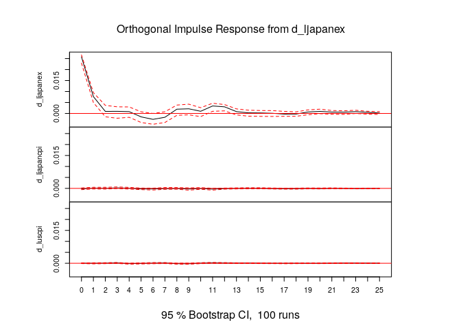
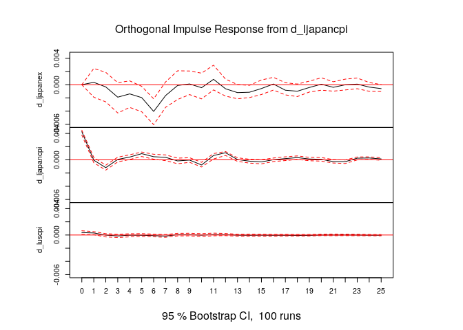
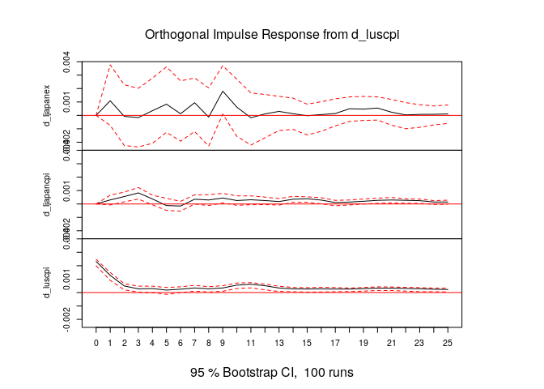

第6章 練習問題\[5\]
================

# \[5\]

## (a)

``` r
library(dplyr)

COINT_PPP <- read.csv("../data/COINT_PPP.csv")

# 各系列を対数変換
df <- data.frame(
  ENTRY = COINT_PPP$ENTRY,
  lUSCPI = log(COINT_PPP$USCPI),
  lCANEX = log(COINT_PPP$CANEX),
  lCANCPI = log(COINT_PPP$CANCPI),
  lJAPANEX = log(COINT_PPP$JAPANEX),
  lJAPANCPI = log(COINT_PPP$JAPANCPI),
  lSWEX = log(COINT_PPP$SWEX),
  lSWCPI = log(COINT_PPP$SWCPI)
)
```

### `USCPI` のADF検定

本来は残差の系列相関チェックなど色々やらなくてはならないが…系列が多いので省略…

``` r
library(urca)

summary(ur.df(df$lUSCPI, type = "trend", lags = 20, selectlags = "AIC"))
```

    ## 
    ## ############################################### 
    ## # Augmented Dickey-Fuller Test Unit Root Test # 
    ## ############################################### 
    ## 
    ## Test regression trend 
    ## 
    ## 
    ## Call:
    ## lm(formula = z.diff ~ z.lag.1 + 1 + tt + z.diff.lag)
    ## 
    ## Residuals:
    ##        Min         1Q     Median         3Q        Max 
    ## -0.0128683 -0.0010725 -0.0000601  0.0013121  0.0097331 
    ## 
    ## Coefficients:
    ##                Estimate Std. Error t value Pr(>|t|)    
    ## (Intercept)   1.606e-02  6.264e-03   2.564 0.010675 *  
    ## z.lag.1      -2.852e-03  1.197e-03  -2.383 0.017581 *  
    ## tt            5.495e-06  3.425e-06   1.605 0.109307    
    ## z.diff.lag1   5.313e-01  4.703e-02  11.297  < 2e-16 ***
    ## z.diff.lag2  -1.118e-01  5.305e-02  -2.108 0.035554 *  
    ## z.diff.lag3   5.953e-02  5.328e-02   1.117 0.264452    
    ## z.diff.lag4   6.658e-02  5.253e-02   1.268 0.205628    
    ## z.diff.lag5  -7.013e-02  5.195e-02  -1.350 0.177749    
    ## z.diff.lag6   6.072e-02  5.201e-02   1.167 0.243679    
    ## z.diff.lag7   4.964e-03  5.195e-02   0.096 0.923910    
    ## z.diff.lag8   1.972e-02  5.203e-02   0.379 0.704820    
    ## z.diff.lag9   6.696e-02  5.218e-02   1.283 0.200061    
    ## z.diff.lag10  3.880e-02  5.283e-02   0.735 0.463030    
    ## z.diff.lag11  1.681e-01  5.283e-02   3.181 0.001569 ** 
    ## z.diff.lag12 -2.013e-01  5.331e-02  -3.776 0.000181 ***
    ## z.diff.lag13 -1.535e-02  5.377e-02  -0.286 0.775360    
    ## z.diff.lag14  8.260e-04  5.355e-02   0.015 0.987700    
    ## z.diff.lag15  1.255e-01  4.690e-02   2.677 0.007708 ** 
    ## ---
    ## Signif. codes:  0 '***' 0.001 '**' 0.01 '*' 0.05 '.' 0.1 ' ' 1
    ## 
    ## Residual standard error: 0.002282 on 440 degrees of freedom
    ## Multiple R-squared:  0.5233, Adjusted R-squared:  0.5049 
    ## F-statistic: 28.41 on 17 and 440 DF,  p-value: < 2.2e-16
    ## 
    ## 
    ## Value of test-statistic is: -2.3833 4.1134 4.8111 
    ## 
    ## Critical values for test statistics: 
    ##       1pct  5pct 10pct
    ## tau3 -3.98 -3.42 -3.13
    ## phi2  6.15  4.71  4.05
    ## phi3  8.34  6.30  5.36

`USCPI` に関しては有意水準5%では単位根仮説を棄却できない。

### `CANEX` のADF検定

``` r
summary(ur.df(df$lCANEX, type = "trend", lags = 20, selectlags = "AIC"))
```

    ## 
    ## ############################################### 
    ## # Augmented Dickey-Fuller Test Unit Root Test # 
    ## ############################################### 
    ## 
    ## Test regression trend 
    ## 
    ## 
    ## Call:
    ## lm(formula = z.diff ~ z.lag.1 + 1 + tt + z.diff.lag)
    ## 
    ## Residuals:
    ##       Min        1Q    Median        3Q       Max 
    ## -0.048334 -0.008552 -0.000281  0.008490  0.101930 
    ## 
    ## Coefficients:
    ##                Estimate Std. Error t value Pr(>|t|)    
    ## (Intercept)   3.700e-03  1.752e-03   2.112  0.03525 *  
    ## z.lag.1      -7.986e-03  5.070e-03  -1.575  0.11594    
    ## tt           -7.958e-06  5.078e-06  -1.567  0.11785    
    ## z.diff.lag1   2.491e-01  4.694e-02   5.308 1.76e-07 ***
    ## z.diff.lag2  -4.488e-03  4.835e-02  -0.093  0.92608    
    ## z.diff.lag3   1.392e-02  4.822e-02   0.289  0.77300    
    ## z.diff.lag4   1.355e-01  4.818e-02   2.813  0.00513 ** 
    ## z.diff.lag5  -4.248e-02  4.850e-02  -0.876  0.38153    
    ## z.diff.lag6  -6.651e-02  4.842e-02  -1.374  0.17025    
    ## z.diff.lag7  -6.866e-02  4.839e-02  -1.419  0.15670    
    ## z.diff.lag8   4.811e-02  4.844e-02   0.993  0.32109    
    ## z.diff.lag9  -2.750e-02  4.819e-02  -0.571  0.56854    
    ## z.diff.lag10  8.372e-02  4.827e-02   1.734  0.08357 .  
    ## z.diff.lag11  5.131e-02  4.842e-02   1.060  0.28991    
    ## z.diff.lag12 -1.333e-01  4.717e-02  -2.827  0.00491 ** 
    ## ---
    ## Signif. codes:  0 '***' 0.001 '**' 0.01 '*' 0.05 '.' 0.1 ' ' 1
    ## 
    ## Residual standard error: 0.01381 on 443 degrees of freedom
    ## Multiple R-squared:   0.12,  Adjusted R-squared:  0.09222 
    ## F-statistic: 4.316 on 14 and 443 DF,  p-value: 3.334e-07
    ## 
    ## 
    ## Value of test-statistic is: -1.5751 1.6903 2.5323 
    ## 
    ## Critical values for test statistics: 
    ##       1pct  5pct 10pct
    ## tau3 -3.98 -3.42 -3.13
    ## phi2  6.15  4.71  4.05
    ## phi3  8.34  6.30  5.36

`CANEX` についても有意水準5%では単位根仮説を棄却できない。

### `CANCPI` のADF検定

``` r
summary(ur.df(df$lCANCPI[is.na(df$lCANCPI) == F], type = "trend", lags = 20, selectlags = "AIC"))
```

    ## 
    ## ############################################### 
    ## # Augmented Dickey-Fuller Test Unit Root Test # 
    ## ############################################### 
    ## 
    ## Test regression trend 
    ## 
    ## 
    ## Call:
    ## lm(formula = z.diff ~ z.lag.1 + 1 + tt + z.diff.lag)
    ## 
    ## Residuals:
    ##        Min         1Q     Median         3Q        Max 
    ## -0.0107930 -0.0018528 -0.0001769  0.0019127  0.0215169 
    ## 
    ## Coefficients:
    ##                Estimate Std. Error t value Pr(>|t|)    
    ## (Intercept)   2.094e-02  7.930e-03   2.640  0.00858 ** 
    ## z.lag.1      -3.466e-03  1.437e-03  -2.411  0.01630 *  
    ## tt            3.655e-06  3.740e-06   0.977  0.32899    
    ## z.diff.lag1   5.630e-02  4.573e-02   1.231  0.21889    
    ## z.diff.lag2   3.255e-02  4.575e-02   0.711  0.47715    
    ## z.diff.lag3   6.802e-02  4.535e-02   1.500  0.13433    
    ## z.diff.lag4   7.593e-02  4.545e-02   1.671  0.09551 .  
    ## z.diff.lag5  -4.747e-03  4.555e-02  -0.104  0.91705    
    ## z.diff.lag6  -4.246e-02  4.552e-02  -0.933  0.35150    
    ## z.diff.lag7  -2.962e-02  4.544e-02  -0.652  0.51482    
    ## z.diff.lag8   1.171e-02  4.543e-02   0.258  0.79673    
    ## z.diff.lag9  -1.033e-02  4.558e-02  -0.227  0.82081    
    ## z.diff.lag10  1.016e-01  4.540e-02   2.237  0.02576 *  
    ## z.diff.lag11  5.338e-02  4.573e-02   1.167  0.24374    
    ## z.diff.lag12  2.533e-01  4.575e-02   5.536 5.32e-08 ***
    ## ---
    ## Signif. codes:  0 '***' 0.001 '**' 0.01 '*' 0.05 '.' 0.1 ' ' 1
    ## 
    ## Residual standard error: 0.003418 on 442 degrees of freedom
    ## Multiple R-squared:  0.3369, Adjusted R-squared:  0.3159 
    ## F-statistic: 16.04 on 14 and 442 DF,  p-value: < 2.2e-16
    ## 
    ## 
    ## Value of test-statistic is: -2.4113 4.06 5.1833 
    ## 
    ## Critical values for test statistics: 
    ##       1pct  5pct 10pct
    ## tau3 -3.98 -3.42 -3.13
    ## phi2  6.15  4.71  4.05
    ## phi3  8.34  6.30  5.36

`CANCPI` についても有意水準5%で単位根仮説が棄却できない。

### `JAPANEX` のADF検定

``` r
summary(ur.df(df$lJAPANEX[is.na(df$lJAPANEX) == F], type = "trend", lags = 20, selectlags = "AIC"))
```

    ## 
    ## ############################################### 
    ## # Augmented Dickey-Fuller Test Unit Root Test # 
    ## ############################################### 
    ## 
    ## Test regression trend 
    ## 
    ## 
    ## Call:
    ## lm(formula = z.diff ~ z.lag.1 + 1 + tt + z.diff.lag)
    ## 
    ## Residuals:
    ##       Min        1Q    Median        3Q       Max 
    ## -0.089089 -0.015762  0.001741  0.017942  0.065744 
    ## 
    ## Coefficients:
    ##                Estimate Std. Error t value Pr(>|t|)    
    ## (Intercept)   1.206e-01  4.408e-02   2.737  0.00646 ** 
    ## z.lag.1      -2.238e-02  7.937e-03  -2.819  0.00503 ** 
    ## tt           -4.701e-05  2.200e-05  -2.137  0.03318 *  
    ## z.diff.lag1   3.253e-01  4.767e-02   6.825 3.01e-11 ***
    ## z.diff.lag2  -2.673e-02  5.002e-02  -0.534  0.59339    
    ## z.diff.lag3   5.117e-02  5.005e-02   1.022  0.30713    
    ## z.diff.lag4   3.504e-02  4.985e-02   0.703  0.48252    
    ## z.diff.lag5  -6.340e-02  5.001e-02  -1.268  0.20553    
    ## z.diff.lag6  -6.106e-02  5.028e-02  -1.214  0.22525    
    ## z.diff.lag7  -8.437e-03  5.041e-02  -0.167  0.86715    
    ## z.diff.lag8   1.177e-01  5.050e-02   2.330  0.02026 *  
    ## z.diff.lag9   5.700e-02  5.066e-02   1.125  0.26111    
    ## z.diff.lag10  4.974e-03  5.057e-02   0.098  0.92170    
    ## z.diff.lag11  1.383e-01  5.061e-02   2.732  0.00656 ** 
    ## z.diff.lag12 -2.709e-02  5.112e-02  -0.530  0.59645    
    ## z.diff.lag13 -6.825e-02  5.102e-02  -1.338  0.18171    
    ## z.diff.lag14  1.019e-01  4.886e-02   2.085  0.03767 *  
    ## ---
    ## Signif. codes:  0 '***' 0.001 '**' 0.01 '*' 0.05 '.' 0.1 ' ' 1
    ## 
    ## Residual standard error: 0.02569 on 430 degrees of freedom
    ## Multiple R-squared:  0.1744, Adjusted R-squared:  0.1437 
    ## F-statistic: 5.677 on 16 and 430 DF,  p-value: 3.52e-11
    ## 
    ## 
    ## Value of test-statistic is: -2.8194 3.2396 4.4096 
    ## 
    ## Critical values for test statistics: 
    ##       1pct  5pct 10pct
    ## tau3 -3.98 -3.42 -3.13
    ## phi2  6.15  4.71  4.05
    ## phi3  8.34  6.30  5.36

`JAPANEX` についても有意水準5%で単位根仮説を棄却できない。

### `JAPANCPI` のADF検定

``` r
summary(ur.df(df$lJAPANCPI[is.na(df$lJAPANCPI) == F], type = "trend", lags = 20, selectlags = "AIC"))
```

    ## 
    ## ############################################### 
    ## # Augmented Dickey-Fuller Test Unit Root Test # 
    ## ############################################### 
    ## 
    ## Test regression trend 
    ## 
    ## 
    ## Call:
    ## lm(formula = z.diff ~ z.lag.1 + 1 + tt + z.diff.lag)
    ## 
    ## Residuals:
    ##        Min         1Q     Median         3Q        Max 
    ## -0.0144821 -0.0020421  0.0000738  0.0019979  0.0168313 
    ## 
    ## Coefficients:
    ##                Estimate Std. Error t value Pr(>|t|)    
    ## (Intercept)   5.164e-02  1.470e-02   3.514 0.000487 ***
    ## z.lag.1      -9.047e-03  2.645e-03  -3.420 0.000685 ***
    ## tt           -2.319e-07  2.310e-06  -0.100 0.920082    
    ## z.diff.lag1  -1.119e-02  4.662e-02  -0.240 0.810373    
    ## z.diff.lag2  -8.247e-02  4.620e-02  -1.785 0.074964 .  
    ## z.diff.lag3  -1.926e-02  4.093e-02  -0.471 0.638170    
    ## z.diff.lag4  -3.577e-02  4.082e-02  -0.876 0.381316    
    ## z.diff.lag5   8.043e-02  4.023e-02   1.999 0.046187 *  
    ## z.diff.lag6   1.562e-02  4.042e-02   0.387 0.699260    
    ## z.diff.lag7   7.300e-02  4.043e-02   1.805 0.071686 .  
    ## z.diff.lag8  -1.499e-02  4.040e-02  -0.371 0.710841    
    ## z.diff.lag9   1.062e-02  4.021e-02   0.264 0.791884    
    ## z.diff.lag10 -1.467e-01  3.994e-02  -3.674 0.000269 ***
    ## z.diff.lag11  2.622e-02  4.048e-02   0.648 0.517585    
    ## z.diff.lag12  4.474e-01  4.023e-02  11.121  < 2e-16 ***
    ## z.diff.lag13  1.376e-02  4.543e-02   0.303 0.762035    
    ## z.diff.lag14 -1.312e-01  4.520e-02  -2.901 0.003901 ** 
    ## ---
    ## Signif. codes:  0 '***' 0.001 '**' 0.01 '*' 0.05 '.' 0.1 ' ' 1
    ## 
    ## Residual standard error: 0.003648 on 439 degrees of freedom
    ## Multiple R-squared:  0.4891, Adjusted R-squared:  0.4704 
    ## F-statistic: 26.26 on 16 and 439 DF,  p-value: < 2.2e-16
    ## 
    ## 
    ## Value of test-statistic is: -3.42 5.4906 7.6892 
    ## 
    ## Critical values for test statistics: 
    ##       1pct  5pct 10pct
    ## tau3 -3.98 -3.42 -3.13
    ## phi2  6.15  4.71  4.05
    ## phi3  8.34  6.30  5.36

`JAPANCPI` についても有意水準5%で単位根仮説が棄却される。

### `SWEX` のADF検定

``` r
summary(ur.df(df$lSWEX[is.na(df$lSWEX) == F], type = "trend", lags = 20, selectlags = "AIC"))
```

    ## 
    ## ############################################### 
    ## # Augmented Dickey-Fuller Test Unit Root Test # 
    ## ############################################### 
    ## 
    ## Test regression trend 
    ## 
    ## 
    ## Call:
    ## lm(formula = z.diff ~ z.lag.1 + 1 + tt + z.diff.lag)
    ## 
    ## Residuals:
    ##       Min        1Q    Median        3Q       Max 
    ## -0.081891 -0.018349  0.000306  0.017799  0.125443 
    ## 
    ## Coefficients:
    ##               Estimate Std. Error t value Pr(>|t|)    
    ## (Intercept)  1.971e-02  7.890e-03   2.498  0.01284 *  
    ## z.lag.1     -2.637e-02  8.847e-03  -2.980  0.00303 ** 
    ## tt          -4.343e-05  1.822e-05  -2.384  0.01753 *  
    ## z.diff.lag   2.901e-01  4.484e-02   6.468 2.57e-10 ***
    ## ---
    ## Signif. codes:  0 '***' 0.001 '**' 0.01 '*' 0.05 '.' 0.1 ' ' 1
    ## 
    ## Residual standard error: 0.02756 on 454 degrees of freedom
    ## Multiple R-squared:  0.09499,    Adjusted R-squared:  0.08901 
    ## F-statistic: 15.88 on 3 and 454 DF,  p-value: 7.747e-10
    ## 
    ## 
    ## Value of test-statistic is: -2.9803 3.5689 4.4726 
    ## 
    ## Critical values for test statistics: 
    ##       1pct  5pct 10pct
    ## tau3 -3.98 -3.42 -3.13
    ## phi2  6.15  4.71  4.05
    ## phi3  8.34  6.30  5.36

`SWEX` についても有意水準5%で単位根仮説を棄却できない。

### `SWCPI` のADF検定

``` r
summary(ur.df(df$lSWCPI[is.na(df$lSWCPI) == F], type = "trend", lags = 20, selectlags = "AIC"))
```

    ## 
    ## ############################################### 
    ## # Augmented Dickey-Fuller Test Unit Root Test # 
    ## ############################################### 
    ## 
    ## Test regression trend 
    ## 
    ## 
    ## Call:
    ## lm(formula = z.diff ~ z.lag.1 + 1 + tt + z.diff.lag)
    ## 
    ## Residuals:
    ##        Min         1Q     Median         3Q        Max 
    ## -0.0100093 -0.0017004 -0.0001291  0.0014467  0.0111329 
    ## 
    ## Coefficients:
    ##                Estimate Std. Error t value Pr(>|t|)    
    ## (Intercept)   4.269e-03  9.760e-03   0.437 0.662029    
    ## z.lag.1      -5.844e-04  1.971e-03  -0.297 0.766988    
    ## tt           -1.869e-06  3.757e-06  -0.497 0.619107    
    ## z.diff.lag1   1.682e-01  4.769e-02   3.526 0.000466 ***
    ## z.diff.lag2   9.495e-02  4.793e-02   1.981 0.048227 *  
    ## z.diff.lag3  -4.332e-02  4.787e-02  -0.905 0.365977    
    ## z.diff.lag4   4.884e-02  4.786e-02   1.021 0.307997    
    ## z.diff.lag5  -1.056e-02  4.764e-02  -0.222 0.824745    
    ## z.diff.lag6   1.907e-01  4.371e-02   4.362 1.61e-05 ***
    ## z.diff.lag7  -1.411e-02  4.457e-02  -0.317 0.751687    
    ## z.diff.lag8  -1.560e-01  4.428e-02  -3.522 0.000473 ***
    ## z.diff.lag9  -1.753e-02  4.483e-02  -0.391 0.696047    
    ## z.diff.lag10  1.192e-01  4.421e-02   2.696 0.007284 ** 
    ## z.diff.lag11 -1.220e-02  4.446e-02  -0.274 0.783902    
    ## z.diff.lag12  3.976e-01  4.352e-02   9.137  < 2e-16 ***
    ## z.diff.lag13 -1.142e-01  4.683e-02  -2.439 0.015109 *  
    ## z.diff.lag14  5.561e-02  4.691e-02   1.185 0.236553    
    ## z.diff.lag15 -7.660e-02  4.694e-02  -1.632 0.103424    
    ## z.diff.lag16 -1.266e-01  4.681e-02  -2.704 0.007110 ** 
    ## z.diff.lag17  7.076e-02  4.588e-02   1.542 0.123700    
    ## ---
    ## Signif. codes:  0 '***' 0.001 '**' 0.01 '*' 0.05 '.' 0.1 ' ' 1
    ## 
    ## Residual standard error: 0.00287 on 437 degrees of freedom
    ## Multiple R-squared:  0.3978, Adjusted R-squared:  0.3716 
    ## F-statistic: 15.19 on 19 and 437 DF,  p-value: < 2.2e-16
    ## 
    ## 
    ## Value of test-statistic is: -0.2965 3.0152 2.5872 
    ## 
    ## Critical values for test statistics: 
    ##       1pct  5pct 10pct
    ## tau3 -3.98 -3.42 -3.13
    ## phi2  6.15  4.71  4.05
    ## phi3  8.34  6.30  5.36

`SWCPI` についても有意水準5%で単位根仮説を棄却できない。

`USCPI`
がトレンド定常である場合は米国の系列をPPPの共和分分析に含めることは出来ない。

## (b)

``` r
longrun_japanex <- lm(lJAPANEX ~ lJAPANCPI + lUSCPI, data = df)
summary(longrun_japanex)
```

    ## 
    ## Call:
    ## lm(formula = lJAPANEX ~ lJAPANCPI + lUSCPI, data = df)
    ## 
    ## Residuals:
    ##      Min       1Q   Median       3Q      Max 
    ## -0.41312 -0.10770 -0.01184  0.08863  0.42784 
    ## 
    ## Coefficients:
    ##             Estimate Std. Error t value Pr(>|t|)    
    ## (Intercept)  9.97459    0.36593  27.258   <2e-16 ***
    ## lJAPANCPI   -0.10420    0.10667  -0.977    0.329    
    ## lUSCPI      -0.76823    0.04505 -17.054   <2e-16 ***
    ## ---
    ## Signif. codes:  0 '***' 0.001 '**' 0.01 '*' 0.05 '.' 0.1 ' ' 1
    ## 
    ## Residual standard error: 0.156 on 465 degrees of freedom
    ##   ( 11 個の観測値が欠損のため削除されました )
    ## Multiple R-squared:  0.8336, Adjusted R-squared:  0.8329 
    ## F-statistic:  1165 on 2 and 465 DF,  p-value: < 2.2e-16

長期でPPPが成り立つ場合、 `lJAPANEX + lUSCPI - lJAPANCPI`
が定常となる。  
このとき、 `lJAPANEX` を `lUSCPI` と `lJAPANCPI`
で回帰すると係数が正負で反対になるはずである。  
しかし上記の推定結果では両係数が負なので、近郊からの乖離を収束させる動きがない。  
よって推定結果は長期PPPとは整合的ではない。

また、共和分回帰におけるt統計量は一般に正規分布に従わない。  
よって上記の推定結果で日本のCPIが有意でないという結論は出せない。

## (c)

``` r
et <- longrun_japanex$residuals
summary(ur.df(et, type = "none", lags = 11))
```

    ## 
    ## ############################################### 
    ## # Augmented Dickey-Fuller Test Unit Root Test # 
    ## ############################################### 
    ## 
    ## Test regression none 
    ## 
    ## 
    ## Call:
    ## lm(formula = z.diff ~ z.lag.1 - 1 + z.diff.lag)
    ## 
    ## Residuals:
    ##       Min        1Q    Median        3Q       Max 
    ## -0.088393 -0.014965  0.001622  0.017906  0.071106 
    ## 
    ## Coefficients:
    ##               Estimate Std. Error t value Pr(>|t|)    
    ## z.lag.1      -0.028442   0.008291  -3.431 0.000659 ***
    ## z.diff.lag1   0.326313   0.046552   7.010 8.93e-12 ***
    ## z.diff.lag2  -0.030768   0.049071  -0.627 0.530971    
    ## z.diff.lag3   0.073662   0.049137   1.499 0.134552    
    ## z.diff.lag4   0.028405   0.049183   0.578 0.563873    
    ## z.diff.lag5  -0.054597   0.049278  -1.108 0.268482    
    ## z.diff.lag6  -0.044013   0.049432  -0.890 0.373750    
    ## z.diff.lag7   0.006249   0.049575   0.126 0.899748    
    ## z.diff.lag8   0.109865   0.049674   2.212 0.027493 *  
    ## z.diff.lag9   0.054779   0.049843   1.099 0.272355    
    ## z.diff.lag10  0.012984   0.049777   0.261 0.794334    
    ## z.diff.lag11  0.142475   0.047581   2.994 0.002904 ** 
    ## ---
    ## Signif. codes:  0 '***' 0.001 '**' 0.01 '*' 0.05 '.' 0.1 ' ' 1
    ## 
    ## Residual standard error: 0.02552 on 444 degrees of freedom
    ## Multiple R-squared:  0.1737, Adjusted R-squared:  0.1514 
    ## F-statistic:  7.78 on 12 and 444 DF,  p-value: 3.382e-13
    ## 
    ## 
    ## Value of test-statistic is: -3.4305 
    ## 
    ## Critical values for test statistics: 
    ##       1pct  5pct 10pct
    ## tau1 -2.58 -1.95 -1.62

付表Cから5%臨界値は -3.76 なので、単位根仮説を棄却できない。  
よって変数間に共和分関係があるとは言えず、長期PPPが成立しているとは言えない。

## (d)

カナダのみの結果を示す。  
まずカナダとアメリカの長期関係を推定する。

``` r
longrun_canex <- lm(lCANEX ~ lCANCPI + lUSCPI, data = df)
summary(longrun_canex)
```

    ## 
    ## Call:
    ## lm(formula = lCANEX ~ lCANCPI + lUSCPI, data = df)
    ## 
    ## Residuals:
    ##       Min        1Q    Median        3Q       Max 
    ## -0.220822 -0.098487 -0.008501  0.071557  0.275328 
    ## 
    ## Coefficients:
    ##             Estimate Std. Error t value Pr(>|t|)    
    ## (Intercept) -0.47363    0.07446  -6.361 4.72e-10 ***
    ## lCANCPI      1.46216    0.12267  11.920  < 2e-16 ***
    ## lUSCPI      -1.36975    0.12154 -11.270  < 2e-16 ***
    ## ---
    ## Signif. codes:  0 '***' 0.001 '**' 0.01 '*' 0.05 '.' 0.1 ' ' 1
    ## 
    ## Residual standard error: 0.1161 on 475 degrees of freedom
    ##   ( 1 個の観測値が欠損のため削除されました )
    ## Multiple R-squared:  0.2706, Adjusted R-squared:  0.2675 
    ## F-statistic:  88.1 on 2 and 475 DF,  p-value: < 2.2e-16

係数は長期PPPと整合的である。  
次に長期関係の残差を用いてエンゲル=グレンジャーの共和分検定を行う。

``` r
et <- longrun_canex$residuals
summary(ur.df(et, type = "none", lags = 11))
```

    ## 
    ## ############################################### 
    ## # Augmented Dickey-Fuller Test Unit Root Test # 
    ## ############################################### 
    ## 
    ## Test regression none 
    ## 
    ## 
    ## Call:
    ## lm(formula = z.diff ~ z.lag.1 - 1 + z.diff.lag)
    ## 
    ## Residuals:
    ##       Min        1Q    Median        3Q       Max 
    ## -0.055225 -0.009175  0.000314  0.008430  0.108181 
    ## 
    ## Coefficients:
    ##               Estimate Std. Error t value Pr(>|t|)    
    ## z.lag.1      -0.012071   0.006185  -1.952 0.051606 .  
    ## z.diff.lag1   0.175550   0.046771   3.753 0.000197 ***
    ## z.diff.lag2   0.032328   0.047242   0.684 0.494123    
    ## z.diff.lag3   0.007698   0.047196   0.163 0.870512    
    ## z.diff.lag4   0.097095   0.047106   2.061 0.039852 *  
    ## z.diff.lag5  -0.014853   0.047266  -0.314 0.753475    
    ## z.diff.lag6  -0.034507   0.047199  -0.731 0.465103    
    ## z.diff.lag7  -0.058298   0.047209  -1.235 0.217510    
    ## z.diff.lag8   0.058767   0.047070   1.248 0.212493    
    ## z.diff.lag9  -0.024924   0.047167  -0.528 0.597463    
    ## z.diff.lag10  0.116502   0.047163   2.470 0.013871 *  
    ## z.diff.lag11  0.029342   0.046884   0.626 0.531730    
    ## ---
    ## Signif. codes:  0 '***' 0.001 '**' 0.01 '*' 0.05 '.' 0.1 ' ' 1
    ## 
    ## Residual standard error: 0.0149 on 454 degrees of freedom
    ## Multiple R-squared:  0.06754,    Adjusted R-squared:  0.04289 
    ## F-statistic:  2.74 on 12 and 454 DF,  p-value: 0.001338
    ## 
    ## 
    ## Value of test-statistic is: -1.9515 
    ## 
    ## Critical values for test statistics: 
    ##       1pct  5pct 10pct
    ## tau1 -2.58 -1.95 -1.62

## (e)

``` r
library(vars)

# 日米の長期関係の残差を求める
et <- longrun_japanex$residuals

# diff(lJAPANEX), diff(lJAPANCPI), diff(lUSCPI)を内生変数、etを外生変数としたVARモデルを推定することで
# 誤差修正モデルを推定する
diff_df <- data.frame(
  d_ljapanex = diff(df$lJAPANEX[1:468]),
  d_ljapancpi = diff(df$lJAPANCPI[1:468]),
  d_luscpi = diff(df$lUSCPI[1:468]),
  et = et[-1]
)

# AICを用いてラグ次数を選択する
vecm <- VAR(diff_df[, 1:3], type = "const", exogen = diff_df[, 4], p = 11)
```

    ## Warning in VAR(diff_df[, 1:3], type = "const", exogen = diff_df[, 4], p = 11): No column names supplied in exogen, using: exo1 , instead.

``` r
summary(vecm)
```

    ## 
    ## VAR Estimation Results:
    ## ========================= 
    ## Endogenous variables: d_ljapanex, d_ljapancpi, d_luscpi 
    ## Deterministic variables: const 
    ## Sample size: 456 
    ## Log Likelihood: 5036.351 
    ## Roots of the characteristic polynomial:
    ## 0.9691 0.9375 0.9375 0.9245 0.8959 0.8959 0.8927 0.8927 0.8898 0.8898 0.8825 0.8825 0.8729 0.8729 0.8447 0.8447 0.8393 0.8393 0.8276 0.8276 0.7908 0.7875 0.7875 0.7675 0.7675 0.7382 0.7382 0.6615 0.6615 0.5578 0.5578 0.5148 0.5148
    ## Call:
    ## VAR(y = diff_df[, 1:3], p = 11, type = "const", exogen = diff_df[, 
    ##     4])
    ## 
    ## 
    ## Estimation results for equation d_ljapanex: 
    ## =========================================== 
    ## d_ljapanex = d_ljapanex.l1 + d_ljapancpi.l1 + d_luscpi.l1 + d_ljapanex.l2 + d_ljapancpi.l2 + d_luscpi.l2 + d_ljapanex.l3 + d_ljapancpi.l3 + d_luscpi.l3 + d_ljapanex.l4 + d_ljapancpi.l4 + d_luscpi.l4 + d_ljapanex.l5 + d_ljapancpi.l5 + d_luscpi.l5 + d_ljapanex.l6 + d_ljapancpi.l6 + d_luscpi.l6 + d_ljapanex.l7 + d_ljapancpi.l7 + d_luscpi.l7 + d_ljapanex.l8 + d_ljapancpi.l8 + d_luscpi.l8 + d_ljapanex.l9 + d_ljapancpi.l9 + d_luscpi.l9 + d_ljapanex.l10 + d_ljapancpi.l10 + d_luscpi.l10 + d_ljapanex.l11 + d_ljapancpi.l11 + d_luscpi.l11 + const + exo1 
    ## 
    ##                  Estimate Std. Error t value Pr(>|t|)    
    ## d_ljapanex.l1    0.296986   0.048535   6.119 2.16e-09 ***
    ## d_ljapancpi.l1   0.043057   0.296896   0.145  0.88476    
    ## d_luscpi.l1      0.470322   0.541209   0.869  0.38533    
    ## d_ljapanex.l2   -0.052514   0.050643  -1.037  0.30036    
    ## d_ljapancpi.l2  -0.099088   0.287488  -0.345  0.73052    
    ## d_luscpi.l2     -0.437075   0.614106  -0.712  0.47703    
    ## d_ljapanex.l3    0.037858   0.050556   0.749  0.45438    
    ## d_ljapancpi.l3  -0.379695   0.295986  -1.283  0.20026    
    ## d_luscpi.l3      0.106642   0.614185   0.174  0.86224    
    ## d_ljapanex.l4    0.008813   0.050593   0.174  0.86180    
    ## d_ljapancpi.l4  -0.243877   0.294924  -0.827  0.40875    
    ## d_luscpi.l4      0.188052   0.614713   0.306  0.75982    
    ## d_ljapanex.l5   -0.068851   0.050941  -1.352  0.17723    
    ## d_ljapancpi.l5  -0.545744   0.285843  -1.909  0.05691 .  
    ## d_luscpi.l5      0.324942   0.614289   0.529  0.59710    
    ## d_ljapanex.l6   -0.070053   0.051079  -1.371  0.17096    
    ## d_ljapancpi.l6  -0.895901   0.285579  -3.137  0.00183 ** 
    ## d_luscpi.l6      0.057141   0.612176   0.093  0.92568    
    ## d_ljapanex.l7   -0.015615   0.051375  -0.304  0.76132    
    ## d_ljapancpi.l7  -0.259305   0.278898  -0.930  0.35303    
    ## d_luscpi.l7      0.675686   0.613161   1.102  0.27110    
    ## d_ljapanex.l8    0.102249   0.051631   1.980  0.04831 *  
    ## d_ljapancpi.l8  -0.113726   0.288054  -0.395  0.69319    
    ## d_luscpi.l8     -0.218082   0.610575  -0.357  0.72114    
    ## d_ljapanex.l9    0.043962   0.051969   0.846  0.39807    
    ## d_ljapancpi.l9  -0.000818   0.277176  -0.003  0.99765    
    ## d_luscpi.l9      1.135480   0.607824   1.868  0.06244 .  
    ## d_ljapanex.l10  -0.003039   0.052055  -0.058  0.95348    
    ## d_ljapancpi.l10  0.078257   0.269622   0.290  0.77177    
    ## d_luscpi.l10    -0.432601   0.605053  -0.715  0.47502    
    ## d_ljapanex.l11   0.093904   0.050148   1.873  0.06183 .  
    ## d_ljapancpi.l11  0.544654   0.269296   2.023  0.04376 *  
    ## d_luscpi.l11    -0.175700   0.543970  -0.323  0.74686    
    ## const           -0.004462   0.002478  -1.800  0.07255 .  
    ## exo1             0.001003   0.008679   0.116  0.90807    
    ## ---
    ## Signif. codes:  0 '***' 0.001 '**' 0.01 '*' 0.05 '.' 0.1 ' ' 1
    ## 
    ## 
    ## Residual standard error: 0.02581 on 421 degrees of freedom
    ## Multiple R-Squared: 0.1856,  Adjusted R-squared: 0.1198 
    ## F-statistic: 2.821 on 34 and 421 DF,  p-value: 6.694e-07 
    ## 
    ## 
    ## Estimation results for equation d_ljapancpi: 
    ## ============================================ 
    ## d_ljapancpi = d_ljapanex.l1 + d_ljapancpi.l1 + d_luscpi.l1 + d_ljapanex.l2 + d_ljapancpi.l2 + d_luscpi.l2 + d_ljapanex.l3 + d_ljapancpi.l3 + d_luscpi.l3 + d_ljapanex.l4 + d_ljapancpi.l4 + d_luscpi.l4 + d_ljapanex.l5 + d_ljapancpi.l5 + d_luscpi.l5 + d_ljapanex.l6 + d_ljapancpi.l6 + d_luscpi.l6 + d_ljapanex.l7 + d_ljapancpi.l7 + d_luscpi.l7 + d_ljapanex.l8 + d_ljapancpi.l8 + d_luscpi.l8 + d_ljapanex.l9 + d_ljapancpi.l9 + d_luscpi.l9 + d_ljapanex.l10 + d_ljapancpi.l10 + d_luscpi.l10 + d_ljapanex.l11 + d_ljapancpi.l11 + d_luscpi.l11 + const + exo1 
    ## 
    ##                   Estimate Std. Error t value Pr(>|t|)    
    ## d_ljapanex.l1    0.0049428  0.0080406   0.615 0.539061    
    ## d_ljapancpi.l1  -0.0229784  0.0491857  -0.467 0.640615    
    ## d_luscpi.l1      0.1298008  0.0896600   1.448 0.148445    
    ## d_ljapanex.l2   -0.0022518  0.0083898  -0.268 0.788523    
    ## d_ljapancpi.l2  -0.3010719  0.0476269  -6.321 6.61e-10 ***
    ## d_luscpi.l2      0.1677690  0.1017366   1.649 0.099883 .  
    ## d_ljapanex.l3    0.0095822  0.0083755   1.144 0.253243    
    ## d_ljapancpi.l3  -0.0288860  0.0490348  -0.589 0.556115    
    ## d_luscpi.l3      0.2822053  0.1017496   2.774 0.005792 ** 
    ## d_ljapanex.l4   -0.0002432  0.0083816  -0.029 0.976869    
    ## d_ljapancpi.l4  -0.0015169  0.0488589  -0.031 0.975247    
    ## d_luscpi.l4      0.0342806  0.1018371   0.337 0.736570    
    ## d_ljapanex.l5   -0.0064505  0.0084392  -0.764 0.445088    
    ## d_ljapancpi.l5   0.2299942  0.0473545   4.857 1.68e-06 ***
    ## d_luscpi.l5     -0.0488832  0.1017669  -0.480 0.631232    
    ## d_ljapanex.l6   -0.0077781  0.0084620  -0.919 0.358529    
    ## d_ljapancpi.l6   0.1782257  0.0473108   3.767 0.000189 ***
    ## d_luscpi.l6     -0.0814196  0.1014168  -0.803 0.422531    
    ## d_ljapanex.l7   -0.0026101  0.0085112  -0.307 0.759245    
    ## d_ljapancpi.l7   0.2413421  0.0462039   5.223 2.77e-07 ***
    ## d_luscpi.l7      0.0530109  0.1015800   0.522 0.602040    
    ## d_ljapanex.l8   -0.0060322  0.0085536  -0.705 0.481064    
    ## d_ljapancpi.l8   0.0705201  0.0477209   1.478 0.140219    
    ## d_luscpi.l8     -0.1208621  0.1011516  -1.195 0.232814    
    ## d_ljapanex.l9   -0.0134649  0.0086094  -1.564 0.118577    
    ## d_ljapancpi.l9   0.0778765  0.0459187   1.696 0.090631 .  
    ## d_luscpi.l9      0.0720128  0.1006958   0.715 0.474911    
    ## d_ljapanex.l10  -0.0014751  0.0086238  -0.171 0.864268    
    ## d_ljapancpi.l10 -0.2363016  0.0446673  -5.290 1.97e-07 ***
    ## d_luscpi.l10    -0.0617440  0.1002368  -0.616 0.538240    
    ## d_ljapanex.l11  -0.0098631  0.0083078  -1.187 0.235815    
    ## d_ljapancpi.l11  0.0484035  0.0446131   1.085 0.278560    
    ## d_luscpi.l11     0.1188677  0.0901173   1.319 0.187875    
    ## const           -0.0009752  0.0004106  -2.375 0.017992 *  
    ## exo1             0.0010515  0.0014378   0.731 0.465002    
    ## ---
    ## Signif. codes:  0 '***' 0.001 '**' 0.01 '*' 0.05 '.' 0.1 ' ' 1
    ## 
    ## 
    ## Residual standard error: 0.004275 on 421 degrees of freedom
    ## Multiple R-Squared: 0.3717,  Adjusted R-squared: 0.321 
    ## F-statistic: 7.326 on 34 and 421 DF,  p-value: < 2.2e-16 
    ## 
    ## 
    ## Estimation results for equation d_luscpi: 
    ## ========================================= 
    ## d_luscpi = d_ljapanex.l1 + d_ljapancpi.l1 + d_luscpi.l1 + d_ljapanex.l2 + d_ljapancpi.l2 + d_luscpi.l2 + d_ljapanex.l3 + d_ljapancpi.l3 + d_luscpi.l3 + d_ljapanex.l4 + d_ljapancpi.l4 + d_luscpi.l4 + d_ljapanex.l5 + d_ljapancpi.l5 + d_luscpi.l5 + d_ljapanex.l6 + d_ljapancpi.l6 + d_luscpi.l6 + d_ljapanex.l7 + d_ljapancpi.l7 + d_luscpi.l7 + d_ljapanex.l8 + d_ljapancpi.l8 + d_luscpi.l8 + d_ljapanex.l9 + d_ljapancpi.l9 + d_luscpi.l9 + d_ljapanex.l10 + d_ljapancpi.l10 + d_luscpi.l10 + d_ljapanex.l11 + d_ljapancpi.l11 + d_luscpi.l11 + const + exo1 
    ## 
    ##                   Estimate Std. Error t value Pr(>|t|)    
    ## d_ljapanex.l1   -0.0005327  0.0044104  -0.121   0.9039    
    ## d_ljapancpi.l1   0.0248612  0.0269790   0.922   0.3573    
    ## d_luscpi.l1      0.5524630  0.0491797  11.234   <2e-16 ***
    ## d_ljapanex.l2    0.0022025  0.0046019   0.479   0.6325    
    ## d_ljapancpi.l2  -0.0341878  0.0261240  -1.309   0.1914    
    ## d_luscpi.l2     -0.0954052  0.0558039  -1.710   0.0881 .  
    ## d_ljapanex.l3    0.0045225  0.0045941   0.984   0.3255    
    ## d_ljapancpi.l3  -0.0229722  0.0268962  -0.854   0.3935    
    ## d_luscpi.l3      0.0514103  0.0558110   0.921   0.3575    
    ## d_ljapanex.l4   -0.0114162  0.0045974  -2.483   0.0134 *  
    ## d_ljapancpi.l4  -0.0071834  0.0267998  -0.268   0.7888    
    ## d_luscpi.l4      0.0549670  0.0558590   0.984   0.3257    
    ## d_ljapanex.l5    0.0050827  0.0046290   1.098   0.2728    
    ## d_ljapancpi.l5  -0.0189256  0.0259746  -0.729   0.4666    
    ## d_luscpi.l5     -0.0013921  0.0558205  -0.025   0.9801    
    ## d_ljapanex.l6    0.0011305  0.0046415   0.244   0.8077    
    ## d_ljapancpi.l6  -0.0259062  0.0259506  -0.998   0.3187    
    ## d_luscpi.l6      0.0767423  0.0556284   1.380   0.1685    
    ## d_ljapanex.l7    0.0040058  0.0046685   0.858   0.3913    
    ## d_ljapancpi.l7  -0.0353594  0.0253435  -1.395   0.1637    
    ## d_luscpi.l7      0.0519769  0.0557179   0.933   0.3514    
    ## d_ljapanex.l8   -0.0101111  0.0046918  -2.155   0.0317 *  
    ## d_ljapancpi.l8   0.0309578  0.0261755   1.183   0.2376    
    ## d_luscpi.l8      0.0026190  0.0554830   0.047   0.9624    
    ## d_ljapanex.l9   -0.0016824  0.0047224  -0.356   0.7218    
    ## d_ljapancpi.l9   0.0013357  0.0251870   0.053   0.9577    
    ## d_luscpi.l9      0.0880528  0.0552330   1.594   0.1116    
    ## d_ljapanex.l10   0.0056914  0.0047303   1.203   0.2296    
    ## d_ljapancpi.l10 -0.0077506  0.0245006  -0.316   0.7519    
    ## d_luscpi.l10     0.0988042  0.0549812   1.797   0.0730 .  
    ## d_ljapanex.l11   0.0030599  0.0045570   0.671   0.5023    
    ## d_ljapancpi.l11  0.0247734  0.0244709   1.012   0.3119    
    ## d_luscpi.l11     0.0476370  0.0494305   0.964   0.3357    
    ## const            0.0002764  0.0002252   1.227   0.2205    
    ## exo1            -0.0010579  0.0007887  -1.341   0.1805    
    ## ---
    ## Signif. codes:  0 '***' 0.001 '**' 0.01 '*' 0.05 '.' 0.1 ' ' 1
    ## 
    ## 
    ## Residual standard error: 0.002345 on 421 degrees of freedom
    ## Multiple R-Squared: 0.5151,  Adjusted R-squared: 0.4759 
    ## F-statistic: 13.15 on 34 and 421 DF,  p-value: < 2.2e-16 
    ## 
    ## 
    ## 
    ## Covariance matrix of residuals:
    ##             d_ljapanex d_ljapancpi  d_luscpi
    ## d_ljapanex   6.660e-04  -6.115e-06 8.533e-07
    ## d_ljapancpi -6.115e-06   1.828e-05 1.573e-06
    ## d_luscpi     8.533e-07   1.573e-06 5.500e-06
    ## 
    ## Correlation matrix of residuals:
    ##             d_ljapanex d_ljapancpi d_luscpi
    ## d_ljapanex     1.00000    -0.05542   0.0141
    ## d_ljapancpi   -0.05542     1.00000   0.1569
    ## d_luscpi       0.01410     0.15692   1.0000

## (f)

``` r
plot(irf(vecm, n.ahead = 25))
```

<!-- --><!-- --><!-- -->

## (g)

(b), (c)では `lJAPANEX ~ lJAPANCPI + lUSCPI`
として長期関係を推定したため、  
今回は `lUSCPI ~ lJAPANCPI + lJAPANEX`
として推定し、エングル=グレンジャーの共和分検定を行う。

``` r
longrun_uscpi <- lm(lUSCPI ~ lJAPANCPI + lJAPANEX, data = df)
summary(longrun_uscpi)
```

    ## 
    ## Call:
    ## lm(formula = lUSCPI ~ lJAPANCPI + lJAPANEX, data = df)
    ## 
    ## Residuals:
    ##       Min        1Q    Median        3Q       Max 
    ## -0.296602 -0.100098  0.001952  0.100742  0.287194 
    ## 
    ## Coefficients:
    ##             Estimate Std. Error t value Pr(>|t|)    
    ## (Intercept)  1.01752    0.47389   2.147   0.0323 *  
    ## lJAPANCPI    1.29996    0.06164  21.089   <2e-16 ***
    ## lJAPANEX    -0.50086    0.02937 -17.054   <2e-16 ***
    ## ---
    ## Signif. codes:  0 '***' 0.001 '**' 0.01 '*' 0.05 '.' 0.1 ' ' 1
    ## 
    ## Residual standard error: 0.126 on 465 degrees of freedom
    ##   ( 11 個の観測値が欠損のため削除されました )
    ## Multiple R-squared:  0.9148, Adjusted R-squared:  0.9144 
    ## F-statistic:  2496 on 2 and 465 DF,  p-value: < 2.2e-16

次に残差を用いて共和分検定を行う。

``` r
et <- longrun_uscpi$residuals
summary(ur.df(et, type = "none", lags = 11))
```

    ## 
    ## ############################################### 
    ## # Augmented Dickey-Fuller Test Unit Root Test # 
    ## ############################################### 
    ## 
    ## Test regression none 
    ## 
    ## 
    ## Call:
    ## lm(formula = z.diff ~ z.lag.1 - 1 + z.diff.lag)
    ## 
    ## Residuals:
    ##       Min        1Q    Median        3Q       Max 
    ## -0.050002 -0.009394  0.002163  0.010616  0.050457 
    ## 
    ## Coefficients:
    ##               Estimate Std. Error t value Pr(>|t|)    
    ## z.lag.1      -0.012338   0.005949  -2.074 0.038655 *  
    ## z.diff.lag1   0.307425   0.046593   6.598 1.19e-10 ***
    ## z.diff.lag2  -0.078697   0.048789  -1.613 0.107456    
    ## z.diff.lag3   0.050239   0.048893   1.028 0.304727    
    ## z.diff.lag4  -0.018749   0.048957  -0.383 0.701932    
    ## z.diff.lag5   0.010761   0.049056   0.219 0.826461    
    ## z.diff.lag6   0.023615   0.049109   0.481 0.630843    
    ## z.diff.lag7   0.026444   0.049267   0.537 0.591707    
    ## z.diff.lag8   0.051517   0.049291   1.045 0.296518    
    ## z.diff.lag9   0.069663   0.049132   1.418 0.156930    
    ## z.diff.lag10 -0.031032   0.048962  -0.634 0.526531    
    ## z.diff.lag11  0.177928   0.046517   3.825 0.000149 ***
    ## ---
    ## Signif. codes:  0 '***' 0.001 '**' 0.01 '*' 0.05 '.' 0.1 ' ' 1
    ## 
    ## Residual standard error: 0.01486 on 444 degrees of freedom
    ## Multiple R-squared:  0.1331, Adjusted R-squared:  0.1097 
    ## F-statistic:  5.68 on 12 and 444 DF,  p-value: 3.976e-09
    ## 
    ## 
    ## Value of test-statistic is: -2.074 
    ## 
    ## Critical values for test statistics: 
    ##       1pct  5pct 10pct
    ## tau1 -2.58 -1.95 -1.62

`z.lag1.1` 係数のt統計量は -2.074 である。  
3変数でサンプルサイズが500の場合の有意水準5%の臨界値は-3.760、有意水準10%の臨界値は-3.464であるため、共和分関係が無いという帰無仮説を棄却できない。  
(b), (c)と同じ結論であるため、今回は長期関係の基準化は結果に影響しない。
