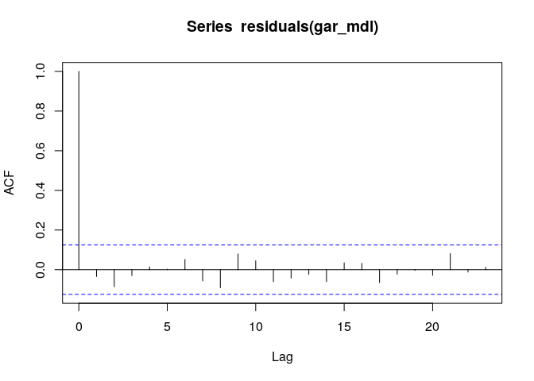

第7章 練習問題\[3\]
================

# \[3\]

``` r
df <- read.csv("../data/LSTAR.csv")
print(head(df))
```

    ##   X ENTRY         Y
    ## 1 1     1  2.130911
    ## 2 2     2  4.394894
    ## 3 3     3  7.646513
    ## 4 4     4 -6.518797
    ## 5 5     5 -6.310156
    ## 6 6     6 -4.706915

基本統計量

``` r
list(
  avg = mean(df$Y),
  std = sd(df$Y),
  max = max(df$Y),
  med = median(df$Y),
  min = min(df$Y)
)
```

    ## $avg
    ## [1] 0.6262886
    ## 
    ## $std
    ## [1] 3.432647
    ## 
    ## $max
    ## [1] 7.646513
    ## 
    ## $med
    ## [1] 1.397528
    ## 
    ## $min
    ## [1] -7.638614

プロット

``` r
library(ggplot2)

g <- ggplot(data = df, mapping = aes(x = ENTRY, y = Y)) +
     geom_line()
plot(g)
```

<!-- -->

## (a)

AICで (7.24) が選ばれることを確かめる。

``` r
library(forecast)
```

    ## Registered S3 method overwritten by 'quantmod':
    ##   method            from
    ##   as.zoo.data.frame zoo

``` r
auto.arima(df$Y, ic = "aic", stepwise = T, trace = T)
```

    ## 
    ##  Fitting models using approximations to speed things up...
    ## 
    ##  ARIMA(2,0,2) with non-zero mean : 1242.745
    ##  ARIMA(0,0,0) with non-zero mean : 1329.133
    ##  ARIMA(1,0,0) with non-zero mean : 1240.914
    ##  ARIMA(0,0,1) with non-zero mean : 1260.056
    ##  ARIMA(0,0,0) with zero mean     : 1335.352
    ##  ARIMA(2,0,0) with non-zero mean : 1242.215
    ##  ARIMA(1,0,1) with non-zero mean : 1242.477
    ##  ARIMA(2,0,1) with non-zero mean : 1242.869
    ##  ARIMA(1,0,0) with zero mean     : 1241.191
    ## 
    ##  Now re-fitting the best model(s) without approximations...
    ## 
    ##  ARIMA(1,0,0) with non-zero mean : 1240.467
    ## 
    ##  Best model: ARIMA(1,0,0) with non-zero mean

    ## Series: df$Y 
    ## ARIMA(1,0,0) with non-zero mean 
    ## 
    ## Coefficients:
    ##          ar1   mean
    ##       0.5507  0.642
    ## s.e.  0.0525  0.400
    ## 
    ## sigma^2 = 8.22:  log likelihood = -617.23
    ## AIC=1240.47   AICc=1240.56   BIC=1251.03

BICでも確かめてみる。

``` r
auto.arima(df$Y, ic = "bic", stepwise = T, trace = T)
```

    ## 
    ##  Fitting models using approximations to speed things up...
    ## 
    ##  ARIMA(2,0,2) with non-zero mean : 1263.874
    ##  ARIMA(0,0,0) with non-zero mean : 1336.176
    ##  ARIMA(1,0,0) with non-zero mean : 1251.479
    ##  ARIMA(0,0,1) with non-zero mean : 1270.62
    ##  ARIMA(0,0,0) with zero mean     : 1338.873
    ##  ARIMA(2,0,0) with non-zero mean : 1256.301
    ##  ARIMA(1,0,1) with non-zero mean : 1256.563
    ##  ARIMA(2,0,1) with non-zero mean : 1260.476
    ##  ARIMA(1,0,0) with zero mean     : 1248.234
    ##  ARIMA(2,0,0) with zero mean     : 1253.095
    ##  ARIMA(1,0,1) with zero mean     : 1253.479
    ##  ARIMA(0,0,1) with zero mean     : 1270.413
    ##  ARIMA(2,0,1) with zero mean     : 1257.626
    ## 
    ##  Now re-fitting the best model(s) without approximations...
    ## 
    ##  ARIMA(1,0,0) with zero mean     : 1247.993
    ## 
    ##  Best model: ARIMA(1,0,0) with zero mean

    ## Series: df$Y 
    ## ARIMA(1,0,0) with zero mean 
    ## 
    ## Coefficients:
    ##          ar1
    ##       0.5652
    ## s.e.  0.0520
    ## 
    ## sigma^2 = 8.268:  log likelihood = -618.48
    ## AIC=1240.95   AICc=1241   BIC=1247.99

AIC, BICの両方で AR(1) モデルが選択された。  
ただし、BICの場合は切片なしモデルが選択されている。AICモデルでも切片の値が書籍と異なる。  
ここでは書籍に合わせて AIC 選択された切片ありの AR(1) モデルを用いる。

## (b)

``` r
library(dplyr)
```

    ## 
    ##  次のパッケージを付け加えます: 'dplyr'

    ##  以下のオブジェクトは 'package:stats' からマスクされています:
    ## 
    ##     filter, lag

    ##  以下のオブジェクトは 'package:base' からマスクされています:
    ## 
    ##     intersect, setdiff, setequal, union

``` r
library(aod)

# 線形AR(1)モデルを推定し、残差と予測値を取得する
linear_ar1 <- arima(df$Y, c(1, 0, 0), include.mean = T)
et <- linear_ar1$residuals
yhat <- df$Y - et

# 予測値の2, 3, 4乗を説明変数として作成
RESET_df <- data.frame(
  et = et,
  yt_1 = dplyr::lag(df$Y),
  yhat = yhat,
  yhat2 = yhat^2,
  yhat3 = yhat^3,
  yhat4 = yhat^4
)

# H=3の場合でRESETの回帰式を推定
RESET_3 <- lm(formula = et ~ yt_1 + yhat2 + yhat3, data = RESET_df)
print(summary(RESET_3))
```

    ## 
    ## Call:
    ## lm(formula = et ~ yt_1 + yhat2 + yhat3, data = RESET_df)
    ## 
    ## Residuals:
    ##     Min      1Q  Median      3Q     Max 
    ## -6.6413 -1.0136  0.0326  1.2084  5.8676 
    ## 
    ## Coefficients:
    ##             Estimate Std. Error t value Pr(>|t|)    
    ## (Intercept)  1.51955    0.19061   7.972 5.93e-14 ***
    ## yt_1         0.80297    0.07987  10.054  < 2e-16 ***
    ## yhat2       -0.33930    0.03673  -9.239  < 2e-16 ***
    ## yhat3       -0.17555    0.01725 -10.175  < 2e-16 ***
    ## ---
    ## Signif. codes:  0 '***' 0.001 '**' 0.01 '*' 0.05 '.' 0.1 ' ' 1
    ## 
    ## Residual standard error: 2.047 on 245 degrees of freedom
    ##   ( 1 個の観測値が欠損のため削除されました )
    ## Multiple R-squared:  0.4961, Adjusted R-squared:   0.49 
    ## F-statistic: 80.41 on 3 and 245 DF,  p-value: < 2.2e-16

``` r
# yhat^2, yhat^3の係数が0とおいた制約を検定する
wald.test(Sigma = vcov(RESET_3), b = coef(RESET_3), Terms = 2:3)
```

    ## Wald test:
    ## ----------
    ## 
    ## Chi-squared test:
    ## X2 = 206.5, df = 2, P(> X2) = 0.0

各係数は有意であり、$\hat{y}^2, \hat{y}^3$
の係数を0と仮定したワルド検定も係数が0であるという帰無仮説が棄却される。  
よって非線形の存在が示唆される。

H=4 の場合は書籍に記載されているので省略。

## (c)

LSTARモデルを推定し、残差に対して BDS 検定を適用する。

``` r
library(tsDyn)
library(tseries)

# LSTARモデルを推定し、残差を算出する
lstar_mdl <- lstar(df$Y, m = 1, d = 1)
```

    ## Using maximum autoregressive order for low regime: mL = 1 
    ## Using maximum autoregressive order for high regime: mH = 1 
    ## Using default threshold variable: thDelay=0
    ## Performing grid search for starting values...
    ## Starting values fixed: gamma =  8.615385 , th =  4.709543 ; SSE =  409.6255 
    ## Optimization algorithm converged
    ## Optimized values fixed for regime 2  : gamma =  11.20357 , th =  5.002034 ; SSE =  229.2068

``` r
lstar_et <- residuals(lstar_mdl)[-1] # 最初はNAなので落とす

# BDS検定によってetが各々独立であるかを検定する
bds.test(lstar_et, m = 6)
```

    ## 
    ##   BDS Test 
    ## 
    ## data:  lstar_et 
    ## 
    ## Embedding dimension =  2 3 4 5 6 
    ## 
    ## Epsilon for close points =  0.4807 0.9614 1.4420 1.9227 
    ## 
    ## Standard Normal = 
    ##       [ 0.4807 ] [ 0.9614 ] [ 1.442 ] [ 1.9227 ]
    ## [ 2 ]    -0.9928    -0.5732   -0.4423     0.0338
    ## [ 3 ]    -0.2939    -0.3169   -0.0043     0.4658
    ## [ 4 ]     1.1305     0.3805    0.4892     0.5307
    ## [ 5 ]     0.8380     0.7123    0.8270     0.7452
    ## [ 6 ]     1.5031     0.8622    1.0826     0.8133
    ## 
    ## p-value = 
    ##       [ 0.4807 ] [ 0.9614 ] [ 1.442 ] [ 1.9227 ]
    ## [ 2 ]     0.3208     0.5665    0.6583     0.9731
    ## [ 3 ]     0.7688     0.7514    0.9966     0.6413
    ## [ 4 ]     0.2583     0.7036    0.6247     0.5956
    ## [ 5 ]     0.4020     0.4763    0.4082     0.4561
    ## [ 6 ]     0.1328     0.3886    0.2790     0.4161

BDS検定では残差の独立性を棄却できない。

## (d)

ARモデルの次数は1の下で、d=1のテラスバータの検定を用いる

``` r
# d = 1
terasvirta_df_d1 <- data.frame(
  et = et,
  yt_1 = dplyr::lag(df$Y),
  yt_1_2 = dplyr::lag(df$Y)^2,
  yt_1_3 = dplyr::lag(df$Y)^3,
  yt_1_4 = dplyr::lag(df$Y)^4
)

# d=1の回帰式を推定
terasvirta_d1 <- lm(et ~ yt_1 + yt_1_2 + yt_1_3 + yt_1_4, terasvirta_df_d1)

# 全ての非線形項の係数が0であるという制約を検定
wald.test(Sigma = vcov(terasvirta_d1), b = coef(terasvirta_d1), Terms = 2:4)
```

    ## Wald test:
    ## ----------
    ## 
    ## Chi-squared test:
    ## X2 = 146.6, df = 3, P(> X2) = 0.0

d=1 のとき、非線形項の存在を確認できる。  
次に、ESTARモデルとLSTARモデルのどちらが適切であるかを検討するために、  
$y_{t-1}^4$ の係数が有意であるかを確かめる。

``` r
summary(terasvirta_d1)
```

    ## 
    ## Call:
    ## lm(formula = et ~ yt_1 + yt_1_2 + yt_1_3 + yt_1_4, data = terasvirta_df_d1)
    ## 
    ## Residuals:
    ##     Min      1Q  Median      3Q     Max 
    ## -6.7054 -0.8483 -0.0571  1.0090  9.8162 
    ## 
    ## Coefficients:
    ##               Estimate Std. Error t value Pr(>|t|)    
    ## (Intercept)  0.9226464  0.2147418   4.297 2.51e-05 ***
    ## yt_1         0.7080787  0.0766988   9.232  < 2e-16 ***
    ## yt_1_2      -0.0269783  0.0273247  -0.987    0.324    
    ## yt_1_3      -0.0328804  0.0028540 -11.521  < 2e-16 ***
    ## yt_1_4      -0.0031865  0.0006579  -4.844 2.27e-06 ***
    ## ---
    ## Signif. codes:  0 '***' 0.001 '**' 0.01 '*' 0.05 '.' 0.1 ' ' 1
    ## 
    ## Residual standard error: 1.959 on 244 degrees of freedom
    ##   ( 1 個の観測値が欠損のため削除されました )
    ## Multiple R-squared:  0.5403, Adjusted R-squared:  0.5328 
    ## F-statistic:  71.7 on 4 and 244 DF,  p-value: < 2.2e-16

$y_{t-1}^4$ の係数が有意であるため、LSTARモデルが選択される。

## (e)

``` r
# GARモデル推定
gar_df <- data.frame(
  yt = df$Y,
  yt_1 = dplyr::lag(df$Y),
  yt_2 = dplyr::lag(df$Y, n = 2),
  yt_1_2 = dplyr::lag(df$Y)^2
)

gar_mdl <- lm(yt ~ yt_1 + yt_2 + yt_1_2, gar_df)
summary(gar_mdl)
```

    ## 
    ## Call:
    ## lm(formula = yt ~ yt_1 + yt_2 + yt_1_2, data = gar_df)
    ## 
    ## Residuals:
    ##     Min      1Q  Median      3Q     Max 
    ## -7.8403 -1.1050 -0.0771  1.5389  6.3127 
    ## 
    ## Coefficients:
    ##             Estimate Std. Error t value Pr(>|t|)    
    ## (Intercept)  2.03279    0.22652   8.974  < 2e-16 ***
    ## yt_1         0.38930    0.05582   6.974 2.87e-11 ***
    ## yt_2         0.20146    0.05796   3.476 0.000603 ***
    ## yt_1_2      -0.14699    0.01390 -10.575  < 2e-16 ***
    ## ---
    ## Signif. codes:  0 '***' 0.001 '**' 0.01 '*' 0.05 '.' 0.1 ' ' 1
    ## 
    ## Residual standard error: 2.384 on 244 degrees of freedom
    ##   ( 2 個の観測値が欠損のため削除されました )
    ## Multiple R-squared:  0.5245, Adjusted R-squared:  0.5186 
    ## F-statistic: 89.71 on 3 and 244 DF,  p-value: < 2.2e-16

残差の自己相関係数

``` r
acf(residuals(gar_mdl))
```

<!-- -->

残差に自己相関は見られない。

GARモデルとLSATRモデルの選択については、LSTARモデルとESTARモデルの選択と同様の手順を取ればよい。  
GARモデルは $y_{t-1}^2$ まで含まれているので、
LSTARモデルのそれより高次の項が0であるという制約を検定すればよい。
