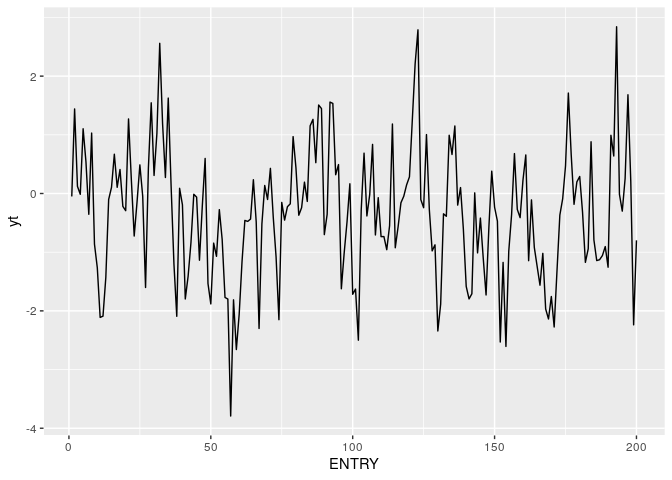
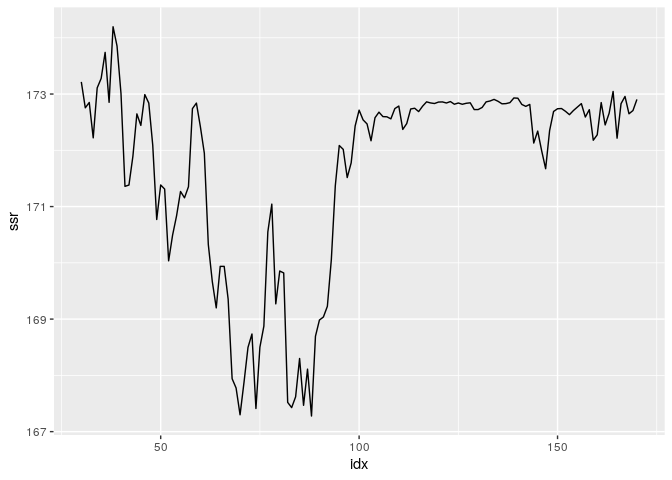

第7章 練習問題\[5\]
================

# \[5\]

``` r
library(dplyr)
library(ggplot2)

df <- read.csv("../data/SIM_TAR.csv")
# 列名を変更
df <- dplyr::rename(df, yt = TAR)

head(df)
```

    ##   ENTRY          yt   Ordered
    ## 1     1 -0.05019815 -3.791488
    ## 2     2  1.44086488 -2.658887
    ## 3     3  0.12250433 -2.605909
    ## 4     4 -0.01350982 -2.530452
    ## 5     5  1.10302371 -2.499344
    ## 6     6  0.53790311 -2.342449

基本統計量

``` r
list(
  mean = mean(df$yt),
  std = sqrt(var(df$yt)),
  max = max(df$yt),
  min = min(df$yt)
)
```

    ## $mean
    ## [1] -0.3380709
    ## 
    ## $std
    ## [1] 1.104951
    ## 
    ## $max
    ## [1] 2.841331
    ## 
    ## $min
    ## [1] -3.791488

プロット

``` r
g <- ggplot(df, aes(x = ENTRY, y = yt)) +
     geom_line()
plot(g)
```

<!-- -->

## (a)

``` r
ar1 <- arima(df$yt, c(1, 0, 0))
ar1
```

    ## 
    ## Call:
    ## arima(x = df$yt, order = c(1, 0, 0))
    ## 
    ## Coefficients:
    ##          ar1  intercept
    ##       0.5269     -0.339
    ## s.e.  0.0597      0.139
    ## 
    ## sigma^2 estimated as 0.8747:  log likelihood = -270.56,  aic = 547.11

## (b)

``` r
et <- residuals(ar1)
yhat <- df$yt - et

reset_df <- data.frame(
  et = et,
  y_1 = dplyr::lag(df$y),
  yhat2 = yhat^2,
  yhat3 = yhat^3,
  yhat4 = yhat^4
)

reset_reg <- lm(et ~ y_1 + yhat2 + yhat3 + yhat4, reset_df)
summary(reset_reg)
```

    ## 
    ## Call:
    ## lm(formula = et ~ y_1 + yhat2 + yhat3 + yhat4, data = reset_df)
    ## 
    ## Residuals:
    ##      Min       1Q   Median       3Q      Max 
    ## -2.55908 -0.57817 -0.03748  0.60344  2.55220 
    ## 
    ## Coefficients:
    ##              Estimate Std. Error t value Pr(>|t|)
    ## (Intercept)  0.084150   0.093402   0.901    0.369
    ## y_1          0.063425   0.132267   0.480    0.632
    ## yhat2       -0.344229   0.243049  -1.416    0.158
    ## yhat3       -0.234553   0.221640  -1.058    0.291
    ## yhat4        0.006056   0.123832   0.049    0.961
    ## 
    ## Residual standard error: 0.9391 on 194 degrees of freedom
    ##   ( 1 個の観測値が欠損のため削除されました )
    ## Multiple R-squared:  0.02151,    Adjusted R-squared:  0.001337 
    ## F-statistic: 1.066 on 4 and 194 DF,  p-value: 0.3744

``` r
# 非線形項の係数が0という制約を検定する
library(aod)
wald.test(Sigma = vcov(reset_reg), b = coef(reset_reg), Terms = 2:4)
```

    ## Wald test:
    ## ----------
    ## 
    ## Chi-squared test:
    ## X2 = 4.3, df = 3, P(> X2) = 0.23

すべての係数が0という制約を棄却できないため、非線形項の存在は確認できない。

## (c)

``` r
# yを昇順に並べ替える
yt_ord <- sort(df$yt)

# SSR格納ベクトル
ssrs <- rep(NA, nrow(df))

# サンプル数を確保するために上下15%点から閾値を候補を探す
# 今系列長は200なので、30 ~ 170の間で閾値を探す
for (i in 30:170) {
  th_df <- data.frame(
    yt = df$yt,
    yt_1 = dplyr::lag(df$yt),
    It = (dplyr::lag(df$yt) > yt_ord[i]) + 0,
    I_It = 1 - (dplyr::lag(df$yt) > yt_ord[i]) + 0
  )
  
  # TARモデル推定
  test_reg <- lm(yt ~ It + It : yt_1 + I_It + I_It : yt_1 + 0, th_df)
  
  # SSR算出
  ssr <- sum(residuals(test_reg)^2)
  ssrs[i] <- ssr
}

# SSRの最小値、最小値のindexを求める
min_ssr <- min(ssrs, na.rm = T)
min_ssr_idx <- which(ssrs == min_ssr)

list(
  min_ssr = min_ssr,
  min_ssr_idx = min_ssr_idx,
  threshold_yt = yt_ord[min_ssr_idx]
)
```

    ## $min_ssr
    ## [1] 167.2774
    ## 
    ## $min_ssr_idx
    ## [1] 88
    ## 
    ## $threshold_yt
    ## [1] -0.4012338

SSRのプロット

``` r
ssr_df <- data.frame(
  idx = 30:170,
  ssr = ssrs[30:170]
)

g <- ggplot(ssr_df, aes(x = idx, y = ssr)) +
     geom_line()
plot(g)
```

<!-- -->

SSRを最小とする閾値は88番目に小さいytの値で、-0.4012338
であることが分かった。

## (d)

``` r
tar_df <- data.frame(
  yt = df$yt,
  yt_1 = dplyr::lag(df$yt),
  It = (dplyr::lag(df$yt) > -0.4012) + 0,
  I_It = 1 - (dplyr::lag(df$yt) > -0.4012) + 0
)

# TARモデル推定
tar_mdl <- lm(yt ~ It + It : yt_1 + I_It + I_It : yt_1 + 0, tar_df)
summary(tar_mdl)
```

    ## 
    ## Call:
    ## lm(formula = yt ~ It + It:yt_1 + I_It + I_It:yt_1 + 0, data = tar_df)
    ## 
    ## Residuals:
    ##     Min      1Q  Median      3Q     Max 
    ## -2.6050 -0.5514 -0.0183  0.6030  2.6187 
    ## 
    ## Coefficients:
    ##           Estimate Std. Error t value Pr(>|t|)   
    ## It          0.0567     0.1017   0.558  0.57765   
    ## I_It       -0.4637     0.2192  -2.116  0.03563 * 
    ## It:yt_1     0.2596     0.1226   2.118  0.03547 * 
    ## yt_1:I_It   0.4018     0.1490   2.696  0.00763 **
    ## ---
    ## Signif. codes:  0 '***' 0.001 '**' 0.01 '*' 0.05 '.' 0.1 ' ' 1
    ## 
    ## Residual standard error: 0.9262 on 195 degrees of freedom
    ##   ( 1 個の観測値が欠損のため削除されました )
    ## Multiple R-squared:  0.3707, Adjusted R-squared:  0.3578 
    ## F-statistic: 28.72 on 4 and 195 DF,  p-value: < 2.2e-16
