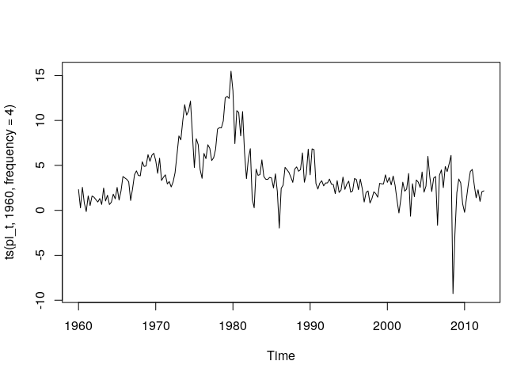

第7章 練習問題\[6\]
================

# \[6\]

## (a)

``` r
library(dplyr)
library(ggplot2)
library(aod)

df <- read.csv("../data/QUARTERLY.csv")

# pi_t系列を作成
pi_t <- diff(log(df$cpi)) * 400
head(pi_t)
```

    ## [1]  2.3062638  0.2704530  2.5602243  0.8050992 -0.1340707  1.6058904

基本統計量

``` r
list(
  mean = mean(pi_t),
  std = sqrt(var(pi_t)),
  min = min(pi_t),
  med = median(pi_t),
  max = max(pi_t)
)
```

    ## $mean
    ## [1] 3.910207
    ## 
    ## $std
    ## [1] 3.058616
    ## 
    ## $min
    ## [1] -9.262969
    ## 
    ## $med
    ## [1] 3.41608
    ## 
    ## $max
    ## [1] 15.47981

プロット

``` r
ts.plot(ts(pi_t, 1960, frequency = 4))
```

<!-- -->

AICを基準として最適なARモデルを選択する。Rの `ar()`
関数は推定の前に平均を系列から引き算していることに注意。

``` r
ar_optim <- ar(pi_t, order.max = 10)
print(ar_optim)
```

    ## 
    ## Call:
    ## ar(x = pi_t, order.max = 10)
    ## 
    ## Coefficients:
    ##       1        2        3  
    ##  0.5841  -0.0188   0.2919  
    ## 
    ## Order selected 3  sigma^2 estimated as  3.589

ラグ次数 3 が選択された。

## (b)

テラスバータの検定を行う。  
d=1, d=2, d=3, …
と遅れパラメータを大きくしながらF統計量の大小で遅れパラメータを決定するのだが…  
項が多くて面倒なので d=2 のみでやる…

``` r
# 残差
et <- ar_optim$resid
# ラグ1系列
yt_1 = dplyr::lag(pi_t)
# ラグ2系列
yt_2 = dplyr::lag(pi_t, n = 2)
# ラグ3系列
yt_3 = dplyr::lag(pi_t, n = 3)

# 遅れパラメータ d=2 で(7.21)式を推定する
terasvirta_df <- data.frame(
  et = et,
  yt_1 = yt_1,
  yt_2 = yt_2,
  yt_3 = yt_3,
  yt_2_2 = yt_2^2,
  yt_2_3 = yt_2^3
)

terasvirta_reg <- lm(
  et ~ yt_1 + yt_2 + yt_3 + yt_1:yt_2 + yt_2:yt_2 + yt_3:yt_2 + yt_1:yt_2_2 + yt_2:yt_2_2 + yt_3:yt_2_2 + yt_1:yt_2_3 + yt_2:yt_2_3 + yt_3:yt_2_3,
  data = terasvirta_df
)
summary(terasvirta_reg)
```

    ## 
    ## Call:
    ## lm(formula = et ~ yt_1 + yt_2 + yt_3 + yt_1:yt_2 + yt_2:yt_2 + 
    ##     yt_3:yt_2 + yt_1:yt_2_2 + yt_2:yt_2_2 + yt_3:yt_2_2 + yt_1:yt_2_3 + 
    ##     yt_2:yt_2_3 + yt_3:yt_2_3, data = terasvirta_df)
    ## 
    ## Residuals:
    ##      Min       1Q   Median       3Q      Max 
    ## -14.1926  -0.7091   0.1222   0.9716   3.8525 
    ## 
    ## Coefficients:
    ##               Estimate Std. Error t value Pr(>|t|)  
    ## (Intercept)  4.161e-01  7.025e-01   0.592   0.5543  
    ## yt_1        -1.121e-01  2.480e-01  -0.452   0.6517  
    ## yt_2         2.717e-01  3.586e-01   0.758   0.4496  
    ## yt_3        -1.889e-01  1.035e-01  -1.825   0.0696 .
    ## yt_1:yt_2   -1.371e-01  1.454e-01  -0.943   0.3467  
    ## yt_2:yt_3    4.009e-02  3.015e-02   1.330   0.1852  
    ## yt_1:yt_2_2  3.663e-02  2.682e-02   1.366   0.1735  
    ## yt_2:yt_2_2 -1.759e-02  1.236e-02  -1.423   0.1564  
    ## yt_3:yt_2_2  1.054e-03  4.516e-03   0.233   0.8157  
    ## yt_1:yt_2_3 -1.890e-03  1.386e-03  -1.364   0.1743  
    ## yt_2:yt_2_3  9.725e-04  9.078e-04   1.071   0.2853  
    ## yt_3:yt_2_3 -2.483e-05  3.026e-04  -0.082   0.9347  
    ## ---
    ## Signif. codes:  0 '***' 0.001 '**' 0.01 '*' 0.05 '.' 0.1 ' ' 1
    ## 
    ## Residual standard error: 1.831 on 196 degrees of freedom
    ##   ( 3 個の観測値が欠損のため削除されました )
    ## Multiple R-squared:  0.09795,    Adjusted R-squared:  0.04733 
    ## F-statistic: 1.935 on 11 and 196 DF,  p-value: 0.03704

``` r
# 非線形項を0とした制約のワルド検定
wald.test(Sigma = vcov(terasvirta_reg), b = coef(terasvirta_reg), Terms = 4:12)
```

    ## Wald test:
    ## ----------
    ## 
    ## Chi-squared test:
    ## X2 = 21.3, df = 9, P(> X2) = 0.011

d=1,
d=3のワルド検定のF統計量がd=2よりも小さいので、d=2が選択される…はず。  
(Rで実行すると結果違うかもしれないが未検証…)  
解答ではd=2が選択されているので、ここでもその値を用いる。

d=2のワルド検定の結果より、非線形項が0という制約が成り立っている帰無仮説は棄却される。  
ESTARとLSTARを選択するために、 $y_{t_2}^3$ の係数が 0
であるという制約を検定する。

``` r
wald.test(Sigma = vcov(terasvirta_reg), b = coef(terasvirta_reg), Terms = 10:12)
```

    ## Wald test:
    ## ----------
    ## 
    ## Chi-squared test:
    ## X2 = 3.3, df = 3, P(> X2) = 0.35

$y_{t_2}^3$ の係数が 0
であるという制約が成り立っているという帰無仮説を棄却できない。  
よって ESTAR モデルが選択される。
