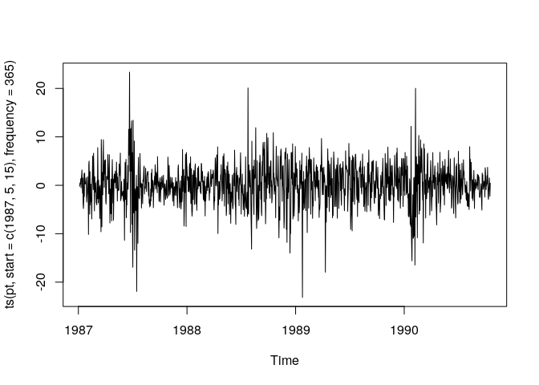
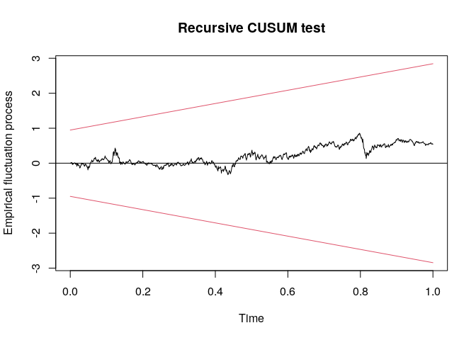
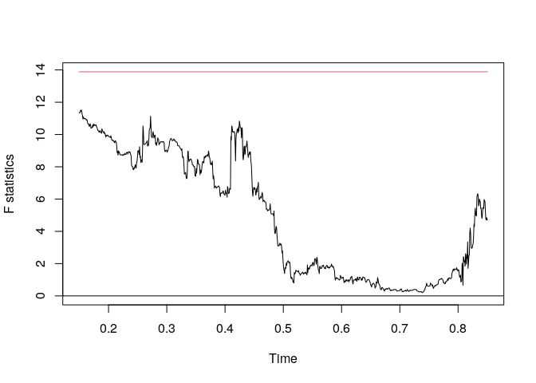
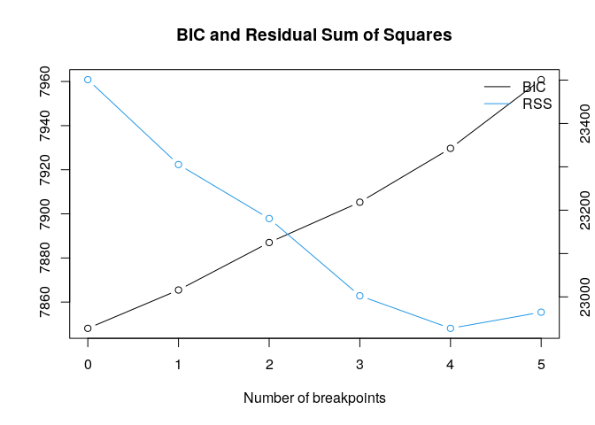

第7章 練習問題\[7\]
================

# \[7\]

``` r
library(dplyr)
library(ggplot2)

df <- read.csv("../data/OIL.csv")

# スポット価格の変化率
pt <- diff(log(df$Spot)) * 100

head(pt)
```

    ## [1] -0.2155173  0.3231021  0.5361943  0.2670229  1.3771404 -0.5274274

基本統計量

``` r
list(
  mean = mean(pt),
  std = sqrt(var(pt)),
  min = min(pt),
  med = median(pt),
  max = median(pt)
)
```

    ## $mean
    ## [1] 0.1276414
    ## 
    ## $std
    ## [1] 4.206605
    ## 
    ## $min
    ## [1] -23.16041
    ## 
    ## $med
    ## [1] 0.3237995
    ## 
    ## $max
    ## [1] 0.3237995

プロット  
`frequency = 365`
とするとうるう年で微妙にずれる気もするが…気にしない。  
(zooパッケージを使った方が良い？)

``` r
ts.plot(ts(pt, start = c(1987, 5, 15), frequency = 365))
```

<!-- -->

書籍の AR(\|\|1, 3\|\|) モデルを推定

``` r
ar13 <- arima(pt, c(3, 0, 0), fixed = c(NA, 0, NA, NA), include.mean = T, transform.pars = F)
ar13
```

    ## 
    ## Call:
    ## arima(x = pt, order = c(3, 0, 0), include.mean = T, transform.pars = F, fixed = c(NA, 
    ##     0, NA, NA))
    ## 
    ## Coefficients:
    ##          ar1  ar2     ar3  intercept
    ##       0.1722    0  0.0842     0.1276
    ## s.e.  0.0264    0  0.0264     0.1492
    ## 
    ## sigma^2 estimated as 17.02:  log likelihood = -3916.63,  aic = 7841.26

## (a)

``` r
library(strucchange)

cusum_df <- data.frame(
  yt = pt,
  yt_1 = dplyr::lag(pt),
  yt_3 = dplyr::lag(pt, 3)
)

res <- efp(yt ~ yt_1 + yt_3, data = cusum_df, type = "Rec-CUSUM")

# 残差のCUSUM
plot(res)
```

<!-- -->

ARモデルの各パラメータの逐次的な推定値のプロット作成する方法が分からなかった…  
とはいえ上記の結果だけでもパラメータが不安定であるとは言えないことが分かった。

## (b)

``` r
res_fstats <- Fstats(yt ~ yt_1 + yt_3, data = cusum_df)
plot(res_fstats)
```

<!-- -->

supF検定でも構造変化点がないという帰無仮説を棄却できない。  
ここで、対立仮説は「1回の構造変化がある」となっている点に注意。

## (c)

色々調べたが、複数の構造変化を仮定してsupF統計量、UDmax統計量を求めるパッケージが見当たらなかった。  
代わりに BIC で構造変化点の数を選択する `strucchange::breakpoints()`
関数で推定するのが一般的らしい？

[Tutorial: Change points and structural
breaks](https://kevin-kotze.gitlab.io/tsm/ts-2-tut/)

書籍では推奨しない方法と書いてあるので、本来は書籍のバイ=ペロン検定を愚直に実装する必要がありそう。  
さすがに面倒なので `breakpoints()` 関数を使った場合を以下に示す。

``` r
bps <- breakpoints(yt ~ yt_1 + yt_3, data = cusum_df)
summary(bps)
```

    ## 
    ##   Optimal (m+1)-segment partition: 
    ## 
    ## Call:
    ## breakpoints.formula(formula = yt ~ yt_1 + yt_3, data = cusum_df)
    ## 
    ## Breakpoints at observation number:
    ##                             
    ## m = 1   211                 
    ## m = 2           585     1120
    ## m = 3           585 912 1149
    ## m = 4   211     585 912 1149
    ## m = 5   211 424 630 912 1149
    ## 
    ## Corresponding to breakdates:
    ##                                                                                
    ## m = 1   0.153120464441219                                                      
    ## m = 2                                       0.424528301886792                  
    ## m = 3                                       0.424528301886792 0.661828737300435
    ## m = 4   0.153120464441219                   0.424528301886792 0.661828737300435
    ## m = 5   0.153120464441219 0.307692307692308 0.457184325108853 0.661828737300435
    ##                          
    ## m = 1                    
    ## m = 2   0.812772133526851
    ## m = 3   0.833817126269956
    ## m = 4   0.833817126269956
    ## m = 5   0.833817126269956
    ## 
    ## Fit:
    ##                                        
    ## m   0     1     2     3     4     5    
    ## RSS 23501 23305 23181 23003 22927 22965
    ## BIC  7848  7865  7887  7905  7930  7961

``` r
# RSS, BICのプロット
plot(bps)
```

<!-- -->

構造変化点 0 個がBIC最小なので、構造変化はないものと考えられる。

## (d)

まず、TARモデルを推定して閾値を推定する。

``` r
library(tsDyn)
```

    ## Registered S3 method overwritten by 'quantmod':
    ##   method            from
    ##   as.zoo.data.frame zoo

``` r
tar_mdl <- setar(pt, 3)
summary(tar_mdl)
```

    ## 
    ## Non linear autoregressive model
    ## 
    ## SETAR model ( 2 regimes)
    ## Coefficients:
    ## Low regime:
    ##     const.L      phiL.1      phiL.2      phiL.3 
    ## -0.18943364  0.13358203 -0.01642552  0.09005297 
    ## 
    ## High regime:
    ##     const.H      phiH.1      phiH.2      phiH.3 
    ##  1.58357654 -0.07731064 -0.03662602  0.07820119 
    ## 
    ## Threshold:
    ## -Variable: Z(t) = + (1) X(t)+ (0)X(t-1)+ (0)X(t-2)
    ## -Value: 1.7
    ## Proportion of points in low regime: 65.75%    High regime: 34.25% 
    ## 
    ## Residuals:
    ##       Min        1Q    Median        3Q       Max 
    ## -23.03866  -2.31101   0.10123   2.37903  21.87516 
    ## 
    ## Fit:
    ## residuals variance = 16.78,  AIC = 3912, MAPE = 148.9%
    ## 
    ## Coefficient(s):
    ## 
    ##          Estimate  Std. Error  t value  Pr(>|t|)    
    ## const.L -0.189434    0.162774  -1.1638  0.244713    
    ## phiL.1   0.133582    0.043926   3.0411  0.002402 ** 
    ## phiL.2  -0.016426    0.033745  -0.4868  0.626511    
    ## phiL.3   0.090053    0.033940   2.6533  0.008063 ** 
    ## const.H  1.583577    0.371121   4.2670 2.117e-05 ***
    ## phiH.1  -0.077311    0.074050  -1.0440  0.296654    
    ## phiH.2  -0.036626    0.045685  -0.8017  0.422861    
    ## phiH.3   0.078201    0.043323   1.8051  0.071279 .  
    ## ---
    ## Signif. codes:  0 '***' 0.001 '**' 0.01 '*' 0.05 '.' 0.1 ' ' 1
    ## 
    ## Threshold
    ## Variable: Z(t) = + (1) X(t) + (0) X(t-1)+ (0) X(t-2)
    ## 
    ## Value: 1.7

閾値が 1.7 と推定された。  
次に、推定した閾値を用いて書籍のモデルを推定する。

``` r
tar_df <- data.frame(
  pt = pt,
  pt_1 = dplyr::lag(pt),
  pt_3 = dplyr::lag(pt, n = 3),
  It = (dplyr::lag(pt) > 1.7) + 0,
  I_It = 1 - (dplyr::lag(pt) > 1.7)
)

tar_mdl <- lm(pt ~ It + It:pt_1 + It:pt_3 + I_It + I_It:pt_1 + I_It:pt_3 + 0, tar_df)
summary(tar_mdl)
```

    ## 
    ## Call:
    ## lm(formula = pt ~ It + It:pt_1 + It:pt_3 + I_It + I_It:pt_1 + 
    ##     I_It:pt_3 + 0, data = tar_df)
    ## 
    ## Residuals:
    ##     Min      1Q  Median      3Q     Max 
    ## -22.937  -2.321   0.075   2.366  21.764 
    ## 
    ## Coefficients:
    ##           Estimate Std. Error t value Pr(>|t|)    
    ## It         1.55734    0.36993   4.210 2.72e-05 ***
    ## I_It      -0.19060    0.16287  -1.170  0.24210    
    ## It:pt_1   -0.07888    0.07407  -1.065  0.28710    
    ## It:pt_3    0.07179    0.04261   1.685  0.09223 .  
    ## pt_1:I_It  0.13054    0.04351   3.000  0.00275 ** 
    ## pt_3:I_It  0.08736    0.03351   2.607  0.00923 ** 
    ## ---
    ## Signif. codes:  0 '***' 0.001 '**' 0.01 '*' 0.05 '.' 0.1 ' ' 1
    ## 
    ## Residual standard error: 4.111 on 1372 degrees of freedom
    ##   ( 3 個の観測値が欠損のため削除されました )
    ## Multiple R-squared:  0.05142,    Adjusted R-squared:  0.04728 
    ## F-statistic:  12.4 on 6 and 1372 DF,  p-value: 1.231e-13

書籍のモデルが推定できた。  
ハンセンの検定を用いて上記で推定したTARモデルの線形性を検定する。  
線形制約を課したモデルは (a) で推定しているので、 $SSR_u$ は (a)
で推定したモデルの残差から計算すればよい。

``` r
# F統計量を算出
# 線形モデルのSSR
SSR_r <- sum(residuals(ar13)^2)
# 非線形モデルのSSR
SSR_u <- sum(residuals(tar_mdl)^2)
# 利用可能なデータ数Tはラグ3の項があるのでその分減少する
T <- length(pt) - 3
# nは線形モデルa13のパラメータ数なので3
n <- 3
# F統計量
F <- ((SSR_r - SSR_u) / n) / (SSR_u / (T - 2 * n))

# ハンセンのブートストラップ法
F_stars <- c()
for (i in 1:1000) {
  # 標準正規乱数
  et <- rnorm(length(pt))
  
  # etを回帰するためのdata.frame
  test_df <- data.frame(
    et = et,
    yt_1 = dplyr::lag(pt),
    yt_3 = dplyr::lag(pt, 3),
    It = (dplyr::lag(pt) > 1.7) + 0,
    I_It = 1 - (dplyr::lag(pt) > 1.7)
  )
  
  # SSR*_rを算出
  r_mdl <- lm(et ~ yt_1 + yt_3 + 0, test_df)
  SSR_star_r <- sum(residuals(r_mdl)^2)
  
  # SSR*_uを算出
  u_mdl_1 <- lm(et ~ It + 0, test_df)
  SSR_star_u_1 <- sum(residuals(u_mdl_1)^2)
  
  u_mdl_2 <- lm(et ~ I_It, test_df)
  SSR_star_u_2 <- sum(residuals(u_mdl_2)^2)
  
  u_mdl_3 <- lm(et ~ It:yt_1 + It:yt_3 + 0, test_df)
  SSR_star_u_3 <- sum(residuals(u_mdl_3)^2)
  
  u_mdl_4 <- lm(et ~ I_It:yt_1 + I_It:yt_3 + 0, test_df)
  SSR_star_u_4 <- sum(residuals(u_mdl_4)^2)
  
  SSR_star_u <- min(c(SSR_star_u_1, SSR_star_u_2, SSR_star_u_3, SSR_star_u_4))
  
  # F*統計量を算出
  F_star <- ((SSR_star_r - SSR_star_u) / n) / (SSR_star_u / (T - 2 * n))
  F_stars <- append(F_stars, F_star)
}

# F*統計量の95%点を求める
F_stars_95 <- sort(F_stars)[950]

print(paste("F statistics: ", as.character(F)))
```

    ## [1] "F statistics:  6.24086067831136"

``` r
print(paste("95% of F* statistics: ", as.character(F_stars_95)))
```

    ## [1] "95% of F* statistics:  1.6270159411214"

ブートストラップ法で求めた臨界値よりもF統計量が大きいので線形性の帰無仮説は棄却される。

## (e)

まず書籍の簡略化されたモデルを推定する。

``` r
tar_mdl2 <- lm(pt ~ It + I_It:pt_1 + I_It:pt_3 + 0, tar_df)
summary(tar_mdl2)
```

    ## 
    ## Call:
    ## lm(formula = pt ~ It + I_It:pt_1 + I_It:pt_3 + 0, data = tar_df)
    ## 
    ## Residuals:
    ##      Min       1Q   Median       3Q      Max 
    ## -23.1573  -2.3991  -0.0074   2.2461  22.1229 
    ## 
    ## Coefficients:
    ##           Estimate Std. Error t value Pr(>|t|)    
    ## It         1.23854    0.18939   6.540 8.67e-11 ***
    ## I_It:pt_1  0.15828    0.03652   4.334 1.57e-05 ***
    ## I_It:pt_3  0.08599    0.03352   2.565   0.0104 *  
    ## ---
    ## Signif. codes:  0 '***' 0.001 '**' 0.01 '*' 0.05 '.' 0.1 ' ' 1
    ## 
    ## Residual standard error: 4.115 on 1375 degrees of freedom
    ##   ( 3 個の観測値が欠損のため削除されました )
    ## Multiple R-squared:  0.04762,    Adjusted R-squared:  0.04555 
    ## F-statistic: 22.92 on 3 and 1375 DF,  p-value: 1.766e-14

各々のAICを算出する。

``` r
print(paste("AIC of model 1: ", as.character(AIC(tar_mdl))))
```

    ## [1] "AIC of model 1:  7814.5107724049"

``` r
print(paste("AIC of model 2: ", as.character(AIC(tar_mdl2))))
```

    ## [1] "AIC of model 2:  7814.01998194265"

AICでは簡略化されたモデルの方が有効と判断された。

## (f)

5)  で推定した閾値とモデルで閾値が $y_{t\_2}$
    で定まるモデルを推定してAICで比較する。

``` r
tar_df2 <- data.frame(
  pt = pt,
  pt_1 = dplyr::lag(pt),
  pt_3 = dplyr::lag(pt, 3),
  It = (dplyr::lag(pt, 2) > 1.7) + 0,
  I_It = 1 - (dplyr::lag(pt, 2) > 1.7)
)

tar_mdl3 <- lm(pt ~ It + I_It:pt_1 + I_It:pt_3 + 0, tar_df2)
AIC(tar_mdl3)
```

    ## [1] 7850.297

遅れ2のモデルはAICが大きく、選択されない。
